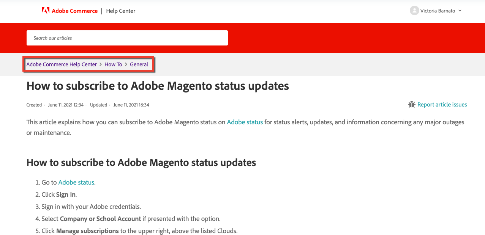

# Adobe Commerce-Support-Wissensdatenbank beginnt mit der Annahme von Beiträgen

Ab dem 15. Juni akzeptiert das Knowledge Base-Team des Adobe Commerce-Supports direkte Bearbeitungen und neue Artikelbeiträge von externer Adobe Commerce-Community über die [Magento/Knowledge-base](https://github.com/magento/knowledge-base) GitHub-Repo!

Haben Sie einen Tippfehler in einem unserer Artikel oder unvollständige Schritte zur Fehlerbehebung bemerkt?
Jetzt können Sie es selbst beheben und Beitragspunkte abrufen!

## Beitragen

Wir freuen uns über alle möglichen Beiträge, von kleinen Tippkorrekturen bis hin zu kompletten Artikeln zur Fehlerbehebung. Wenn Sie zu diesem Repo beitragen, erhalten Sie Belohnungspunkte, die in etwa dem Adobe Commerce-Code und unserer Entwicklerdokumentation entsprechen. Siehe [Beitragsbelohnungspunkte](https://github.com/magento/knowledge-base/blob/main/docs/contribution-points.md) für Details.

### Allgemeiner Beitragsfluss

1. Fork diesen Repo.
1. Bearbeiten Sie das abgespaltete Repo.
1. Senden Sie eine Pull-Anfrage (PR) an dieses Repo.
1. Tests werden ausgeführt:
   * Adobe CLA - Sicherstellen, dass die Adobe Open Source Contributor-Lizenzvereinbarung unterzeichnet ist.
   * Markdown-Linktest: Stellen Sie sicher, dass die Markdown-Syntax korrekt ist.
   * Validierungstest für die Dateistruktur - Sicherstellen, dass der Commit gemäß [erforderliche Dateistruktur](https://github.com/magento/knowledge-base/blob/main/.github/CONTRIBUTING.md#file_structure).
1. PR-Genehmigungsfluss:
   1. Die Entwickler der Support-Wissensdatenbank (KB) überprüfen die PR innerhalb mehrerer Tage und fügen Beschriftungen hinzu.
   1. KB-Autor kann Änderungen genehmigen/ablehnen/anfordern.
   1. Wenn es genehmigt wurde, fügt KB-Autor Beschriftungen hinzu, die dem in PR bereitgestellten Input entsprechen, und interne Subject Matter Expert (SME) überprüft die PR.
   1. KMU können Änderungen genehmigen/ablehnen/beantragen.
1. Sobald alle Korrekturen durchgeführt wurden (falls angefordert) und sowohl der KB-Autor als auch das KMU die PR genehmigen, importiert der KB-Autor Inhalte in das interne Repo und führt sie intern zusammen.
1. Die [Magento/Knowledge-base](https://github.com/magento/knowledge-base) repo synchronisiert sich mit dem internen innerhalb von 20 Minuten.
1. Sobald die Berichte synchronisiert sind, wird Ihr PR geschlossen und Sie erhalten [Beitragspunkte](#contribution-points).

Einzelheiten zum Beitragsfluss finden Sie im Abschnitt [Mitarbeiter-Handbuch](https://github.com/magento/knowledge-base/blob/main/.github/CONTRIBUTING.md).
Weiterführende Informationen zu Vorlagen, Stilhandbüchern und Formatierungsrichtlinien finden Sie unter [Dokumentation](https://github.com/magento/knowledge-base/tree/main/docs).

### Suchen Sie die Support-KB-Artikeldatei auf GitHub

In der Support-Wissensdatenbank (KB) sind Artikel in Abschnitte unterteilt, die unter Kategorien verschachtelt sind.

Beispiel: die [Adobe Magento-Statusaktualisierungen abonnieren](/help/how-to/general/how-to-subscribe-to-adobe-magento-status-updates.md) -Artikel gehört zum Abschnitt &quot;Allgemein&quot;in der Kategorie &quot;Verfahren&quot;.

Sie können den Abschnitt- und Kategorienamen im Breadcrumbs-Pfad auf der Artikelseite sehen, siehe Abbildung unten:

Die Artikeldateien werden auf die gleiche Weise in der [Magento/Knowledge-base](https://github.com/magento/knowledge-base) repo.
Der gesamte Inhalt wird im `src` Ordner mit Ordnern für Kategorien und verschachtelten Ordnern für Abschnitte; Dateinamen entsprechen entweder den Artikeltiteln oder sind ähnlich.

Sie können auch die Suche innerhalb des Repositorys verwenden, indem Sie einen Textabschnitt aus dem Support-KB-Artikel als Suchzeichenfolge verwenden. Wenn die Suche Dateien zurückgibt, die diese Zeichenfolge enthalten, wählen Sie die Datei aus, die zum richtigen Abschnitt und zur richtigen Kategorie gehört.

### Beitragspunkte

Die [Magento/Knowledge-base](https://github.com/magento/knowledge-base) repo in integriert mit Magento Community Engineering für Beitragspunkte und Support.

Siehe [Beitragspunkte](https://github.com/magento/knowledge-base/blob/main/docs/contribution-points.md) , um zu sehen, wie Punkte belohnt werden.
