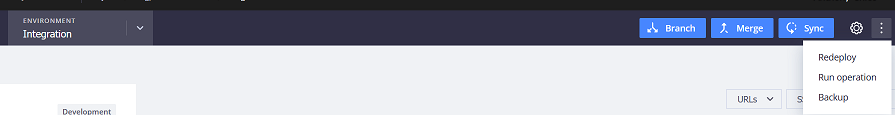

# Backup (Schnappschuss) in Cloud: FAQ

In diesem Artikel wird die Sicherung Ihrer Umgebungen mit Momentaufnahmen in Adobe Commerce in der Cloud-Infrastruktur beschrieben.

## Betroffene Produkte und Versionen

* Adobe Commerce auf Cloud-Infrastruktur 2.4.x
* Architekturpläne: Starter, Pro Legacy, Pro

## Umgebungsmomentan, Pro-Plan

### Staging- und Produktionsumgebungen

* Manuelle Momentaufnahmen sind nicht für Staging- und Produktionsumgebungen in Pro Plan verfügbar.
* Automatische Momentaufnahmen werden erstellt **unabhängig vom Live-Status** Ihrer Site (Momentaufnahmen, die auch für Sites erstellt wurden, die noch nicht gestartet wurden). Automatische Sicherungen sind nicht öffentlich zugänglich, da sie in einem separaten System gespeichert sind. Sie können [Senden eines Adobe Commerce Support-Tickets](/docs/commerce-knowledge-base/kb/help-center-guide/magento-help-center-user-guide.html#submit-ticket) , um ein spezielles Backup anzufordern oder aus einem bestimmten Backup wiederherzustellen, das Datum, Uhrzeit und Zeitzone des Tickets angibt. Beachten Sie außerdem, dass die Unterstützung das Rollback oder die Wiederherstellung der Datenbank nicht für Sie ausführt - sie rufen den Schnappschuss ab, aber Sie müssen die Datenbank selbst wiederherstellen.
* Die Backups werden mithilfe des **verschlüsselte Amazon Web Services Elastic Block Store (AWS EBS)-Momentaufnahmen**.
* Umgebungsmomentaufnahmen beinhalten Ihr gesamtes System (Dateisystem und Datenbank).
* Aufbewahrungszeit für automatische Momentaufnahmen **ist anders** und folgt [den Zeitplan](/docs/commerce-cloud-service/user-guide/architecture/pro-architecture.html?lang=en#backup-and-disaster-recovery).

>[!NOTE]
>Die Cloud-Konsole zeigt immer [!UICONTROL No backup] in Staging- und Produktionsumgebungen. Sie können nur Backups aus der Integrationsumgebung aufnehmen. Auswählen **[!UICONTROL Backup]** im Dropdown-Menü mit den Auslassungspunkten.
>

### Integrations- (Entwicklungs-)Umgebung

* Ihre [Integrationsumgebung](/help/announcements/adobe-commerce-announcements/integration-environment-enhancement-request-pro-and-starter.md) is **nicht automatisch gesichert werden**, aber Sie können Momentaufnahmen erstellen **manuell**.
* Sie können manuelle Momentaufnahmen für Integrationsumgebungen in Nicht-Live Stores erstellen.
* Sie können **mehrere Momentaufnahmen** die manuell ausgelöst wurden.
* Ein manuell ausgelöster Schnappschuss wird für **7 Tage**.

**Verwandte Artikel in unserer Entwicklerdokumentation:**

* [Sicherung und Wiederherstellung nach Katastrophen](/docs/commerce-cloud-service/user-guide/architecture/pro-architecture.html#backup-and-disaster-recovery)
* [Erstellen eines Schnappschusses](/docs/commerce-cloud-service/user-guide/develop/storage/snapshots.html)

## Umgebungsmomentaufnahme, Startplan

* Alle Arten von Umgebungen (Integration, Staging, Produktion) **nicht automatisch gesichert werden**, aber Sie können Momentaufnahmen manuell erstellen.
* Sie können manuelle Momentaufnahmen erstellen **unabhängig vom Live-Status** Ihrer Site (Momentaufnahmen, die auch für Sites erstellt wurden, die noch nicht gestartet wurden).
* Ein manuell ausgelöster Schnappschuss wird für **7 Tage**.

## Wiederherstellen eines Umgebungs-Snapshots

Um einen vorhandenen Schnappschuss wiederherzustellen (in der unterstützten Umgebung: Integration, Staging, Produktion im Starter-Plan oder Integration in Pro-Plan), führen Sie die Schritte unter [Backup-Management: Wiederherstellen einer manuellen Sicherung](/docs/commerce-cloud-service/user-guide/develop/storage/snapshots#restore-a-manual-backup) in unserem Commerce on Cloud Infrastructure Guide.

## Datenbanksicherung (DB)

Die DB-Sicherung ist Teil eines Cloud-Snapshots:

>>
Ein Snapshot ist eine vollständige Sicherung einer Umgebung, die alle persistenten Daten aus allen laufenden Diensten enthält (z. B. **MySQL-Datenbank**, Redis usw.) und allen Dateien, die auf den bereitgestellten Volumes gespeichert sind.

>[!NOTE]
>
>Die bereitgestellten Volumina enthalten/beziehen sich ausschließlich auf die [Schreibbare Reittiere](/docs/commerce-cloud-service/user-guide/configure/app/properties/properties.html?lang=en#mounts) und umfasst nicht das gesamte Verzeichnis /app . Wie bei den anderen Dateien werden sie von [Build- und Bereitstellungsprozess](/docs/commerce-cloud-service/user-guide/architecture/pro-develop-deploy-workflow.html?lang=en#deployment-workflow)und Sie müssen auch die verbleibenden Dateien aus Ihrem Git-Repository auschecken.

[Snapshots und Backup-Verwaltung](/docs/commerce-cloud-service/user-guide/develop/storage/snapshots.html) in unserer Entwicklerdokumentation.

Senden Sie nur eine [Support-Anfrage](/docs/commerce-knowledge-base/kb/help-center-guide/magento-help-center-user-guide.html?lang=en#submit-ticket) für einen DB-Schnappschuss von Pro Production und Staging, wenn Sie die DB von einem bestimmten Zeitpunkt an benötigen. Wenn Sie nur eine aktuelle Sicherung Ihrer DB (in einer beliebigen Umgebung) benötigen, lesen Sie den Knowledge Base-Artikel: [Generieren von Datenbank-Dumps in Cloud](/help/how-to/general/create-database-dump-on-cloud.md).
