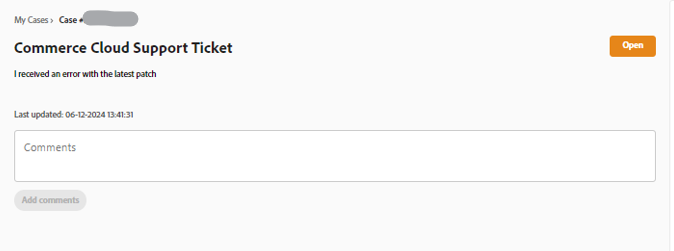

# Experience League Support-Benutzerhandbuch für Adobe Commerce

In diesem Handbuch erfahren Sie, wie Sie ein Support-Ticket an den [Experience League-Support](https://experienceleague.adobe.com/home#support) senden und gemeinsamen Zugriff auf die Adobe Commerce-Konten gewähren.

>[!NOTE]
>
>Der Adobe Commerce-Support wurde vom Adobe Commerce Help Center zu Experience League migriert. Verwenden Sie den beschriebenen Formularfluss von Experience League [hier](#what-is-experience-support), um Support-Fälle zu übermitteln.

>[!NOTE]
>
>Um Ihre zuvor eingereichten Anfragen im Adobe Commerce Help Center anzuzeigen, müssen Sie jetzt auf https://support.magento.com/hc/en-us/requests gehen, da diese Fälle nicht in das neue Support-Ticket-System migriert wurden. Das Hilfezentrum ist jetzt schreibgeschützt. Um weiterhin Support für das ursprüngliche Problem zu erhalten, müssen Sie ein Folgeticket an den [Experience League-Support senden](https://experienceleague.adobe.com/home#support).

>[!NOTE]
>
>Der Knowledgebase-Teil des Adobe Commerce Help Centers wurde zum Adobe Experience League-Portal migriert. Wenn Sie ein Support-Ticket erstellen, werden Ihnen zugehörige Knowledge Base-Artikel sowie andere relevante Adobe Commerce-Dokumentationen aus Adobe Experience League vorgeschlagen.

**Wichtige Aktualisierung:** 29. Juli 2024

**[WAS IST DER EXPERIENCE LEAGUE-SUPPORT?](#what-is-experience-support)**

**[SUPPORT-FÄLLE](#support-cases)**

* [Beim Experience League-Support anmelden](#sign-in-experience-support)
* [Senden eines Support-Tickets](#submit-case)

   * [Adobe Experience League-Startseite](#experience-league-start-page)
   * [Adobe Commerce-Kontoseite](#submit-case-adobe-commerce-account-page)
   * [*Überprüfen Sie Ihre E-Mail-Adresse*](#verify-email-address-error)

* [Support-Fälle tracken](#track-support-cases)
* [Kommentare in Ihrem Fall](#comments-in-your-case)
* [Fall schließen](#close-case)
* [Fall erneut öffnen](#reopen-case)
* [Senden eines Tickets mit der Cloud-Konsole](#cloud-console)
* [Adobe Commerce P1-Hotline](#P1-hotline)
* [Adobe Commerce Shared Responsibility -Betriebsmodell](#shared-responsibility-operational-model)

**[FREIGEGEBENER ZUGRIFF: GEWÄHREN SIE ANDEREN BENUTZERN BERECHTIGUNGEN FÜR DEN ZUGRIFF AUF IHR KONTO](#shared-access)**

* [Wer gemeinsamen Zugriff gewähren kann](#who-can-provide-shared-access)
* [Freigegebenen Zugriff bereitstellen](#provide-shared-access)
* [Freigegebenen Zugriff widerrufen (löschen)](#revoke-shared-access)

   * [Wie können Benutzer gelöscht werden, denen über ein Cloud-Projekt gemeinsamer Zugriff gewährt wurde?](#remove-cloud-shared-access-users)

* [Auf freigegebenes Konto zugreifen (Konten wechseln)](#switch-accounts)
* [Fehlerbehebung bei freigegebenem Zugriff](#troubleshooting-shared-access)

**[FAQ ZUR ABRECHNUNG FÜR ADOBE COMMERCE](#billing-faq)**

## WAS IST DER EXPERIENCE LEAGUE-SUPPORT? {#what-is-experience-support}

Der Experience League-Support ist ein Support-Portal für Adobe, auf dem qualifizierte Adobe Commerce-Kunden Support-Tickets einreichen und verwalten können. Dort finden Sie auch Artikel zur Fehlerbehebung.

## SUPPORT-FÄLLE {#support-cases}

Mit dem Fallmanagement für den Adobe Experience League-Support können Sie über verschiedene Fälle mit dem Support zusammenarbeiten, um bestimmte Probleme zu beheben, die bei der Verwendung von Adobe-Produkten, einschließlich Adobe Commerce, für alle Adobe Commerce-Produkte unter Vertrag auftreten.

## BEIM EXPERIENCE LEAGUE-SUPPORT ANMELDEN {#sign-in-experience-support}

Mit der Anmeldung können Sie Fragen von Agenten auf Support-Tickets senden, aktualisieren und beantworten.

Gehen Sie wie folgt vor, um sich beim Adobe Experience League-Support anzumelden:

1. Navigieren Sie zu [experienceleague.adobe.com](https://experienceleague.adobe.com/).
1. Melden Sie sich mit Ihren Adobe-Anmeldedaten an.

### Senden eines Support-Tickets {#support-case}

Nach der erfolgreichen Anmeldung als Kontoinhaber oder Shared Access-Benutzer können Sie über die Adobe Experience League -Homepage, Ihre Adobe Commerce -Kontoseite und Ihre Adobe Commerce Cloud -Kontoseite einen Support-Fall einreichen.

>[!NOTE]
>
>Support-Anfragen für das Adobe Commerce Marketplace-Team können nicht über Experience League gesendet werden, da ihr Support-System auf einer separaten Plattform ausgeführt wird, die nicht mit Experience League integriert ist.
>
>Sie können Ihren Support-Fall einreichen, wenn die folgenden Aussagen zutreffen:
>
>* Die betreffende Organisation wird in der linken Spalte benannt und endet in ([!DNL Commerce]). Ihre Anfrage bezieht sich auf diese Organisation oder ein mit ihr verknüpftes Konto.
>* Ihr Problem besteht darin, dass Sie sich nicht beim Marketplace-Konto anmelden können oder dass Sie eine Frage zur Bereitstellung einer Erweiterung haben.
>* Bei Ihrem Problem geht es nicht nur darum, eine Rückerstattung für Ihren Marketplace-Kauf bzw. Ihre -Käufe anzufordern.
>
>Bei Problemen mit der Veröffentlichung Ihrer Erweiterung, Problemen beim Kauf oder der Anforderung einer Rückerstattung auf dem [Adobe Commerce Marketplace](https://commercemarketplace.adobe.com/) müssen Sie sich direkt an das [!DNL Commerce Marketplace] wenden, indem Sie https://commercemarketplace.adobe.com/ besuchen. Navigieren Sie zum unteren Rand der Seite und klicken Sie auf **[!UICONTROL Contact Us]**. Daraufhin wird ein Formular geöffnet, um ein Marketplace-Support-Ticket zu senden.

#### Adobe Experience League-Startseite {#experience-league-start-page}

Gehen Sie wie folgt vor, um einen neuen Support-Fall über die Startseite von Adobe Experience League einzureichen:

>[!INFO]
>
>1. Um einen Fall einzureichen, müssen Sie berechtigt sein, Support für das entsprechende Produkt zu erhalten (z. B. Adobe Commerce, Adobe Commerce Intelligence, Adobe Commerce Payment Services, Experience Platform usw.). Wenn Sie nicht zu Support berechtigt sind, wird oben auf der Seite eine Leiste angezeigt, die Sie darüber informiert, dass Sie kein Support-berechtigter Benutzer in der Organisation sind.
>1. Wenn Sie mehreren Organisationen angehören oder es mehrere Organisationen mit ähnlich aussehenden Namen gibt (jedes von ihnen repräsentiert eines der anderen Adobe-Produkte, die das Unternehmen abonniert hat), müssen Sie zunächst das entsprechende Unternehmen aus der Dropdown-Liste in der linken Spalte auswählen, die auf *[!DNL (Commerce)]* endet.
>1. Wenn die Dropdown-Liste &quot;**[!UICONTROL Select a product]**&quot; beim Senden einer Anfrage leer ist, verwenden Sie wahrscheinlich ein Adobe Commerce-Partnerkonto. Nur Benutzer mit [Shared Access](#shared-access) von einem Händler mit Support-Berechtigungen können Tickets senden. Bei Problemen mit Händlern fordern Sie den gemeinsamen Zugriff an. Bei Partnerproblemen wenden Sie sich an spphelp@adobe.com.

>[!NOTE]
>
>Stellen Sie sicher, dass Sie die richtige Organisation ausgewählt haben, bevor Sie den Fall einreichen, und dass die ausgewählte Organisation über die entsprechenden Berechtigungen für das Produkt verfügt, für das Sie Unterstützung anfordern. Wenn Ihr Problem beispielsweise mit Adobe Commerce zusammenhängt, Sie aber Adobe Commerce Intelligence oder Adobe Experience Platform als Produkt ausgewählt haben und der Fall erfolgreich eingereicht wurde, kann dies zu einer falschen Weiterleitung Ihres Falls und zu Verzögerungen bei der Reaktion führen.
>
>Wenn die falsche Organisation zum Zeitpunkt der Fallübermittlung ausgewählt wurde, kann Ihr Team die unter [!UICONTROL My Cases] stehende Anfrage außerdem nicht für die entsprechende/korrekte Organisation anzeigen. Das Adobe Commerce-Supportteam ist nicht in der Lage, die mit dem Fall verbundene Organisation zu ändern. Um dies zu beheben, müssen Sie den bestehenden Fall schließen und einen neuen Fall mit den entsprechenden angegebenen/ausgewählten Details einreichen.

1. Klicken Sie auf **Support** in der Kopfzeile. Dadurch wird die Support-Homepage geöffnet.

   

1. Um den Support-Aufnahmeprozess zu starten, stellen Sie sicher, dass Sie die entsprechende Organisation in der Dropdown-Liste Organisation ausgewählt haben (falls sichtbar). Um eine Anfrage für Adobe Commerce zu senden, wählen Sie den Organisationsnamen aus, der auf *[!DNL Commerce]* endet.

   

1. Klicken Sie im Menü links auf **[!UICONTROL Open Ticket]** oder auf **[!UICONTROL Get Started]** in *[!UICONTROL Open a support ticket]* Karte.

   

1. Wählen Sie ein Produkt aus dem Dropdown-Menü aus und geben Sie einen Falltitel und eine Beschreibung an. HINWEIS: Wenn in der Dropdown-Liste keine Produkte angezeigt werden oder [!DNL Commerce] keine verfügbare Option ist, wechseln Sie den [!UICONTROL Organization] in der linken Spalte und versuchen Sie es erneut.

   

   >[!NOTE]
   >
   >Wenn Sie ein Ticket mit &quot;**[!DNL Commerce]in der Cloud-Infrastruktur** als Produkt senden und die Organisation mehrere Projekte aufgelistet hat, werden Sie aufgefordert, die entsprechende [!UICONTROL Project ID] auszuwählen. Wenn Sie das gewünschte [!UICONTROL Project ID] nicht finden können, fügen Sie dem Ticket einen Hinweis hinzu, dass Sie Hilfe bei einem anderen „Projekt X“ suchen. Wenn Sie ein Ticket &quot;**[!DNL Commerce]on Managed Services**&quot; einreichen möchten und **[!DNL Commerce]in der Cloud-** sind, **[!DNL Commerce]jedoch nicht in der Cloud-Infrastruktur**:  1. Geben Sie in **[!UICONTROL Case title]** einen Betreff für Ihr Problem ein. 2. Geben Sie in **[!UICONTROL Case description]** eine Beschreibung Ihres Problems ein. 3. Nachdem Sie beide Elemente eingegeben haben, wird das **[!UICONTROL Cloud Project URL]** unten angezeigt.

1. Adobe Experience League schlägt Artikel und Best Practices vor, die Ihnen bei der Lösung Ihres Falls helfen können. Wenn Sie weiterhin direkten Support benötigen, müssen Sie einige zusätzliche Informationen angeben, bevor Sie Ihren Fall einreichen.

   

1. Nachdem Sie alle erforderlichen Informationen eingegeben haben, klicken Sie auf **[!UICONTROL Submit case]**.

>[!IMPORTANT]
>
>Wenn Ihre Organisation beim Anmelden bei experienceleague.adobe.com nicht im Dropdown-Menü der Organisation angezeigt wird, müssen Sie möglicherweise Ihr Profil mit accounts.magento.com synchronisieren, bevor Sie Support anfordern oder einen vorhandenen Support-Fall verwalten.
>
>1. Navigieren Sie zu accounts.magento.com und melden Sie sich mit demselben Profil (Firmenprofil, Schulprofil oder persönliches Profil) an, das Sie für die Verwaltung von Support-Fällen in Adobe Experience League verwenden werden.
>1. Nachdem Sie sich erfolgreich bei Ihrem Profil accounts.magento.com angemeldet haben, navigieren Sie zurück zu experienceleague.adobe.com und melden Sie sich an.
>1. Wählen Sie Ihre Organisation im Dropdown-Menü Organisation aus.
>1. Wenn Ihr Unternehmen weiterhin nicht angezeigt wird, wenden Sie sich an Ihren Commerce-Administrator, um Support-Delegiertenrechte zu erhalten. Weitere Informationen finden Sie im Hilfeartikel zur [Commerce-Kontofreigabe](https://experienceleague.adobe.com/en/docs/commerce-admin/start/commerce-account/commerce-account-share).

>[!NOTE]
>
>Warum die Organisation/das Produkt wichtig ist
>
>**Beispiel A**: Sie haben den gemeinsamen Zugriff auf nur ein Unternehmen und dieses Unternehmen hat Berechtigungen für zwei Adobe-Produkte: Produkt1 und Produkt2.
>
>1. Da jede Organisation ein Produkt darstellt, werden in der Dropdown-Liste zwei Organisationen angezeigt, z. B. OrgA-Product1 und OrgB-Product2.
>1. Wenn Sie Produkt = Produkt1 ausgewählt haben, Ihr Problem jedoch mit Produkt2 zusammenhängt, wird der Fall an den Produkt2-Support weitergeleitet, und es kommt zu Verzögerungen bei der Übertragung des Falls an den Produkt1-Support.
>1. Wenn Sie die Anfrage für OrgA-Product1 eingereicht haben und [!UICONTROL My Cases] für diese Organisation in Zukunft überprüfen möchten, wird sie nicht angezeigt, wenn Sie OrgA-Product2 als Organisation auswählen (Sie müssen nur die andere Organisation im Vergleich zu Beispiel B auswählen).
>
>**Beispiel B**: Sie haben gemeinsamen Zugriff auf zwei Unternehmen, und jede Firma hat nur Berechtigungen für Adobe Commerce.
>
>1. Wenn Sie den Fall für OrgA eingereicht haben, das Problem aber tatsächlich Auswirkungen auf OrgB hat, können Mitglieder der OrgB diesen Fall in Zukunft nicht mehr unter [!UICONTROL My Cases] sehen.
>1. Darüber hinaus können Mitglieder der OrgA unter [!UICONTROL My Cases] Fälle sehen, die tatsächlich für OrgB vorgesehen sind, was zu Datenschutzproblemen führen kann.

Sie müssen über ein Konto sowohl auf https://account.adobe.com als auch auf https://account.magento.com verfügen, um sich bei Experience League anzumelden und einen Support-Fall zu senden. Sie können erst dann einen Support-Fall senden, wenn Sie angemeldet sind.

>[!NOTE]
>
>Wenn Sie bereits über ein Konto unter https://account.magento.com verfügen, sich jedoch nicht anmelden können, haben Sie sich möglicherweise noch nicht für ein Konto unter https://account.adobe.com registriert, was ab August 2022 erforderlich ist.
>
>So beheben Sie das Problem:
>
>1. Erstellen Sie unter https://account.adobe.com ein Konto mit derselben E-Mail-Adresse für Ihre MAG-ID.
>1. Navigieren Sie zu https://account.magento.com , um Ihre Adobe ID mit der MAG-ID zu verknüpfen.

#### Adobe Commerce-Kontoseite {#submit-case-adobe-commerce-account-page}

Gehen Sie wie folgt vor, um ein neues Support-Ticket über Ihre Adobe Commerce-Kontoseite einzureichen:

1. Melden Sie sich bei Ihrem Adobe Commerce-Konto an. Siehe [detaillierte Anweisungen](https://experienceleague.adobe.com/docs/commerce-admin/start/commerce-account/commerce-account-create.html?lang=en#create-a-commerce-account) in unserem Benutzerhandbuch.
1. Klicken Sie auf **Registerkarte** Support“.

   {width="800"}

1. Die Adobe Experience League-Support-Seite wird für Sie geladen.
1. Wählen Sie **[!UICONTROL Open Ticket]** aus dem Menü links aus.
1. Füllen Sie die [Felder](https://experienceleague.adobe.com/en/docs/commerce-knowledge-base/kb/faq/support-ticket-contact-reason-descriptions) aus.
1. Klicken Sie **Senden**.

#### *E-Mail-Adresse überprüfen* Fehlermeldung auf der Adobe Commerce-Kontoseite {#verify-email-address-error}

Sie können kein Support-Ticket senden, wenn Sie die Fehlermeldung Erhalten: Überprüfen Sie Ihre E-Mail-Adresse ähnlich der unten auf der Seite [Adobe Commerce-Konto](https://account.magento.com/).

### Support-Fälle tracken {#track-support-case}

Ihre Support-Fälle sind die, die Sie:

* haben persönlich eingereicht.
* wurden zu as a Watcher über eine CC (Carbon Copy) hinzugefügt.

#### Fälle anzeigen

Sie können die von Ihnen übermittelten Fälle persönlich einsehen, indem Sie im Menü links auf **[!UICONTROL My Cases]** klicken. Stellen Sie sicher, dass Sie die richtige Organisation mit der Endung „(Commerce)“ ausgewählt haben.

#### Historische Anfragen im Adobe Commerce-Hilfezentrum anzeigen

Erfahren Sie mehr darüber, wie Sie **Ihre historischen Fälle anzeigen** im Adobe Commerce Help Center in [Stilllegung des Adobe Commerce Help Centers](https://experienceleague.adobe.com/en/docs/commerce-knowledge-base/kb/announcements/news/decommissioning-of-adobe-commerce-help-center) in unserer Adobe Commerce Knowledge Base.

#### Überwachte Fälle anzeigen

Sie können die Fälle anzeigen, zu *Sie als Beobachter hinzugefügt wurden* indem Sie im Menü links auf **[!UICONTROL My organization's cases]** klicken.

<!-- TODO: Add image here -->

#### Nach Fällen suchen

Um Fälle zu finden, geben Sie Ihre Suchanfrage in das Feld *[!UICONTROL Search]* ein und drücken Sie *Eingabetaste* auf Ihrer Tastatur.

#### Eskalieren von Fällen

Wenn Sie der Meinung sind, dass ein Fall weitere Aufmerksamkeit erfordert und unsere anfängliche Reaktionszeit verstrichen ist, können Sie den Fall eskalieren. Gehen Sie dazu folgendermaßen vor:

1. Klicken Sie unten rechts im *[!UICONTROL Case Detail]* auf der rechten Seite des Bildschirms auf **[!UICONTROL Escalate to management]** .

   

1. Nach dem Klicken wird ein Popup-Formular angezeigt. Füllen Sie das Formular aus und klicken Sie dann auf **[!UICONTROL Escalate]**.

   

   *Gründe für die Eskalation können sein*: Kommunikationsfähigkeiten des Agenten, technisches Wissen des Agenten, Warten auf Rückruf/Aktualisierung, Änderung des dringenden Problems, Lösung entsprach nicht den Erwartungen oder Zeit bis zur Lösung.

#### Einen Beobachter bei Support-Fällen hinzufügen

Sie können Beobachter zu Support-Fällen hinzufügen, die von Mitgliedern Ihrer Organisation eingereicht wurden. Beobachter erhalten E-Mail-Benachrichtigungen, wenn neue Fälle übermittelt oder vorhandene Fälle aktualisiert werden.

1. Um einen Beobachter zu einem vorhandenen Gehäuse hinzuzufügen, öffnen Sie das Gehäuse und klicken Sie auf das Stiftsymbol neben „Beobachter“ im Bedienfeld „Gehäusedetails“ auf der rechten Seite des Bildschirms.

   

1. Nachdem Sie auf den Stift geklickt haben, können Sie Beobachter zur Liste hinzufügen oder daraus entfernen.

   

### Kommentare in Ihrem Fall {#comments-in-your-case}

Kommentare in Ihrem Fall enthalten alle Kommentare, die von Ihnen oder dem Adobe Commerce-Supportteam geschrieben wurden. Kommentare werden von der neuesten (oben) zur frühesten (unten) angezeigt.
Gehen Sie wie folgt vor, um einen Kommentar hinzuzufügen:

1. Scrollen Sie nach unten auf Ihrem Ticket.
1. Geben Sie den Kommentar in das Feld **[!UICONTROL Comments]** ein und klicken Sie auf **[!UICONTROL Add comments]**.

### Fall schließen {#close-case}

Um Ihren Fall zu schließen, klicken Sie unten rechts im *[!UICONTROL Case Detail]* auf **[!UICONTROL Close case]** .

### Fall erneut öffnen {#reopen-case}

Um Ihren Fall erneut zu öffnen, antworten Sie auf die E-Mail von unserem Support-System in diesem Fall und bitten Sie den Agenten, ihn erneut zu öffnen. Wenn Sie dies innerhalb von 14 Tagen nach dem Schließen des Falls tun, kann der Agent den Fall für Sie erneut öffnen. Wenn es jedoch nach 14 Tagen ist, muss der Agent einen neuen Fall erstellen.

### Senden eines Tickets mit der Cloud-Konsole {#cloud-console}

Gehen Sie wie folgt vor, um ein neues Support-Ticket über die Cloud-Konsole einzureichen:

1. Melden Sie sich bei der [Cloud-Konsole](https://console.adobecommerce.com) an.
1. Wählen Sie **[!UICONTROL Support]** im Menü USER aus.
1. Die **[!UICONTROL My Tickets]** Seite wird geladen.
1. Klicken Sie oben rechts auf **[!UICONTROL Submit a ticket]** .
1. Füllen Sie die [Felder](https://experienceleague.adobe.com/en/docs/commerce-knowledge-base/kb/faq/support-ticket-contact-reason-descriptions) aus.
1. Klicken Sie auf **[!UICONTROL Submit]**.

### Adobe Commerce P1-Hotline {#P1-hotline}

Der Artikel [Adobe Commerce P1 Hotline](https://experienceleague.adobe.com/docs/commerce-knowledge-base/kb/how-to/adobe-commerce-p1-notification-hotline.html) enthält die P1-Hotline-Nummern für Adobe Commerce, wenn Sie während eines P1-Vorfalls Hilfe anfordern, und erläutert, welche Informationen bereitgestellt werden müssen.

### Adobe Commerce Shared Responsibility -Betriebsmodell {#shared-responsibility-operational-model}

Siehe den Artikel über das Betriebsmodell mit gemeinsamer Verantwortung für [Adobe Commerce](https://experienceleague.adobe.com/en/docs/commerce-operations/security-and-compliance/shared-responsibility#operational-responsibilities-summary),
, um nur die betrieblichen Zuständigkeiten für unser Pro-Infrastruktur-Angebot zu klären.

### Follow-up-Ticket öffnen {#follow-up}

Durch die Eröffnung eines Follow-up-Tickets wird sichergestellt, dass das ursprüngliche Problem mit dem Follow-up-Ticket verknüpft ist, um Kontinuität zu gewährleisten.

Um ein Folgeticket zu öffnen, klicken Sie auf den Link &quot;*Folgenachricht erstellen* am Ende des Tickets, für das Sie ein Folgeticket erstellen möchten.

## GEMEINSAMER ZUGRIFF: ANDEREN BENUTZERN BERECHTIGUNGEN FÜR DEN ZUGRIFF AUF IHR KONTO ERTEILEN {#shared-access}

Sie können anderen Adobe Commerce-Kontoinhabern eingeschränkten Zugriff auf Ihr Konto gewähren. Insbesondere mit der Funktion **freigegebener Zugriff** können Sie vertrauenswürdigen Mitarbeitern und Dienstleistern Berechtigungen für die Verwendung Ihres Help-Center-Kontos erteilen, damit sie mit Ihren Support-Tickets arbeiten können.

Sie können den freigegebenen Zugriff mithilfe Ihrer Adobe Commerce-Kontoseite unter [https://account.magento.com](https://account.magento.com/) bereitstellen und verwalten.

### Wer gemeinsamen Zugriff gewähren kann {#who-can-provide-shared-access}

Nur der Kontoinhaber (primärer Kontoinhaber) mit den entsprechenden Berechtigungen kann anderen Benutzern gemeinsamen Zugriff gewähren.

Die Verwaltung von Benutzern und deren Zugriff liegt in der Verantwortung des Kunden, insbesondere in der Perspektive des gemeinsamen Zugriffs. Daher kann das Adobe Commerce-Supportteam im Namen einer Kundin oder eines Kunden keinen gemeinsamen Zugriff auf ein Adobe Commerce-Konto bereitstellen. Kunden wird empfohlen, Benutzer mit freigegebenem Zugriff selbst hinzuzufügen, indem sie die Adobe Commerce-Kontoseite .

Benutzende, denen ein freigegebener Zugriff gewährt wurde, können diesen Zugriff nicht an andere Benutzende übertragen oder gewähren.

### Freigegebenen Zugriff bereitstellen {#provide-shared-access}

Im Abschnitt [Freigeben eines Commerce-](https://experienceleague.adobe.com/en/docs/commerce-admin/start/commerce-account/commerce-account-share)&quot; in den ersten Schritten mit Adobe Commerce finden Sie ausführliche Schritte zum Einrichten eines freigegebenen Kontos.

>[!NOTE]
>
>Der/die Benutzende muss über ein bestehendes Konto verfügen, damit ihm/ihr gemeinsamer Zugriff gewährt werden kann. Weitere Informationen finden Sie [Erstellen eines Commerce](https://experienceleague.adobe.com/en/docs/commerce-admin/start/commerce-account/commerce-account-create#create-a-commerce-account)Kontos).

Nachdem Sie einem neuen Benutzer gemeinsamen Zugriff gewährt haben, sind die zugehörigen Informationen auf der Seite **Freigegebener Zugriff** > **Berechtigungen verwalten** Ihres Adobe Commerce-Kontos verfügbar.

>[!NOTE]
>
>Freigegebener Zugriff gewährt nicht automatisch Zugriff auf die Commerce Cloud-Konsole. Sie müssen den [ separat zum Cloud-Projekt hinzufügen](https://experienceleague.adobe.com/en/docs/commerce-on-cloud/user-guide/project/user-access#add-a-user-to-the-project).

### Freigegebenen Zugriff widerrufen (löschen) {#revoke-shared-access}

1. Melden Sie sich bei Ihrem Adobe Commerce-Konto unter [https://account.magento.com](https://account.magento.com/) an.
1. Wählen Sie im Bedienfeld auf der linken Seite unter Freigegebener Zugriff die Option **Berechtigungen verwalten.**
1. Suchen Sie den Benutzer, für den Sie den freigegebenen Zugriff widerrufen möchten, und klicken Sie {width="25"} in der Zeile des Benutzers (**Aktionen** Spalte).
1. Klicken Sie **Benutzer löschen**, um den Zugriff zu widerrufen, oder auf X in der oberen Ecke, um den Widerruf abzubrechen.

   {width="800"}

   Sie können den gemeinsamen Zugriff auch über das Menü **Bearbeiten** widerrufen:

1. Melden Sie sich bei Ihrem Adobe Commerce-Konto unter [https://account.magento.com](https://account.magento.com/) an.
1. Wählen Sie im Bedienfeld auf der linken Seite unter Freigegebener Zugriff die Option **Berechtigungen verwalten.**
1. Suchen Sie den Benutzer, für den Sie den freigegebenen Zugriff widerrufen möchten, und klicken Sie **Bearbeiten** in der Zeile des Benutzers (Spalte **Aktionen**).
1. Klicken **unten auf** Seite auf „Diesen Benutzer löschen“.
1. Klicken Sie im Bestätigungs-Popup auf **Benutzer löschen**, um den Zugriff zu widerrufen, oder auf X in der oberen Ecke, um den Widerruf abzubrechen.

### Wie können Benutzer gelöscht werden, denen über ein Cloud-Projekt gemeinsamer Zugriff gewährt wurde? {#remove-cloud-shared-access-users}

<u>Betroffene Produkte und Versionen</u>

* Adobe Commerce Cloud (alle Versionen)

<u>Ursache</u>

Wenn Sie ein Adobe Commerce Cloud-Projekt haben/hatten und eine Benutzerin oder einen Benutzer zum Projekt hinzugefügt haben, wurde ihr bzw. ihm möglicherweise automatisch gemeinsamer Zugriff auf die Bild-ID des Projektbesitzers gewährt. Dies wird normalerweise in der Spalte &quot;**[!UICONTROL Share Name]**&quot; angezeigt, die &quot;*freigegebenen Cloud-Zugriff von MAG_[&quot;]*.

>[!NOTE]
>
>Wenn der DELETE-Link fehlt, bedeutet dies, dass der freigegebene Zugriff automatisch über Commerce Cloud gewährt wurde.

<u>Lösung</u>

Es ist nicht möglich, die Liste der Benutzer mit freigegebenem Zugriff mit dem Freigabenamen *Cloud Shared Access von MAG[XYZ) zu löschen]* wenn der freigegebene Zugriff nicht hinzugefügt/[ wurde](https://account.magento.com/grantor/manage/). Diese werden zu Informations-/Prüfungszwecken aufbewahrt.

Nachdem Sie jedoch die Berechtigungen für diese Benutzer mit freigegebenem Zugriff widerrufen haben, verfügen sie nicht mehr über diesen Zugriff.

1. Melden Sie sich bei Ihrem Adobe Commerce-Konto unter [https://account.magento.com](https://account.magento.com/) an.
1. Wählen Sie im Bedienfeld links unter *[!UICONTROL Shared Access]* die Option **[!UICONTROL Manage Permissions]** aus.
1. Suchen Sie den Benutzer, für den Sie den freigegebenen Zugriff sperren möchten, und klicken Sie in der Zeile des Benutzers auf **[!UICONTROL Edit]** (*[!UICONTROL Actions]* Spalte).
1. Deaktivieren Sie alle Ressourcen unter *[!UICONTROL Grant Account Permissions]*.

{width="800"}

Weitere Informationen finden Sie in der Dokumentation [Verwalten des Benutzerzugriffs](https://experienceleague.adobe.com/docs/commerce-cloud-service/user-guide/project/user-access.html#manage-users-from-the-project-web-interface) in unserem Handbuch zu Commerce in Cloud-Infrastrukturen.

### Auf freigegebenes Konto zugreifen (Konten wechseln) {#switch-accounts}

Gehen Sie wie folgt vor, um den für Sie bereitgestellten freigegebenen Zugriff zu verwenden:

1. Melden Sie sich bei Ihrem Adobe Commerce-Konto unter [https://account.magento.com](https://account.magento.com/) an.
1. Klicken Sie auf **Menü Konten wechseln** wählen Sie ein Konto aus.

   {width="800"}

Um zu erfahren, welches Konto Sie derzeit verwenden (Ihr eigenes natives Konto oder freigegebener Zugriff), rufen Sie das Menü **Konten wechseln** auf. Es zeigt das aktive Konto an.

### Fehlerbehebung bei freigegebenem Zugriff {#troubleshooting-shared-access}

Weitere Informationen finden Sie im [Artikel zur Fehlerbehebung bei freigegebenem Zugriff](/help/troubleshooting/miscellaneous/shared-access-troubleshooting.md) in unserer Support-Wissensdatenbank.

## FAQ ZUR ABRECHNUNG FÜR ADOBE COMMERCE {#billing-faq}

Händler bezahlen unsere Dienstleistungen in der Regel mit einer Kreditkartenzahlung (CC), und diese [FAQ zur Rechnungsstellung für Adobe Commerce](/help/faq/general/billing-faq-for-adobe-commerce.md) ist eine Ressource, die Sie bei der Zahlung Ihrer Rechnung unterstützt.

