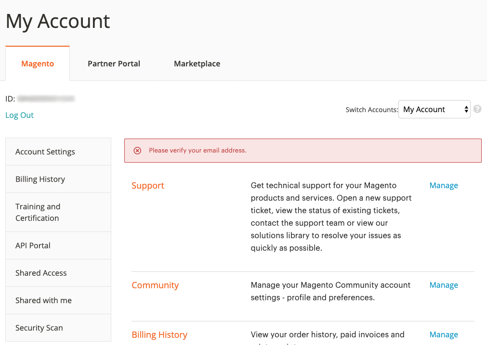

# Benutzerhandbuch zum Adobe Commerce Help Center

In diesem Handbuch erfahren Sie, wie Sie ein Support-Ticket an die [Adobe Commerce Help Center](https://support.magento.com/hc/en-us) und gewähren freigegebenen Zugriff auf die Magento-Konten.

>[!NOTE]
>
>Der Knowledgebase-Teil des Adobe Commerce Help Center wurde in das Adobe Experience League-Portal migriert. Wenn Sie ein Support-Ticket erstellen, werden Ihnen neben anderen relevanten Adobe Commerce-Dokumentationen aus der Adobe Experience League entsprechende Knowledge Base-Artikel vorgeschlagen.

**Wichtige Aktualisierung:** 14. Oktober 2022

**[WAS IST DAS ADOBE COMMERCE HELP CENTER?](#what-is)**

**[SUPPORT-TICKETS](#support-tickets)**

* [Bei Help Center anmelden](#login)
* [Support-Ticket senden](#submit-ticket)

   * [Startseite von Help Center](#submit-ticket-help-center-start-page)
   * [Magento-Kontoseite](#submit-ticket-magento-account-page)
   * [Cloud-Konsole](#submit-ticket-magento-cloud-account-page)
   * [Informationen zum Support-Ticket](#info-in-support-ticket)
   * [Der Link &quot;Ticket senden&quot;wird nicht auf der Startseite des Adobe Commerce Help Center angezeigt](#no-submit-link)
   * [*&quot;Bitte überprüfen Sie Ihre E-Mail-Adresse&quot;*](#verify-email-address)
   * [Formular für die Übermittlung von Tickets: Der Händler wird nicht in der Dropdown-Liste &quot;Organisation&quot;angezeigt](#merchant-not-displayed)

* [Tickets verfolgen](#track-tickets)
* [Adobe Commerce P1-Hotline (Anmeldung erforderlich)](#P1-hotline)
* [Betriebsmodell für die gemeinsame Verantwortung von Adobe Commerce (Anmeldung erforderlich)](#shared-responsibility-operational-model)
* [Erläuterung der Support-Ticketfelder](#ticket-fields-explained)
* [Ticket-Status: Verarbeitung Ihrer Anfragen](#ticket-status)
* [Unterhaltung in Ihrem Ticket](#conversation-in-ticket)
* [Ticket lösen](#resolve-ticket)
* [Öffnen Sie ein Folgenachticket.](#follow-up)

**[FREIGEGEBENER ZUGRIFF: GEWÄHREN SIE ANDEREN BENUTZERN BERECHTIGUNGEN FÜR DEN ZUGRIFF AUF IHR KONTO.](#shared-access)**

* [Wer kann freigegebenen Zugriff gewähren?](#who-can-provide-shared-access)
* [Freigegebenen Zugriff gewähren](#provide-shared-access)
* [Freigegebenen Zugriff sperren (löschen)](#revoke-shared-access)

   * [Wie kann ich Benutzer löschen, denen der gemeinsame Zugriff über ein Cloud-Projekt gewährt wurde?](#remove-cloud-shared-access-users)

* [Zugriff auf freigegebene Konten (Konten wechseln)](#switch-accounts)
* [Fehlerbehebung bei freigegebenen Zugriffen](#troubleshooting-shared-access)

**[FAQ ZUR ABRECHNUNG FÜR ADOBE COMMERCE](#billing-faq)**

**[MAGENTO U IST JETZT TEIL VON ADOBE DIGITAL LERNDIENSTLEISTUNGEN](#magento-u)**

## WAS IST ADOBE COMMERCE HELP CENTER? {#what-is}

Die [Adobe Commerce Help Center](https://support.magento.com/hc/en-us) ist ein Support-Portal für Adobe Commerce, in dem qualifizierte Kunden Support-Tickets einreichen und verwalten können. Dort können Sie auch Artikel zur Fehlerbehebung lesen.

## SUPPORT-TICKETS {#support-tickets}

Das Adobe Commerce Ticketing System ermöglicht die Arbeit mit Support-Tickets, um die Probleme zu beheben, die bei der Arbeit mit Adobe Commerce auftreten - für alle Adobe Commerce-Produkte.

## BEI HELFE CENTER ANMELDEN {#login}

Durch die Anmeldung können Sie Fragen von Agenten zu Support-Tickets senden, aktualisieren und beantworten.

Gehen Sie wie folgt vor, um sich beim Adobe Commerce Help Center anzumelden:

1. Zugriff auf das Help Center unter <https://support.magento.com>.
1. Klicks **Anmelden** in der oberen rechten Ecke.

Melden Sie sich mit Ihren Magento-Kontoanmeldeinformationen an. Weitere Informationen finden Sie unter [Ihr Magento-Konto](https://experienceleague.adobe.com/docs/commerce-admin/start/commerce-account/commerce-account-create.html) in unserem Benutzerhandbuch.

### <strong>Support-Ticket senden</strong> {#submit-ticket}

Nach der erfolgreichen Anmeldung können Sie ein Support-Ticket über die Startseite des Help Center, Ihre Magento-Kontoseite und Ihre Magento Cloud-Kontoseite senden.

* Wenn Sie **Kontoinhaber** Gehen Sie wie folgt vor:
* Wenn Sie **Benutzer mit gemeinsamem Zugriff: Sie müssen zuerst zwischen Konten wechseln** [Zugriff auf freigegebene Konten (Konten wechseln)](#switch-accounts)und dann können Sie mit den folgenden Schritten fortfahren.

#### Startseite von Help Center {#submit-ticket-help-center-start-page}

Gehen Sie wie folgt vor, um über die Startseite des Adobe Commerce Help Center ein neues Support-Ticket zu senden:

1. Navigieren Sie zu [Adobe Commerce Help Center](https://support.magento.com/hc/en-us).
1. Klicks **Einreichen eines Tickets** oben rechts.

   {width="800"}

1. Füllen Sie die Felder aus.
1. Klicks **Einsenden**.

You **muss sich anmelden** über Ihr Magento-Konto zum Help Center gelangen, um ein Support-Ticket zu senden. Bis Sie angemeldet sind, [die **Einreichen eines Tickets** -Schaltfläche wird nicht angezeigt](#no-submit-link).

#### Magento-Kontoseite {#submit-ticket-magento-account-page}

Gehen Sie wie folgt vor, um über Ihre Magento-Kontoseite ein neues Support-Ticket zu senden:

1. Melden Sie sich bei Ihrem Magento-Konto an. Siehe [detaillierte Anweisungen](https://experienceleague.adobe.com/docs/commerce-admin/start/commerce-account/commerce-account-create.html?lang=en#create-a-commerce-account) in unserem Benutzerhandbuch.
1. Klicken Sie auf **Support** Registerkarte.

   {width="800"}

1. Die Startseite von Help Center wird für Sie geladen.
1. Klicks **Einreichen eines Tickets** in der oberen rechten Ecke.
1. Füllen Sie die Felder aus.
1. Klicks **Einsenden**.

#### Cloud-Konsole {#submit-ticket-magento-cloud-account-page}

Gehen Sie wie folgt vor, um über die Cloud Console ein neues Support-Ticket zu senden:

1. Melden Sie sich bei [Cloud-Konsole](https://console.adobecommerce.com).
1. Auswählen **[!UICONTROL Support]** im Benutzermenü.
1. Die **[!UICONTROL My Tickets]** Seite lädt.
1. Klicks **[!UICONTROL Submit a ticket]** in der oberen rechten Ecke.
1. Füllen Sie die Felder aus.
1. Klicks **Einsenden**.
1. Klicks **[!UICONTROL Submit]**.

#### Informationen zum Support-Ticket {#info-in-support-ticket}

Die mit einem roten Sternchen ( **\*** ), sind erforderlich und müssen ausgefüllt werden. Wenn Sie eines dieser Felder leer lassen, können Sie Ihr Ticket nicht senden.

Siehe [Erläuterung der Ticketfelder](#ticket-fields-explained) unten finden Sie weitere Informationen.

### Der Link &quot;Ticket senden&quot;wird nicht auf der Startseite des Adobe Commerce Help Center angezeigt {#no-submit-link}

#### Problem

Sie greifen auf das Adobe Commerce Help Center zu und möchten eine Support-Anfrage senden, aber die **Einreichen eines Tickets** -Link nicht auf der Startseite von Help Center angezeigt.

#### Ursache

Eine der folgenden Ursachen könnte sein:

* Sie haben sich nicht beim Help Center angemeldet.
* Wenn Sie zum ersten Mal freigegebenen Zugriff verwenden, haben Sie nicht die erforderlichen Schritte ausgeführt, um sicherzustellen, dass das Adobe Commerce Help Center ordnungsgemäß über den SSO-Aufruf von Magento.com konfiguriert ist.
* Ihr Konto hat keinen Anspruch auf Adobe Commerce-Support (z. B. Sie sind kein zahlender Commerce-Kunde oder Open Source-Kunde).

#### Lösung

[Bei Help Center anmelden](/help/help-center-guide/help-center/magento-help-center-user-guide.md#provide-shared-access).

Die **Einreichen eines Tickets** wird nur für Kunden angezeigt, deren E-Mail mit einer gültigen Supportvereinbarung verknüpft ist.

#### Freigegebenes Zugriffskonto verwenden

Um das Konto für freigegebenen Zugriff zum Senden von Support-Tickets verwenden zu können, müssen Sie Folgendes ausführen (dies muss nur einmal durchgeführt werden):

1. Nach Erhalt [freigegebener Zugriff](https://support.magento.com/hc/en-us/articles/360052444712#who-can-provide-shared-access)Melden Sie sich bei Ihrem [Magento Account auf der magento.com Website](https://account.magento.com/).
1. Im **Wechseln von Konten** in der oberen rechten Ecke das freigegebene Zugriffskonto auswählen.
1. Klicken Sie auf **Support** im linken Bereich. Dadurch wird sichergestellt, dass das Adobe Commerce Help Center über den SSO-Aufruf von Magento.com zum Adobe Commerce Help Center ordnungsgemäß konfiguriert ist.

#### Sie können die **Einreichen eines Tickets** link

Wenn Sie **Freigegebene Konten** unter **Wechseln von Konten** Dropdown-Liste. Sie arbeiten jedoch für einen Client, der über eine Adobe Commerce-Lizenz verfügt, und bitten Sie ihn darum, Ihnen freigegebenen Zugriff zu gewähren. Weitere Informationen finden Sie unter [Freigegebenen Zugriff auf Magento-Konto gewähren](/help/help-center-guide/help-center/magento-help-center-user-guide.md#provide-shared-access).

Wenn Sie Adobe Commerce-Lizenzinhaber sind, vergewissern Sie sich bitte, dass Sie keine Rechnung mit **Ausstehende Zahlung** -Status. Förderansprüche werden automatisch entsprechend dem Status der Rechnungszahlung gewährt oder widerrufen.

Überprüfen des Zahlungsstatus:

1. Anmelden bei [magento.com](https://support.magento.com/).
1. Klicken Sie auf **Rechnungsverlauf** auf der linken Seite.
1. Wenn Sie **do** eine Rechnung mit **Ausstehende Zahlung** Status, **Wenden Sie sich an Ihr Adobe Account-Team** , um das Zahlungsproblem zu lösen.

Wir unterstützen nur Lizenzinhaber und Konten von Adobe Commerce, die über einen gemeinsamen Zugriff auf ein Konto mit einer Adobe Commerce-Lizenz verfügen. Wenn Sie Unterstützung für die Bearbeitung der Magento Open Source benötigen, nutzen Sie diese technischen Ressourcen zur Selbsthilfe:

* [Adobe Commerce Help Center](https://support.magento.com/)
* [Dokumentation für Adobe Commerce-Entwickler](https://developer.adobe.com/commerce/docs/)
* [Adobe Commerce-Dokumentationsressourcen](https://experienceleague.adobe.com/docs/commerce.html)
* [Magento-Foren](https://community.magento.com/?_ga=2.99592990.1084044056.1559046120-720752292.1551793747)

Wenn Sie Probleme haben, sich bei Ihrem Konto anzumelden, oder der Ansicht sind, dass der Freigabezugriff ordnungsgemäß eingerichtet wurde, Sie jedoch trotzdem nicht sehen können **Einreichen eines Tickets** Schaltfläche, bitte E-Mail [Anmeldungsprobleme beim Help Center](mailto:grp-magento-helpcenterloginissues@adobe.com)und wir werden Ihre Kontoeinstellungen gerne überprüfen und Berechtigungen unterstützen.

>[!NOTE]
>
>Senden Sie keine E-Mail, wenn Sie ein Ticket senden können, sondern haben stattdessen ein Problem beim Zugriff auf Ihr Cloud-Projekt. Bitte senden Sie das Ticket für dieses Problem über die regulären Kanäle.

### Fehler &quot;Bitte überprüfen Sie Ihre E-Mail-Adresse&quot; auf der Magento-Kontoseite {#verify-email-address}

Sie können kein Support-Ticket senden, wenn Sie die *Bitte überprüfen Sie Ihre E-Mail-Adresse* -Fehler ähnlich dem folgenden auf der [Magento-Kontoseite](https://account.magento.com/).

{width="800"}

Die Lösung besteht darin, Ihre E-Mail-Adresse zu validieren:

1. Klicken Sie auf **E-Mail validieren** Schaltfläche unter dem Feld E-Mail auf der [Kontoinformationen bearbeiten](https://account.magento.com/customer/account/edit/) -Seite ähnlich der unten aufgeführten.

   {width="800"}

1. Klicken Sie auf **E-Mail validieren** -Schaltfläche eine E-Mail an die für dieses Magento-Konto registrierte E-Mail-Adresse mit einem Link zur Validierung der E-Mail-Adresse.
1. Klicken Sie auf den E-Mail-Validierungslink, um Ihre E-Mail zu validieren und dieses Problem zu beheben.
1. Wenn Sie keine E-Mail mit einem E-Mail-Validierungslink erhalten, wenden Sie sich bitte per E-Mail an [Anmeldungsprobleme beim Help Center](mailto:grp-magento-helpcenterloginissues@adobe.com) und geben an, dass Sie Ihre E-Mail-Adresse nicht überprüfen können.

>[!NOTE]
>
>Dies gilt nur für den E-Mail-Validierungslink von https://account.magento.com (Magento-Kontoseite).

### Formular für die Übermittlung von Tickets: Der Händler wird nicht in der Dropdown-Liste &quot;Organisation&quot;angezeigt {#merchant-not-displayed}

#### Problem

Voraussetzungen: Sie verfügen über ein von einem Händler genehmigtes Konto für den gemeinsamen Zugriff.

Zu reproduzierende Schritte:

1. Melden Sie sich über Ihr freigegebenes Konto beim Help Center an.
1. Klicken Sie auf **Einreichen eines Tickets** -Link. Das Formular für die Übermittlung des Tickets wird geöffnet.
1. Erweitern Sie die **Einrichtung** Dropdown-Feld zur Auswahl des Händlers.

Erwartetes Ergebnis:

Der Händler, der dem freigegebenen Konto entspricht, wird im **Einrichtung** Optionen.

Tatsächliches Ergebnis:

Der Händler, der dem verwendeten freigegebenen Konto entspricht, ist im **Einrichtung** Optionen.

#### Lösung

Nachdem Sie vom Händler freigegebenen Zugriff erhalten haben, müssen Sie die folgenden Schritte ausführen (nur einmal):

1. Melden Sie sich bei Ihrer [Magento Account auf der magento.com Website](https://account.magento.com/).
1. Im **Wechseln von Konten** in der oberen rechten Ecke das Freigabekonto ein.
1. Klicken Sie auf **Support** im linken Bereich. Dadurch wird sichergestellt, dass das Adobe Commerce Help Center über den SSO-Aufruf von Magento.com zum Adobe Commerce Help Center ordnungsgemäß konfiguriert ist.

Wenn Sie dies bereits getan haben, überprüfen Sie, ob Ihnen die Genehmigung erteilt wurde. *freigegebener Zugriff von mehr als einem Händler* durch Klicken auf die [[!UICONTROL Shared with me] Registerkarte Ihres Kontos](https://account.magento.com/grantor/manage/shared/):
* Wenn nur eine [!UICONTROL Share Name] aufgelistet ist, d. h., Sie wurden nur von einem Händler bewilligt, *Sie sehen keine [!UICONTROL Organization] Dropdown*.
* Wenn mehrere [!UICONTROL Share Names]kann es sein, dass die Stützungsberechtigungen des Händlers abgelaufen sind, da ihre Lizenz aufgrund von Zahlungsproblemen zuvor widerrufen wurde.

### Tickets verfolgen {#track-tickets}

Ihre Tickets sind die, die Sie:

* persönlich
* wurden über einen CC (CO2-Kopie) als Beobachter hinzugefügt

#### Tickets anzeigen

Um alle Tickets aufzulisten, klicken Sie auf Ihr Profilmenü (obere rechte Ecke) auf der Startseite des Help-Center und wählen Sie **Meine Tickets**.

{width-&quot;800&quot;}

Um zwischen Ihren Tickets und den Tickets zu wechseln, die Sie bereits aktiviert haben, klicken Sie auf den entsprechenden Tab:

* **Meine Tickets**
* **Eintrittskarten, die ich mitnehmen kann**
* **OrganisationsTickets** (verfügbar, wenn Ihr Konto mit mehreren Organisationen verknüpft ist)

Klicken Sie zum Sortieren von Tickets auf **Erstellt** oder **Letzte Aktivität** Spaltenüberschriften.

#### Tickets suchen

Um Tickets zu finden, geben Sie Ihre Suchabfrage in die **Tickets suchen** field und press *Eingabe* auf Ihrer Tastatur. Auswählen [Status](#ticket-status) für zusätzliche Filtermöglichkeiten.

#### Tickets für Organisationen

Sie können den Support-Tickets folgen, die von den Mitgliedern Ihres Unternehmens eingereicht wurden.

Wenn Sie Ihren Organisations-Tickets folgen, gehen Sie wie folgt vor:

* kann Tickets innerhalb der **OrganisationsTickets** tab
* erhalten E-Mail-Benachrichtigungen, wenn die neuen Tickets gesendet oder die vorhandenen Tickets geändert werden

So folgen/folgen Sie den Tickets für eine Organisation:

1. Navigieren Sie zu **Meine Tickets** > **OrganisationsTickets** Registerkarte.
1. Wählen Sie eine Organisation im Menü aus und klicken Sie auf **Folgen/Unfolgen**.

### Adobe Commerce P1-Hotline {#P1-hotline}

**Anmeldung erforderlich** , um auf die [Adobe Commerce P1-Hotline](https://experienceleague.adobe.com/docs/commerce-knowledge-base/kb/how-to/adobe-commerce-p1-notification-hotline.html) -Artikel, der die P1-Hotline-Nummern für Adobe Commerce bereitstellt, wenn Sie während eines P1-Vorfalls Hilfe benötigen, und erklärt, welche Informationen bereitgestellt werden sollen.

### Betriebsmodell für gemeinsame Verantwortung von Adobe Commerce {#shared-responsibility-operational-model}

**Anmeldung erforderlich** , um auf die [Betriebsmodell für gemeinsame Verantwortung von Adobe Commerce](https://support.magento.com/hc/en-us/articles/4407700678669) Dieser Artikel soll die operativen Zuständigkeiten rund um die Adobe Commerce in Bezug auf unser Infrastrukturangebot klären.

### Erläuterung der Support-Ticketfelder {#ticket-fields-explained}

#### Betroffene URL

Link zur Umgebung, in der das Adobe Commerce-Supportteam Ihr Problem sehen kann. Starten Sie die URL mit &quot;http://&quot; oder &quot;https://&quot;.

#### Anhänge

Fügen Sie Protokolle, Screenshots, Videoaufzeichnungen oder andere Medien an, die Ihr Problem besser illustrieren könnten.

#### Backoffice-URL (nur MOM)

URL muss mit &quot;https://&quot;beginnen. Sie weist normalerweise folgendes Format auf: Handelsname +&quot;.mcom.magento.com/admin/login&quot;, Beispiel: &quot;https://luma.mcom.magento.com/admin/login&quot;.

Sie können auch den direkten Link zu Ihrem Problem setzen.

#### CC

E-Mails der Personen, denen Sie Ihr Ticket folgen möchten (z. B. *first@e.mail*).

Sie können E-Mails von Personen hinzufügen, die kein Magento-Konto oder kein Zendesk-Konto haben; diese Personen können weiterhin in Ihrem Ticket zur Unterhaltung beitragen.

So fügen Sie CC mehrere E-Mails hinzu:

>[!NOTE]
>
>Der Benutzer in CC: muss über ein vorhandenes Konto unter https://account.magento.com verfügen. Ist dies nicht der Fall, muss zunächst ein Konto unter https://account.adobe.com erstellt und mit diesem Konto bei https://account.magento.com angemeldet werden.

1. Geben Sie die E-Mail ein.
1. Presse *Leerzeichen* auf Ihrer Tastatur, um die eingegebene E-Mail zu speichern. Die E-Mail wird in einem grauen Rahmen angezeigt.\
   
1. Geben Sie die nächste E-Mail ein.
1. Speichern Sie alle anderen E-Mails, indem Sie *Leerzeichen*.

Um E-Mails aus CC zu löschen, klicken Sie auf **x** in einer gerahmten E-Mail.

#### Produkt

Wählen Sie den Typ des Adobe Commerce-Produkts aus, mit dem Sie arbeiten:

* Adobe Commerce: Die **[!UICONTROL Implementation Type]** wird angezeigt, nachdem Sie diese Option ausgewählt haben (Einzelheiten finden Sie unten)
* Magento Order Management
* Adobe Commerce-Berichterstellung: nicht eingeschlossen [Fortschrittliche Berichterstellung](https://experienceleague.adobe.com/docs/commerce-admin/config/general/advanced-reporting.html)
* Adobe Commerce [Zahlungsdienste](https://experienceleague.adobe.com/docs/commerce-merchant-services/payment-services/overview.html)
* Adobe Commerce Services: [Kanal-Manager](https://experienceleague.adobe.com/docs/commerce-channels/channel-manager/guide-overview.html) only

#### Implementierungstyp

Dieses Feld wird erst angezeigt, nachdem Sie ausgewählt haben **[!UICONTROL Product]** = *Adobe Commerce*

Geben Sie Ihre Implementierungsmethode an:

* Cloud: Wählen Sie diese Option nur aus, wenn Sie mit Adobe Commerce on Cloud Infrastructure arbeiten.
* Vor Ort: *Alle selbstgehosteten Instanzen sowie [AWS] Cloud-basiertes Hosting* (ohne Adobe Commerce on Cloud)

#### Cloud-Projekt-URL

Geben Sie die URL für das Cloud Console-Projekt an, z. B. `https://console.adobecommerce.com/<owner-user-name>/<project-ID>`.

Eine weitere Methode zum Abrufen der Projekt-URL lautet:

1. Melden Sie sich bei [Cloud-Konsole](https://console.adobecommerce.com).
1. Klicken Sie auf das entsprechende Projekt.
1. Kopieren Sie die URL.

#### Kontaktgrund

Die Kontaktgründe variieren je nach Produkt. Wählen Sie aus, welcher Kontaktgrund für Ihre Symptome am besten geeignet ist. Siehe Abschnitt [Beschreibungen der Gründe für Support-Tickets](/help/faq/general/support-ticket-contact-reason-descriptions.md) Artikel , um mehr darüber zu erfahren, welchen Kontaktgrund Sie auswählen sollten.

#### Adobe Commerce-Umgebungs-ID

Dieses Feld wird erst angezeigt, nachdem Sie ausgewählt haben **[!UICONTROL Contact Reason]** = *Adobe Commerce Cloud-Anwendung*, gefolgt von **Adobe Commerce-Anwendungskontaktgrund** = *[!DNL Live Search]*.
Navigieren Sie zu **[!UICONTROL System]** > **[!UICONTROL Services]** > **[!UICONTROL Commerce Services Connector]** > **[!UICONTROL SaaS Identifier]** und stellen Sie die *[!UICONTROL Data Space ID]*.

#### (Daten) Integrationstyp (nur Adobe Commerce Reporting)

Wählen Sie den Integrationstyp aus, den Sie in Adobe Commerce Reporting verwenden. Dies hilft unseren Ingenieuren, Ihr Problem effizienter zu lösen.

#### Beschreibung

Geben Sie einen Überblick über Ihr Problem mit so vielen Details, wie Sie für vernünftig gehalten werden.

Bitte machen Sie genaue Angaben und Schritte zur Reproduktion (mit Ausnahme der lokalen Adobe Commerce-Infrastruktur und der Cloud-Infrastruktur, in der eine separate [Zu reproduzierende Schritte](#steps) -Feld) und Symptome Ihres Problems oder Ihrer Anfrage. Stellen Sie sicher, dass Sie alle betroffenen SKUs, relevanten Datenpunkte und andere relevante Links einbeziehen.

#### Umgebung (Adobe Commerce für Cloud-Infrastruktur, Adobe Commerce vor Ort, Adobe Commerce Reporting und Versand)

Wählen Sie die **Umgebungstyp** auf der Sie das Problem haben:

* Entwicklung (**Integrationsverzweigungen**)
* Staging
* Produktion

Weitere Informationen zu Adobe Commerce in Cloud-Infrastrukturumgebungen in [Pro Architektur](https://experienceleague.adobe.com/docs/commerce-cloud-service/user-guide/architecture/pro-architecture.html) in unserem Benutzerhandbuch.

#### Anzahl der betroffenen Bestellungen (nur MOM)

Wählen Sie den betroffenen Auftragsbereich aus.

Dies ist eine Dropdown-Liste und gilt nur für das Bestellverwaltungsprodukt.

#### Einrichtung

Geben Sie die Organisation an, mit der Ihr Ticket verknüpft werden soll - falls Sie mit mehreren Organisationen arbeiten.

Dieses Feld wird angezeigt, wenn Ihr Konto mit mehr als einer Organisation verknüpft ist.

>[!WARNING]
>
>Sie müssen sicherstellen, dass Sie die richtige Organisation ausgewählt haben. Drittanbieter, die nicht mit der Organisation verbunden sind, können potenziell vertrauliche und geschützte Informationen anzeigen, wenn Sie die falsche Organisation auswählen.

>[!NOTE]
>
>Die Organisation kann geändert werden, nachdem das Ticket gesendet wurde. Führen Sie diese Schritte aus, um die Organisation zu ändern.
>
>1. Gehen Sie zur rechten Spalte des Tickets.
>1. Suchen Sie das Dropdown-Menü für verfügbare Organisationen.
>1. Wählen Sie die entsprechende Organisation aus.
>
>

Darüber hinaus würde es uns dadurch möglich sein, ähnliche/duplizierte/verwandte Tickets, die für diese Organisation in der Vergangenheit eingereicht wurden, schnell miteinander zu vergleichen und Hinweise zu identifizieren, die bei der Untersuchung und Lösung des aktuellen Tickets hilfreich sein könnten.

Wenn Sie über gemeinsamen Zugriff für mehrere Organisationen verfügen, dieses Feld jedoch nicht verfügbar ist, finden Sie weitere Informationen unter [Formular für die Übermittlung von Tickets: Der Händler wird nicht in der Dropdown-Liste &quot;Organisation&quot;angezeigt](https://experienceleague.adobe.com/docs/commerce-knowledge-base/kb/help-center-guide/magento-help-center-user-guide.html#merchant-not-displayed)

#### Name des Partners (Name des Händlers)

Für Händler: **Partnername** den Namen der Entwicklungsorganisation (Adobe Commerce) [Technologiepartner](https://partners.magento.com/portal/directory/?&amp;partner_type=6) oder [Lösungspartner](https://partners.magento.com/portal/directory/?&amp;partner_type=1)), die an der Entwicklung Ihres Adobe Commerce-Stores beteiligt sind.

Für Partner: **Merchant Name** ist der Name Ihres Kunden.

#### Projekt-URL (nur Commerce Cloud)

Link zur [Cloud-Konsole](https://experienceleague.adobe.com/docs/commerce-cloud-service/user-guide/project/overview.html).

#### Zu reproduzierende Schritte (nur Adobe Commerce vor Ort und Adobe Commerce auf Cloud-Infrastruktur)

Geben Sie genaue schrittweise Anweisungen, um Ihr Problem zu reproduzieren, einschließlich:

* Zu replizierende Schritte
* Erwartetes Ergebnis
* Tatsächliches Ergebnis

*Empfehlung:* Angenommen, Sie schreiben diese Schritte für jemanden, der weiß **nichts** über Adobe Commerce:

* Erwähnen Sie jeden Schritt, auch wenn er einfach und offensichtlich erscheint
* Verlassen Sie sich nicht auf die Annahme, dass Ihr Leser weiß, was Sie meinen

Schreiben Sie in einfacher Sprache mit kurzen Sätzen.

#### Betreff

Schließen Sie einen kurzen Überblick über Ihr Problem ein (z. B. *Fehler 404 auf allen Seiten* ).

**Vorgeschlagene Artikel:** Wenn Sie den Suchbegriff eingeben, wird eine Liste mit Adobe Commerce-Dokumentationsartikeln angezeigt, die möglicherweise mit Ihrem Problem in Zusammenhang stehen. Klicken Sie auf einen Artikel in der Liste, um ihn zu öffnen.

*Empfehlung:* Bitte beachten Sie die vorgeschlagenen Artikel sorgfältig. Sie können die Lösung enthalten, die Sie vom Adobe Commerce-Supportteam erwarten.

#### Version (nur Adobe Commerce On-Premise, Adobe Commerce on Cloud Infrastructure und Shipping)

Bitte wählen Sie die Adobe Commerce-Version aus, für die Sie Hilfe anfordern. Alle unterstützten Versionen von Adobe Commerce sind oben aufgeführt. Ununterstützte Versionen werden unten mit Klammern aufgeführt. Wenn Sie sich in der Migration befinden, wählen Sie die neueste Version aus, um sicherzustellen, dass Sie unterstützt werden.

Um die Version Ihrer Adobe Commerce (Cloud-Infrastruktur) zu finden, scrollen Sie nach unten [Cloud-Konsole](https://experienceleague.adobe.com/docs/commerce-cloud-service/user-guide/project/overview.html) und aktivieren Sie die untere Mitte des Fensters.

Wenn Sie [Elasticsearch](https://experienceleague.adobe.com/docs/commerce-operations/installation-guide/prerequisites/search-engine/overview.html) oder [OpenSearch](https://experienceleague.adobe.com/docs/commerce-operations/installation-guide/prerequisites/search-engine/aws-opensearch.html)nicht auswählen.

Um diese Informationen zu erhalten, navigieren Sie im Adobe Commerce-Admin zu **Marketing** > **Live Search** > **GraphQL Playground**, scrollen Sie nach unten zum Ende der Seite und klicken Sie auf **HTTP-HEADER**.

### Ticketstatus: Verarbeitung der Tickets {#ticket-status}

Ihr Ticket kann einen dieser drei Status haben.

#### **1. Öffnen**

Ihr Ticket wurde nicht gelöst und wird vom Adobe Commerce-Supportteam verarbeitet. Wenn Sie alle Informationen bereitgestellt haben, die von Ihnen in einem bestimmten Schritt des Gesprächs erwartet werden, und der nächste Schritt vom Adobe Commerce-Support durchgeführt werden muss, hat Ihr Ticket die Funktion **Öffnen** -Status.

#### **2. Abwarten der Antwort**

Der Adobe Commerce-Support erwartet Informationen von Ihnen.

In Ihrer Antwort können Sie zusätzliche technische Details zu Ihrem Problem angeben, Eskalationsdetails angeben oder angeben, ob die vom Adobe Commerce-Support angebotene Lösung für Ihr Problem hilfreich war. Stellen Sie sicher, dass Sie Ihre Antworten so schnell wie möglich bereitstellen, da der Adobe Commerce-Support mit der Verarbeitung Ihres Tickets nicht fortfahren kann, während es sich in der **Abwarten der Antwort** -Status.

Referenz: [Aktualisierung der Ticketlebenszyklus-Richtlinie durch Adobe Commerce](/help/help-center-guide/help-center/magento-support-ticket-lifecycle-policy-update.md) Artikel für Details zur Timing- und Benachrichtigungsrichtlinie.

#### **3. Gelöst**

Der Adobe Commerce-Support bietet eine Lösung für Ihr Problem, und Sie haben zugestimmt, dass dies hilfreich war. Du bist es, der das Ticket als **Gelöst**. Wenn das Problem erneut behoben wird, können Sie das Ticket erneut öffnen und seinen Status auf **Öffnen**.

### Unterhaltung in Ihrem Ticket {#conversation-in-ticket}

Die Unterhaltung in Ihrem Ticket vereint alle Kommentare, die von Ihnen oder dem Adobe Commerce-Supportteam geschrieben wurden. Kommentare werden von der neuesten (oben) zur frühesten (unten) angezeigt.

Gehen Sie wie folgt vor, um einen Kommentar zur Konversation hinzuzufügen:

1. Scrollen Sie zum unteren Ende Ihres Tickets.
1. Klicken Sie auf **Konversation hinzufügen** -Feld, um mit dem Schreiben zu beginnen.

   

1. Um eine Person zu Ihrem Kommentar hinzuzufügen, geben Sie die E-Mail im **CC** -Feld des Kommentarfelds.
   >[!NOTE]
   >
   >Der Benutzer in CC: muss über ein vorhandenes Konto unter https://account.magento.com verfügen. Ist dies nicht der Fall, muss zunächst ein Konto unter https://account.adobe.com erstellt und mit diesem Konto bei https://account.magento.com angemeldet werden.

   

1. Nachdem Sie mit Ihrem Kommentar fertig sind, klicken Sie auf **Einsenden**.

### Ticket lösen {#resolve-ticket}

Um Ihr Ticket zu lösen, klicken Sie auf **Als gelöst markieren** am Ende Ihres Tickets.

### Öffnen Sie ein Folgenachticket. {#follow-up}

Durch die Eröffnung eines Folgenachweises wird sichergestellt, dass das ursprüngliche Problem mit dem Folgeticket für die Kontinuität verknüpft ist.

Klicken Sie auf das Symbol &quot;*eine Weiterverfolgung erstellen*&quot; am unteren Ende des Tickets, zu dem Sie ein Follow-up erstellen möchten.

## FREIGEGEBENER ZUGRIFF: GEWÄHREN SIE ANDEREN BENUTZERN BERECHTIGUNGEN FÜR DEN ZUGRIFF AUF IHR KONTO. {#shared-access}

Sie können anderen Magento-Kontoinhabern eingeschränkten Zugriff auf Ihr Konto gewähren. Insbesondere wird mithilfe des **freigegebener Zugriff** -Funktion nutzen, können Sie vertrauenswürdigen Mitarbeitern und Dienstleistern die Verwendung Ihres Help-Center-Kontos ermöglichen, damit sie mit Ihren Support-Tickets arbeiten können.

Sie können freigegebenen Zugriff über Ihre Magento-Kontoseite unter [https://account.magento.com](https://account.magento.com/).

### Wer kann freigegebenen Zugriff gewähren? {#who-can-provide-shared-access}

Nur der Kontoinhaber (Primärer Kontoinhaber) mit den entsprechenden Berechtigungen kann anderen Benutzern freigegebenen Zugriff gewähren.

Die Verwaltung von Benutzern und deren Zugriff liegt in der Verantwortung des Kunden, insbesondere im Hinblick auf den gemeinsamen Zugriff. Daher kann das Adobe Commerce-Supportteam keinen freigegebenen Zugriff auf ein Magento-Konto für einen Kunden bereitstellen. Kunden wird empfohlen, Benutzer mit gemeinsamem Zugriff selbst hinzuzufügen, indem sie die [Magento-Kontoseite](https://account.magento.com/).

Benutzer, denen freigegebener Zugriff gewährt wurde, können diesen Zugriff nicht an andere Benutzer übertragen oder gewähren.

### Freigegebenen Zugriff gewähren {#provide-shared-access}

Siehe [Freigeben Ihres Kontos](https://experienceleague.adobe.com/docs/commerce-admin/start/commerce-account/commerce-account-share.html) im Adobe Commerce-Benutzerhandbuch für detaillierte Schritte zum Einrichten eines freigegebenen Kontos.

Nachdem ein neuer Benutzer freigegebenen Zugriff erhalten hat, sind die zugehörigen Informationen unter **Freigegebener Zugriff** > **Berechtigungen verwalten** auf Ihrer Magento-Kontoseite.

{width="800"}

### Freigegebenen Zugriff sperren (löschen) {#revoke-shared-access}

1. Melden Sie sich bei Ihrem Magento-Konto an unter [https://account.magento.com](https://account.magento.com/).
1. Wählen Sie im Bereich auf der linken Seite unter &quot;Freigegebener Zugriff&quot;die Option **Verwalten von Berechtigungen.**
1. Suchen Sie den Benutzer, von dem der freigegebene Zugriff widerrufen werden soll, und klicken Sie auf {width="25"} in der Zeile des Benutzers (**Aktionen** Spalte).
1. Klicks **Benutzer löschen** , um den Zugriff zu sperren, oder X in der oberen Ecke, um die Sperrung abzubrechen.

   {width="800"}

   Sie können den freigegebenen Zugriff auch über die **Bearbeiten** Menü:

1. Melden Sie sich bei Ihrem Magento-Konto an unter [https://account.magento.com](https://account.magento.com/).
1. Wählen Sie im Bereich auf der linken Seite unter &quot;Freigegebener Zugriff&quot;die Option **Verwalten von Berechtigungen.**
1. Suchen Sie den Benutzer, von dem der freigegebene Zugriff widerrufen werden soll, und klicken Sie auf **Bearbeiten** in der Zeile des Benutzers (**Aktionen** Spalte).
1. Klicks **Diesen Benutzer löschen** unten auf der Seite.
1. Klicken Sie im Bestätigungs-Popup auf **Benutzer löschen** , um den Zugriff zu sperren, oder X in der oberen Ecke, um die Sperrung abzubrechen.

### Wie kann ich Benutzer löschen, denen der gemeinsame Zugriff über ein Cloud-Projekt gewährt wurde? {#remove-cloud-shared-access-users}

<u>Betroffene Produkte und Versionen</u>

* Adobe Commerce Cloud (alle Versionen)

<u>Ursache</u>

Wenn Sie ein Adobe Commerce Cloud-Projekt durchgeführt haben/hatten und einen Benutzer zum Projekt hinzugefügt hatten, erhalten diese automatisch freigegebenen Zugriff auf die MAGE-ID des Projekteigentümers. Dies würde normalerweise im **[!UICONTROL Share Name]** Spalte anzeigen *Freigegebener Cloud-Zugriff über MAG[XYZ]*.

Wenn der DELETE-Link fehlt, bedeutet dies, dass der Freigegebene Zugriff automatisch über Commerce Cloud gewährt wurde.

<u>Lösung</u>

Es ist nicht möglich, die Liste der Benutzer mit gemeinsamem Zugriff mit dem Freigabenamen *Freigegebener Cloud-Zugriff über MAG[XYZ]* , wenn der freigegebene Zugriff nicht auf dieser Seite hinzugefügt/bereitgestellt wurde. Diese werden zu Informations-/Auditzwecken aufbewahrt.

Nachdem Sie die Berechtigungen für diese Benutzer mit gemeinsamem Zugriff widerrufen haben, haben sie diesen Zugriff jedoch nicht mehr.

1. Melden Sie sich bei Ihrem Magento-Konto an unter [https://account.magento.com](https://account.magento.com/).
1. Im Bedienfeld auf der linken Seite, unter *[!UICONTROL Shared Access]* auswählen **[!UICONTROL Manage Permissions]**.
1. Suchen Sie den Benutzer, von dem der freigegebene Zugriff widerrufen werden soll, und klicken Sie auf **[!UICONTROL Edit]** in der Zeile des Benutzers (*[!UICONTROL Actions]* Spalte).
1. Deaktivieren Sie alle Ressourcen unter *[!UICONTROL Grant Account Permissions]*.

{width="800"}

Weitere Informationen finden Sie im Abschnitt [Benutzerzugriff verwalten](https://experienceleague.adobe.com/docs/commerce-cloud-service/user-guide/project/user-access.html#manage-users-from-the-project-web-interface) Dokumentation zu unserem Commerce on Cloud Infrastructure Guide.

### Zugriff auf freigegebene Konten (Konten wechseln) {#switch-accounts}

Gehen Sie wie folgt vor, um den für Sie freigegebenen Zugriff zu verwenden:

1. Melden Sie sich bei Ihrem Magento-Konto an unter [https://account.magento.com](https://account.magento.com/).
1. Klicken Sie auf **Wechseln von Konten** und wählen Sie ein Konto.

   {width="800"}

Informationen dazu, welches Konto Sie derzeit verwenden (Ihr eigenes natives Konto oder freigegebener Zugriff), finden Sie unter **Wechseln von Konten** Menü: Es wird das aktive Konto angezeigt.

### Fehlerbehebung bei freigegebenen Zugriffen {#troubleshooting-shared-access}

Weitere Informationen finden Sie unter [Artikel zur Fehlerbehebung bei freigegebenen Zugriffen](/help/troubleshooting/miscellaneous/shared-access-troubleshooting.md) in unserer Wissensdatenbank.

## FAQ ZUR ABRECHNUNG FÜR ADOBE COMMERCE {#billing-faq}

Händler zahlen für unsere Dienstleistungen in der Regel per Kreditkartengeschäft (CC), und dies [Häufig gestellte Fragen zur Rechnungsstellung für Adobe Commerce](/help/faq/general/billing-faq-for-adobe-commerce.md) ist eine Ressource, die Ihnen bei der Zahlung Ihrer Rechnung hilft.

## MAGENTO U IST JETZT TEIL VON ADOBE DIGITAL LERNDIENSTLEISTUNGEN {#magento-u}

Magento U hat mit [Adobe Digital Learning Services (ADLS)](https://learning.adobe.com/).

Magento U Zendesk wird eingestellt.
