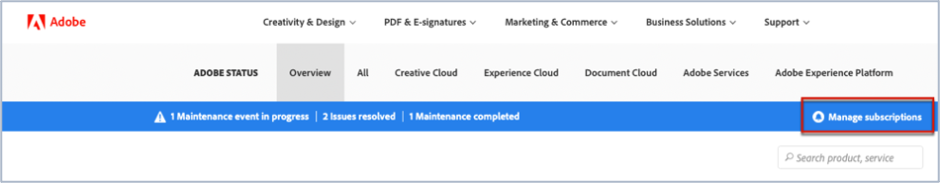
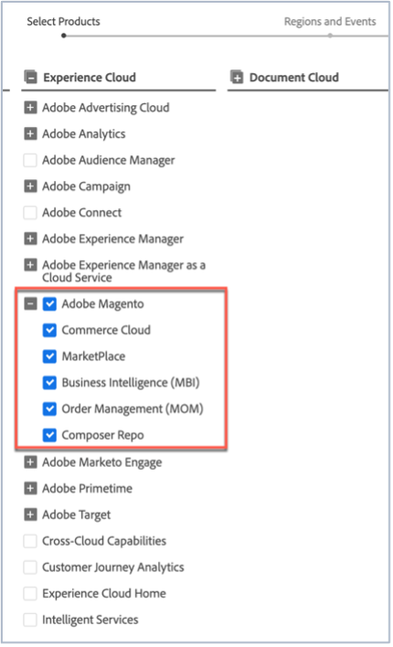

# Abonnieren von Adobe Commerce-Statusaktualisierungen

## Abonnieren von Adobe-Magento-Statusaktualisierungen

1. Zum Status [Adobe wechseln](https://status.adobe.com).
1. Klicken Sie **Anmelden**.
1. Melden Sie sich mit Ihren Adobe-Anmeldeinformationen an.
1. Wählen Sie **Firmen- oder Schulkonto** aus, falls die Option angezeigt wird.
1. Klicken Sie **oben rechts** den aufgelisteten Clouds auf „Abonnements verwalten“.

   
1. Klicken Sie **Abonnements erstellen**.

   
1. Es wird ein Fenster angezeigt, in dem Sie Benachrichtigungen für Produkte auswählen können. Er kann sich vom folgenden Screenshot unterscheiden, da einige Abonnements basierend auf Ihrem Profil vorausgewählt sein können oder weil Sie bereits einige Abonnements eingerichtet haben. Klicken Sie auf **Adobe Magento** unter Experience Cloud. Wenn Sie Benachrichtigungen für alle Adobe-Magento-Dienste erhalten möchten, aktivieren Sie das Kontrollkästchen Adobe-Magento. Dadurch werden automatisch alle Adobe-Magento-Services ausgewählt, die angezeigt werden, wenn der Adobe-Magento-Abschnitt erweitert wird (siehe Screenshot).

   

   Um einen Adobe-Magento-Service auszuwählen, deaktivieren Sie alternativ die Kontrollkästchen der anderen Adobe-Magento-Services. Wenn Sie beispielsweise nur Benachrichtigungen für Order Management (MOM) erhalten möchten, deaktivieren Sie die anderen Services, sodass nur das Kontrollkästchen Adobe-Magento und das Kontrollkästchen Order Management (MOM) aktiviert sind (siehe Screenshot).

   
1. Es wird ein Fenster angezeigt, in dem Sie Benachrichtigungen für Produkte für ausgewählte Regionen und Ereignisse auswählen können. Wenn Sie Benachrichtigungen für dieselben Regionen und Ereignistypen für alle Produkte erhalten möchten, aktivieren Sie das Kontrollkästchen **Regionen und Ereignistypen für alle Produkte auswählen** (siehe Screenshot).

   

   Wenn Sie mehrere Produkte (nicht nur Adobe-Magento) abonniert haben und jedes Produkt Benachrichtigungen für verschiedene Regionen und Ereignistypen enthalten soll, aktivieren Sie alternativ das Kontrollkästchen **Regionen und Ereignistypen nach Produkten anpassen** (siehe Screenshot).

   
1. Klicken Sie **Weiter**.
1. Das **Abonnementvoreinstellungen bestätigen** wird angezeigt. Vergewissern Sie sich, dass die Benachrichtigungen das widerspiegeln, was Sie möchten. Klicken Sie **Fertig**.

Nachdem Sie auf **Fertig** geklickt haben, sollten Sie eine Zusammenfassung Ihrer Produktabonnements und Ereignisabonnements sehen und Sie erhalten von Adobe eine E-Mail mit dem Titel „Abonnementstatus-E-Mail-Benachrichtigungen“. Wenn Sie sich abmelden und/oder Ihre Benachrichtigungseinstellungen ändern möchten, wiederholen Sie die Schritte 1 bis 9.
