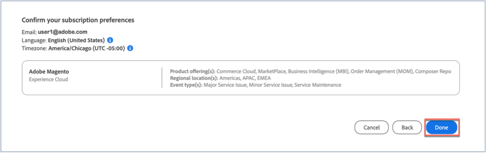

# Abonnieren von Statusaktualisierungen für Adobe Commerce

## Adobe Magento-Statusaktualisierungen abonnieren

1. Wechseln Sie zu [Adobe status](https://status.adobe.com).
1. Klicken Sie auf **Anmelden**.
1. Melden Sie sich mit Ihren Adobe-Anmeldedaten an.
1. Wählen Sie **Firmen- oder Schulkonto** aus, wenn die Option angezeigt wird.
1. Klicken Sie oben rechts über den aufgelisteten Clouds auf **Abonnements verwalten** .

   
1. Klicken Sie auf **Abonnements erstellen**.

   
1. Es wird ein Fenster angezeigt, in dem Sie Benachrichtigungen für Produkte auswählen können. Dieser Screenshot kann sich von dem folgenden unterscheiden, da einige Abonnements je nach Profil vorab ausgewählt werden können oder weil Sie bereits einige Abonnements eingerichtet haben. Klicken Sie unter Experience Cloud auf **Adobe Magento**. Wenn Sie Benachrichtigungen für alle Adobe Magento-Dienste erhalten möchten, aktivieren Sie das Kontrollkästchen Adobe-Magento . Dadurch werden automatisch alle Adobe-Magento-Dienste ausgewählt, die Sie sehen können, wenn der Adobe-Magento-Bereich erweitert wird (siehe Screenshot).

   

   Wenn Sie einen Adobe-Magento-Dienst auswählen möchten, deaktivieren Sie die Kontrollkästchen der anderen Adobe-Magento-Dienste. Wenn Sie beispielsweise nur Benachrichtigungen für Order Management (MOM) erhalten möchten, deaktivieren Sie die anderen Dienste, sodass nur das Kontrollkästchen Adobe-Magento und das Kontrollkästchen Order Management (MOM) aktiviert sind (siehe Screenshot).

   
1. Es wird ein Fenster angezeigt, in dem Sie Benachrichtigungen für Produkte für ausgewählte Regionen und Ereignisse auswählen können. Wenn Sie Benachrichtigungen für dieselben Regionen und Ereignistypen für alle Produkte erhalten möchten, aktivieren Sie das Kontrollkästchen **Regionen und Ereignistypen für alle Produkte auswählen** (siehe Screenshot).

   

   Wenn Sie mehrere Produkte abonniert haben (nicht nur Adobe-Magento) und möchten, dass jedes Produkt Benachrichtigungen für verschiedene Regionen und Ereignistypen erhält, aktivieren Sie das Kontrollkästchen **Regionen und Ereignistypen nach Produkten anpassen** (siehe Screenshot).

   
1. Klicken Sie auf **Weiter**.
1. Das Fenster **Bestätigen Ihrer Abonnementvoreinstellungen** wird angezeigt. Überprüfen Sie, ob die Benachrichtigungen Ihren Anforderungen entsprechen. Klicken Sie auf **Fertig**.

Nachdem Sie auf **Fertig** geklickt haben, sollten Sie eine Zusammenfassung Ihrer Produktabonnements und Ereignisabonnements sehen. Sie erhalten eine E-Mail mit dem Titel &quot;Abonnement für Status-E-Mail-Benachrichtigungen&quot;von Adobe. Wiederholen Sie die Schritte 1 bis 9, wenn Sie sich abmelden und/oder Ihre Benachrichtigungseinstellungen ändern möchten.
