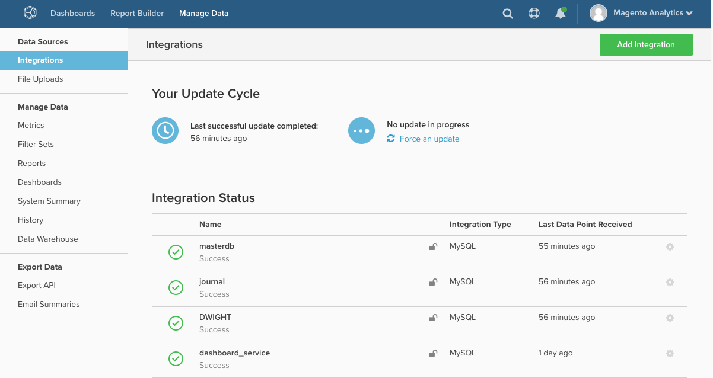

# MBI: Integrationen erneut authentifizieren

Dieser Artikel bietet Lösungen zum erneuten Autorisieren einer Integration, um Magento Business Intelligence (MBI) die erforderlichen Berechtigungen zum Abrufen von Daten von einem Drittanbieterdienst zu gewähren. Eine erneute Autorisierung ist erforderlich, wenn diese Berechtigungen widerrufen werden.

## Integration von Datenbank und SaaS

Eine Liste der Datenbankintegrationen und SaaS-Integrationen finden Sie unter [Externe Daten mithilfe einer Integration verbinden](https://docs.magento.com/mbi/data-analyst/importing-data/integrations/integrations.html) in unserer Entwicklerdokumentation. (Verwenden Sie beim Öffnen der Seite das Inhaltsverzeichnis auf der linken Seite zur Navigation).

## Haben Sie Verbindungsprobleme?

Durch die Autorisierung einer Integration erhält MBI die erforderlichen Berechtigungen zum Abrufen von Daten von einem Drittanbieterdienst. Eine erneute Autorisierung ist erforderlich, wenn diese Berechtigungen widerrufen werden.

Dies kann aus verschiedenen Gründen geschehen:

* ein Problem mit dem Drittanbieterdienst
* Gültigkeit des Authentifizierungstokens
* eine Änderung an Ihrem Verwaltungskonto
* oder ein internes Problem innerhalb des MBI

Der Status aller Integrationen befindet sich auf der Seite Integrationen ( **Daten verwalten > Integrationen** ):

Um sich erneut zu authentifizieren, müssen Sie möglicherweise Ihre Kontoanmeldeinformationen erneut eingeben. In einigen Fällen müssen Sie möglicherweise neue API-Schlüssel für die Problemintegration generieren. Klicken Sie auf den Namen der Problemintegration, um den Neuautorisierungsprozess zu starten.

Wenn das Problem weiterhin besteht, bitte [Support-Ticket einreichen](/help/help-center-guide/help-center/magento-help-center-user-guide.md#submit-ticket).
