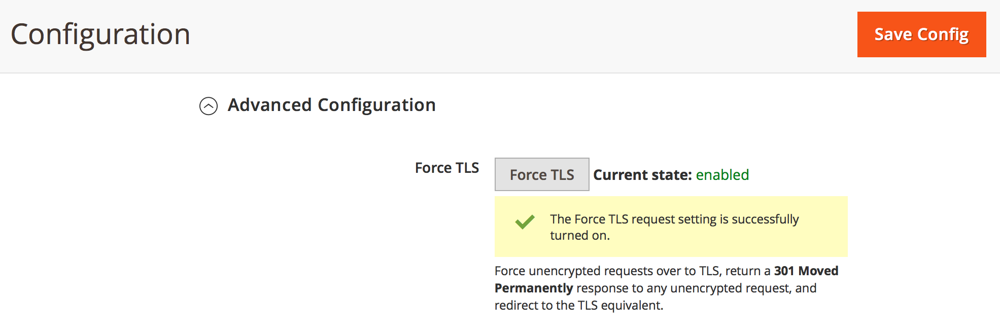

# Umleiten von HTTP zu HTTPS für alle Seiten in Adobe Commerce auf Cloud-Infrastrukturen (TLS erzwingen)

Aktivieren Sie im Commerce Admin die **Force TLS**-Funktion von Fastly, um die globale HTTP-zu-HTTPS-Umleitung für alle Seiten Ihrer Adobe Commerce im Cloud-Infrastrukturspeicher zu aktivieren.

Dieser Artikel enthält [Schritte](#steps) einen schnellen Überblick über die TLS-Erzwingungsfunktion, die betroffenen Versionen und Links zur zugehörigen Dokumentation.

## Schritte {#steps}

### Schritt 1: Konfigurieren sicherer URLs {#step-1-configure-secure-urls}

In diesem Schritt definieren wir die sicheren URLs für den Store. Wenn dies bereits geschehen ist, fahren Sie mit [Schritt 2: TLS erzwingen](#step-2-enable-force-tls) fort.

1. Melden Sie sich beim Commerce Admin an.
1. Navigieren Sie zu **Stores** > **Konfiguration** > **Allgemein** > **Web**.
1. Erweitern Sie den Abschnitt **Basis-URLs (sicher**.    
1. Geben Sie im Feld **Sichere Basis** URL die HTTPS-URL Ihres Stores an.
1. Legen Sie die Einstellungen **Sichere URLs für Storefront verwenden** und **Sichere URLs für Admin verwenden** auf **Ja** fest.    
1. Klicken **oben rechts auf** Konfiguration speichern“, um Änderungen anzuwenden.

**Verwandte Dokumentation in unserem Benutzerhandbuch:**   [URLs speichern](https://experienceleague.adobe.com/de/docs/commerce-admin/stores-sales/site-store/store-urls).

### Schritt 2: TLS erzwingen aktivieren {#step-2-enable-force-tls}

1. Navigieren Sie in der Commerce Admin zu **Stores** > **Configuration** > **Advanced** > **System**.
1. Erweitern Sie den **Vollständiger Seitencache**-Abschnitt, dann **Fastly Configuration** und dann **Advanced Configuration**.
1. Klicken Sie auf die **TLS erzwingen**-Schaltfläche.    
1. Klicken Sie im angezeigten Dialogfeld auf **Hochladen**.    
1. Stellen Sie nach dem Schließen des Dialogfelds sicher, dass der aktuelle Status von TLS erzwingen als **aktiviert“ angezeigt**.    

**Verwandte Fastly-Dokumentation:**   [TLS-Handbuch erzwingen](https://github.com/fastly/fastly-magento2/blob/master/Documentation/Guides/FORCE-TLS.md) für Adobe Commerce 2.

## Über TLS erzwingen

TLS (Transport Layer Security) ist ein Protokoll für sichere HTTP-Verbindungen, das sein weniger sicheres Vorgängerprotokoll, das SSL-Protokoll (Secure Socket Layer), ersetzt.

Mit der Force TLS-Funktion von Fastly können Sie alle eingehenden unverschlüsselten Anfragen für Ihre Website-Seiten an TLS erzwingen.

&#x200B;>>
Es funktioniert durch Rückgabe einer *301 Moved Permanently*-Antwort auf jede unverschlüsselte Anfrage, die zum TLS-Äquivalent umleitet. Wenn Sie beispielsweise eine Anfrage für *http://www.example.com/foo.jpeg* stellen, leiten Sie diese an *https://www.example.com/foo.jpeg* weiter.

[Sicherung der Kommunikation](https://docs.fastly.com/guides/securing-communications/) (Fastly-Dokumentation)

## Betroffene Versionen

* **Adobe Commerce auf Cloud-Infrastruktur:**
   * Version: 2.1.4 und höher
   * Pläne: Adobe Commerce auf Cloud-Infrastruktur Starter-Planarchitektur und Adobe Commerce auf Cloud-Infrastruktur Pro-Planarchitektur (einschließlich Pro Legacy)
* **Fastly:** 1.2.4

## Keine Änderungen in routes.yaml erforderlich

Um die HTTP-zu-HTTPS-Umleitung auf **allen**-Seiten Ihres Stores zu aktivieren, müssen Sie die Seiten nicht zur `routes.yaml`-Konfigurationsdatei hinzufügen. Es reicht aus, TLS global für Ihren gesamten Store zu erzwingen (mit der Commerce-Admin).

## Verwandte Fastly-Dokumentation

* [TLS-Handbuch für Adobe Commerce 2 erzwingen](https://github.com/fastly/fastly-magento2/blob/master/Documentation/Guides/FORCE-TLS.md)
* [Erzwingen einer TLS-Umleitung](https://docs.fastly.com/guides/securing-communications/forcing-a-tls-redirect)
* [Sichern der Kommunikation](https://docs.fastly.com/guides/securing-communications/)
