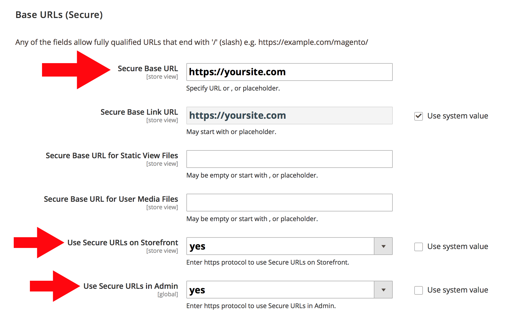

# Umleiten von HTTP zu HTTPS für alle Seiten in Adobe Commerce in der Cloud-Infrastruktur (TLS erzwingen)

Aktivieren Sie die **TLS erzwingen** -Funktion in Commerce Admin verwenden, um die globale HTTP- zu HTTPS-Umleitung für alle Seiten Ihrer Adobe Commerce im Cloud-Infrastrukturspeicher zu aktivieren.

Dieser Artikel enthält detaillierte Informationen [Schritte](#steps)ein kurzer Überblick über die Funktion &quot;TLS erzwingen&quot;, die betroffenen Versionen und Links zur zugehörigen Dokumentation.

## Schritte {#steps}

### Schritt 1: Sichere URLs konfigurieren {#step-1-configure-secure-urls}

In diesem Schritt definieren wir die sicheren URLs für den Store. Wenn das bereits geschehen ist, gehen Sie zu [Schritt 2: TLS erzwingen aktivieren](#step-2-enable-force-tls).

1. Melden Sie sich bei Commerce Admin an.
1. Navigieren Sie zu **Stores** > **Konfiguration** > **Allgemein** > **Web**.
1. Erweitern Sie die **Basis-URLs (sicher)** Abschnitt.    
1. Im **Sichere Basis-URL** Geben Sie die HTTPS-URL Ihres Stores an.
1. Legen Sie die **Verwenden sicherer URLs auf der Storefront** und **Verwenden sicherer URLs in Admin** Einstellungen zu **Ja**.    
1. Klicks **Konfiguration speichern** in der oberen rechten Ecke, um Änderungen anzuwenden.

**Weitere Informationen finden Sie in unserem Benutzerhandbuch:**   [Store-URLs](https://docs.magento.com/m2/ee/user_guide/stores/store-urls.html).

### Schritt 2: TLS erzwingen aktivieren {#step-2-enable-force-tls}

1. Navigieren Sie in Commerce Admin zu **Stores** > **Konfiguration** > **Erweitert** > **System**.
1. Erweitern Sie die **Vollständiger Seiten-Cache** Abschnitt, dann **Schnelle Konfiguration**, dann **Erweiterte Konfiguration**.
1. Klicken Sie auf **TLS erzwingen** Schaltfläche.    
1. Klicken Sie im angezeigten Dialogfeld auf **Hochladen**.    
1. Stellen Sie nach dem Schließen des Dialogfelds sicher, dass der aktuelle Status TLS erzwingen als **enabled**.    

**Verwandte Fastly-Dokumentation:**   [TLS-Handbuch erzwingen](https://github.com/fastly/fastly-magento2/blob/master/Documentation/Guides/FORCE-TLS.md) für Adobe Commerce 2.

## Über TLS erzwingen

TLS (Transport Layer Security) ist ein Protokoll für sichere HTTP-Verbindungen, das seinen weniger sicheren Vorgänger ersetzt - das SSL-Protokoll (Secure Socket Layer).

Mit der Funktion TLS erzwingen von Fastly können Sie alle eingehenden unverschlüsselten Anfragen für Ihre Siteseiten zu TLS zwingen.

>>
Es funktioniert durch Rückgabe einer *301 Dauerhaft verschoben* Antwort auf eine nicht verschlüsselte Anforderung, die zum TLS-Äquivalent umleitet. Angenommen, Sie stellen eine Anfrage an *http://www.example.com/foo.jpeg* würde umleiten zu *https://www.example.com/foo.jpeg*.

[Sicherheit der Kommunikation](https://docs.fastly.com/guides/securing-communications/) (Fastly-Dokumentation)

## Betroffene Versionen

* **Adobe Commerce über Cloud-Infrastruktur:**
   * Version: 2.1.4 und höher
   * Pläne: Adobe Commerce zur Starter-Planarchitektur der Cloud-Infrastruktur und Adobe Commerce zur Cloud Infrastructure Pro-Planarchitektur (einschließlich Pro Legacy)
* **Fastly:** 1.2.4

## Keine Änderungen erforderlich in routes.yaml

So aktivieren Sie die HTTP-/HTTPS-Umleitung auf **all** Seiten Ihres Stores, müssen Sie die Seiten nicht zum `routes.yaml` Konfigurationsdatei: Die globale Aktivierung von TLS erzwingen für Ihren gesamten Store (unter Verwendung von Commerce Admin) reicht aus.

## Verwandte Schnelldokumentation

* [TLS-Handbuch für Adobe Commerce 2 erzwingen](https://github.com/fastly/fastly-magento2/blob/master/Documentation/Guides/FORCE-TLS.md)
* [Erzwingen einer TLS-Umleitung](https://docs.fastly.com/guides/securing-communications/forcing-a-tls-redirect)
* [Sicherheit der Kommunikation](https://docs.fastly.com/guides/securing-communications/)
