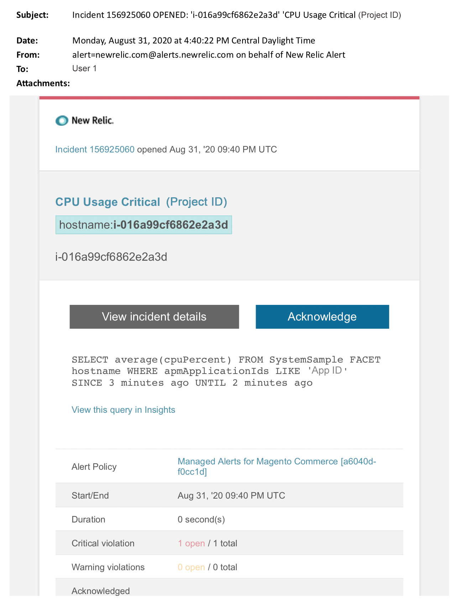

# Verwaltete Warnhinweise zu Adobe Commerce: CPU-kritischer Warnhinweis

Dieser Artikel enthält Schritte zur Fehlerbehebung, wenn Sie einen CPU-kritischen Warnhinweis für Adobe Commerce in New Relic erhalten. Um dieses Problem zu beheben, sind sofortige Maßnahmen erforderlich. Der Warnhinweis sieht je nach ausgewähltem Benachrichtigungskanal für Warnhinweise ungefähr wie folgt aus.

{width="500"}

## Betroffene Produkte und Versionen

Adobe Commerce on Cloud Infrastructure Pro-Planarchitektur

## Problem

Sie erhalten einen Warnhinweis, der in New Relic verwaltet wird, wenn Sie sich bei [Verwaltete Warnhinweise für Adobe Commerce](/help/support-tools/managed-alerts-for-adobe-commerce/managed-alerts-for-magento-commerce.md) und eine oder mehrere der Alarmschwellen überschritten wurden. Diese Warnhinweise wurden von Adobe Commerce entwickelt, um Kunden einen Standardsatz mit Einblicken aus dem Support und Engineering zu bieten.

<u>**Tu!**</u>:

* Beenden Sie alle geplanten Implementierungen, bis dieser Warnhinweis gelöscht ist.
* Setzen Sie Ihre Site sofort in den Wartungsmodus, wenn Ihre Site vollständig oder gar nicht reagiert. Eine Anleitung finden Sie unter [Installationsanleitung > Wartungsmodus aktivieren oder deaktivieren](https://devdocs.magento.com/guides/v2.4/install-gde/install/cli/install-cli-subcommands-maint.html?itm_source=devdocs&amp;itm_medium=search_page&amp;itm_campaign=federated_search&amp;itm_term=mainten) in unserer Entwicklerdokumentation. Stellen Sie sicher, dass Sie Ihre IP-Adresse zur Liste der ausgenommenen IP-Adressen hinzufügen, um sicherzustellen, dass Sie weiterhin auf Ihre Website zugreifen können, um die Fehlerbehebung durchzuführen. Eine Anleitung finden Sie unter [Liste der ausgenommenen IP-Adressen beibehalten](https://devdocs.magento.com/guides/v2.4/install-gde/install/cli/install-cli-subcommands-maint.html?itm_source=devdocs&amp;itm_medium=search_page&amp;itm_campaign=federated_search&amp;itm_term=mainten#instgde-cli-maint-exempt) in unserer Entwicklerdokumentation.

<u>**Nicht!**</u>:

* Starten Sie zusätzliche Marketing-Kampagnen, die zusätzliche Seitenansichten zu Ihrer Site bringen können.
* Führen Sie Indexer oder zusätzliche Crons aus, was zusätzliche Belastungen auf der CPU oder Festplatte verursachen kann.
* Führen Sie alle wichtigen Verwaltungsaufgaben aus (d. h. den Commerce-Administrator, Datenimporte/-exporte).
* Löschen Sie den Cache.

Ihre Site reagiert möglicherweise nicht mehr (wenn Sie noch keinen Site-Ausfall haben), wenn Sie eine der &quot;Don&#39;t&quot;-Aktionen ausführen, bevor Sie die Ursache des Warnhinweises untersucht und gelöst haben.

## Lösung

Führen Sie diese Schritte aus, um die Ursache zu identifizieren und zu beheben.

>[!WARNING]
>
>Da dies ein kritischer Warnhinweis ist, wird dringend empfohlen, **Schritt 1** bevor Sie versuchen, das Problem zu beheben (ab Schritt 2).

Überprüfen Sie, ob das Adobe Commerce-Supportticket vorhanden ist. Eine Anleitung finden Sie unter [Support-Tickets verfolgen](/help/help-center-guide/help-center/magento-help-center-user-guide.md#track-tickets) in unserer Wissensdatenbank. Der Support hat möglicherweise einen New Relic-Schwellenwert-Warnhinweis erhalten, ein Ticket erstellt und mit der Bearbeitung des Problems begonnen. Wenn kein Ticket existiert, erstellen Sie eines. Das Ticket sollte die folgenden Informationen enthalten:

1. Kontaktgrund: Wählen Sie &quot;New Relic CRITICAL alert&quot;.
1. Beschreibung der Warnung.
1. [Link zu New Relic-Vorfällen](https://docs.newrelic.com/docs/alerts-applied-intelligence/new-relic-alerts/alert-incidents/view-violation-event-details-incidents). Dies ist in Ihrer [Verwaltete Warnhinweise für Adobe Commerce](/help/support-tools/managed-alerts-for-adobe-commerce/managed-alerts-for-magento-commerce.md).
1. Verwendung [Transaktionsseite des New Relic APM](https://docs.newrelic.com/docs/apm/applications-menu/monitoring/transactions-page-find-specific-performance-problems) zur Identifizierung von Transaktionen mit Leistungsproblemen:
   * Sortieren von Transaktionen nach aufsteigenden Apdex-Werten. [Apdex](https://docs.newrelic.com/docs/apm/new-relic-apm/apdex/apdex-measure-user-satisfaction) bezieht sich auf die Benutzerzufriedenheit mit der Reaktionszeit Ihrer Webanwendungen und -dienste. A [niedrige Apdex-Punktzahl](/help/support-tools/managed-alerts-for-adobe-commerce/managed-alerts-for-magento-commerce-apdex-warning-alert.md) kann einen Engpass anzeigen (eine Transaktion mit einer höheren Reaktionszeit). Normalerweise ist es mit der Datenbank, Redis oder PHP verbunden. Anweisungen finden Sie unter New Relic [Anzeigen von Transaktionen mit höchster Apdex-Unzufriedenheit](https://docs.newrelic.com/docs/apm/new-relic-apm/apdex/view-your-apdex-score#apdex-dissat).
   * Sortieren Sie Transaktionen nach höchstem Durchsatz, langsamster durchschnittlicher Antwortzeit, zeitaufwendigsten und anderen Schwellenwerten. Anweisungen finden Sie unter New Relic [Finden Sie spezifische Leistungsprobleme](https://docs.newrelic.com/docs/apm/applications-menu/monitoring/transactions-page-find-specific-performance-problems).
1. Wenn Sie immer noch Schwierigkeiten haben, die Quelle zu identifizieren, verwenden Sie [Infrastrukturseite von New Relic APM](https://docs.newrelic.com/docs/infrastructure/infrastructure-ui-pages/infra-hosts-ui-page) zur Identifizierung ressourcenintensiver Dienste. Anweisungen finden Sie unter New Relic [Seite &quot;Infrastruktur-Monitoring-Hosts&quot;> Registerkarte &quot;Prozesse&quot;](https://docs.newrelic.com/docs/infrastructure/infrastructure-ui-pages/infra-hosts-ui-page/#processes).
1. Wenn Sie die Quelle identifizieren, senden Sie SSH in die Umgebung, um weitere Untersuchungen durchzuführen. Eine Anleitung finden Sie unter [SSH in Ihre Umgebung für Adobe Commerce in der Cloud-Infrastruktur](https://experienceleague.adobe.com/docs/commerce-cloud-service/user-guide/develop/secure-connections.html) in unserer Entwicklerdokumentation.
1. Wenn Sie noch immer Schwierigkeiten haben, die Quelle zu identifizieren:
   * Überprüfen Sie aktuelle Trends, um Probleme mit kürzlich durchgeführten Code-Bereitstellungen oder Konfigurationsänderungen zu identifizieren (z. B. neue Kundengruppen und große Änderungen am Katalog). Es wird empfohlen, die letzten sieben Tage der Aktivität auf Korrelationen in Code-Bereitstellungen oder Änderungen zu überprüfen.
   * Überprüfen und deaktivieren Sie flache Kataloge. Eine Anleitung finden Sie unter [Langsame Leistung, langsame und lange laufende Crons](/help/troubleshooting/miscellaneous/slow-performance-slow-and-long-running-crons.md) in unserer Wissensdatenbank.
   * Wenn Sie vermuten, dass Sie einen DDoS-Angriff erleben, versuchen Sie, den Bot-Traffic zu blockieren. Eine Anleitung finden Sie unter [Blockieren von schädlichem Traffic für Adobe Commerce in der Cloud-Infrastruktur auf der schnellsten Ebene](/help/how-to/general/block-malicious-traffic-for-magento-commerce-on-fastly-level.md) in unserer Wissensdatenbank.
1. Wenn das Problem vorübergehend erscheint, führen Sie Minderungsschritte wie eine Vergrößerung durch oder platzieren Sie die Site in den Wartungsmodus. Eine Anleitung finden Sie unter [Anfordern der temporären Größenanpassung](/help/how-to/general/how-to-request-temporary-magento-upsize.md) in unserer Wissensdatenbank und [Installationsanleitung > Wartungsmodus aktivieren oder deaktivieren](https://devdocs.magento.com/guides/v2.4/install-gde/install/cli/install-cli-subcommands-maint.html?itm_source=devdocs&amp;itm_medium=search_page&amp;itm_campaign=federated_search&amp;itm_term=mainten) in unserer Entwicklerdokumentation. Wenn die Upsize-Datei den normalen Betrieb der Site wiederherstellt, sollten Sie eine permanente Upsize anfordern (wenden Sie sich an Ihr Adobe Account-Team) oder versuchen, das Problem in Ihrer dedizierten Staging-Umgebung zu reproduzieren, indem Sie einen Lasttest durchführen und Abfragen oder Code optimieren, der den Druck auf die Dienste verringert. Eine Anleitung finden Sie unter [Testbereitstellung > Belastungstests](https://devdocs.magento.com/cloud/live/stage-prod-test.html#loadtest) in unserer Entwicklerdokumentation für Adobe Commerce zur Cloud-Infrastruktur.
