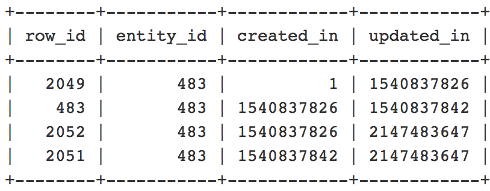

# Mehrere Zeilen in der Datenbank für dieselbe Entität

Dieser Artikel bietet eine Lösung für das Problem, dass in der Datenbank mehrere Zeilen für dieselbe Entitäts-ID vorhanden sind.

## Betroffene Produkte und Versionen:

* Adobe Commerce (alle Versionen)

## Problem

Es gibt mehrere Zeilen für dieselbe Entitäts-ID in der Datenbank.

Wenn Sie z. B. beim Ausführen dieser Abfrage eine Liste von Datensätzen mit doppelten Entitäts-IDs erhalten:

```
SELECT * FROM $entityTable WHERE $column = <$entityID> ORDER BY created_in;
```

Wo `$entityID = ID` der Preisregel für Kategorie/Produkt/Warenkorb/Katalogpreisregel/CMS-Seite.

| Entität | $entityTable | $column |
|------------------|-----------------------------------|------------------|
| Kategorie/Produkt | CATALOG_CATEGORY_ENTITY/CATALOG_PRODUCT_ENTITY | entity_id |
| Warenkorb-Preisregel/Katalog-Preisregel | salesrule/catalogRule | rule_id |
| CMS-Seite | cms_page | page_id |

## Ursache

Dies ist das erwartete Verhalten. Die mehreren Zeilen werden von der Staging-Funktion für Inhalte erstellt:

* Wenn Sie ein Startdatum ohne Enddatum angeben, gibt es mindestens zwei Zeilen mit derselben Entitäts-/Regel-/Seiten-ID. Eine Zeile zeigt den ursprünglichen Status der Entität an (die Zeile, in der die `created_in=1` erfolgt), und eine Zeile zeigt das *Ende der geplanten Aktualisierung*.

* Wenn Sie ein Startdatum mit einem Enddatum angeben, gibt es mindestens drei Zeilen mit derselben Entitäts-/Regel-/Seiten-ID. Eine Zeile zeigt den ursprünglichen Status der Entität an (die Zeile, in der `created_in=1` steht), eine Zeile für den *Start der geplanten Aktualisierung* und eine Zeile für das *Ende der geplanten Aktualisierung*.

In dieser Abfrage gilt beispielsweise Folgendes:

```
SELECT row_id, entity_id, created_in, updated_in FROM catalog_product_entity WHERE entity_id = 483 ORDER BY created_in;
```



* Die `created_in`- und `updated_in` sollten diesem Muster folgen: Der `created_in` Wert der aktuellen Zeile ist gleich dem `updated_in` Wert in der vorherigen Zeile. Außerdem sollte die erste Zeile `created_in = 1` und die letzte Zeile `updated_in = 2147483647` enthalten. (Wenn es nur eine Zeile gibt, müssen `created_in=1` und `updated_in=2147483647` angezeigt werden.)

### Warum wird der zweite DB-Eintrag (und alle nächsten) für dieselbe Entität in der DB angezeigt?

* Der zweite DB-Datensatz (und möglicherweise die nächsten) für die betroffene Entität bedeutet, dass unter Verwendung des `Magento_Staging`-Moduls Aktualisierungen für das Content-Staging geplant wurden, wodurch ein zusätzlicher Datensatz für eine Entität in den entsprechenden Tabellen erstellt wird.

Ein Problem tritt nur auf, wenn die Datensätze dieselben Werte für die `created_in` oder `updated_in` Spalten aufweisen.

## Lösung

Dies ist das erwartete Verhalten und führt nur zu Problemen, wenn es Diskrepanzen zwischen den Zeilen gibt.

## Verwandtes Lesen

* [Änderungen an Kategorien werden nicht in ](https://experienceleague.adobe.com/docs/commerce-knowledge-base/kb/troubleshooting/miscellaneous/changes-to-categories-are-not-being-saved.html?lang=de) Support-Wissensdatenbank gespeichert
* [Best Practices zum Ändern von Datenbanktabellen](https://experienceleague.adobe.com/de/docs/commerce-operations/implementation-playbook/best-practices/development/modifying-core-and-third-party-tables#why-adobe-recommends-avoiding-modifications) im Commerce-Implementierungs-Playbook
