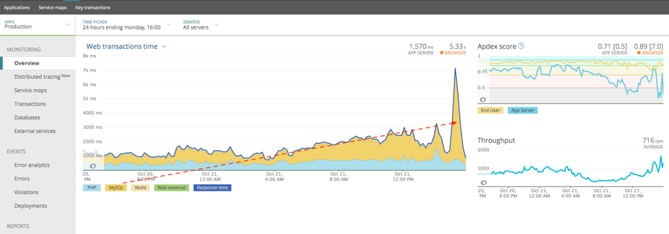

# Engpässe bei hoher MySQL-Auslastung in Adobe Commerce in der Cloud-Infrastruktur

Dieses Thema behandelt eine Lösung, wenn eine hohe Belastung durch MySQL in Adobe Commerce ein Problem mit Leistungsengpässen in der Cloud-Infrastruktur verursacht.

## Betroffene Produkte und Versionen

* Adobe Commerce auf Cloud-Infrastruktur 2.x.x, Pro-Konten.

### Voraussetzungen

* ECE Tools Version 2002.0.16 und höher
* New Relic APM-Dienst (**Ihr Adobe Commerce-Konto für die Cloud-Infrastruktur enthält die Software für den New Relic-APM-Dienst** zusammen mit einem Lizenzschlüssel.)

Weitere Informationen zum New Relic APM-Dienst und dessen Einrichtung mit Ihrem Adobe Commerce-Konto für die Cloud-Infrastruktur-Konto finden Sie unter [New Relic-Dienste](https://experienceleague.adobe.com/en/docs/commerce-cloud-service/user-guide/monitor/new-relic/new-relic-service) und [Einführung in New Relic APM](https://docs.newrelic.com/docs/apm/new-relic-apm/getting-started/introduction-apm/).

## Problem

<u>Schritte, um festzustellen, ob das Problem Sie betrifft</u>

1. Überprüfen Sie in Ihrem New Relic APM-Übersichtsdiagramm, ob MySQL zum Engpass geworden ist. Sehen Sie sich unten das Beispielbild an, in dem MySQL zum Engpass geworden ist und die meisten Webtransaktionen zeitaufwendig macht:

   

   Beachten Sie, dass die rote gestrichelte Linie im Bild einen erkennbaren Aufwärtstrend bei der Zeit der MySQL-Webtransaktionen zeigt und dann sogar noch höhere Spitzen aufweist.
1. Von hier aus können Sie dann zu Ihrem Bildschirm **Datenbank** wechseln, wo Sie die zweite Anzeige von hohem Durchsatz oder langsamen `SELECT` Abfragen in MySQL sehen können. Im folgenden Beispielbild sehen Sie, wie Sie beim Sortieren nach **Am zeitintensivsten** sehen, Ihr Speicher in diesem Beispiel ist bei `SELECT` MySQL-Abfragen langsam.

   

Analysieren Sie die langsamen Transaktionen in New Relic APM. Wenn eine große Anzahl von Abfragen oder ein hoher Druck auf eine MySQL-Datenbank auftritt, können Sie die Last über verschiedene Knoten verteilen, indem Sie `SLAVE` -Verbindungen aktivieren.

## Ursache

Ihre Adobe Commerce im Cloud-Infrastrukturspeicher hat einen hohen Durchsatz oder ist bei `SELECT` MySQL-Abfragen langsam.

## Lösung

>[!WARNING]
>
>Für skalierte Architektur (Aufspaltungsarchitektur) SOLLTEN Redis-Slave-Verbindungen **NICHT** aktiviert sein. Sie können überprüfen, ob Sie sich in einer skalierten Architektur befinden, indem Sie Ihre Projekt-URL aufrufen, z. B. `https://console.adobecommerce.com/<owner-user-name>/<project-ID>/<environment-name>`. Klicken Sie auf **[!UICONTROL SSH]**. Wenn mehr als drei Knoten vorhanden sind, befinden Sie sich in einer skalierten Architektur. Wenn Sie Redis Slave Reads für skalierte Architektur aktivieren, erhält der Kunde Fehler bei Redis-Verbindungen, die keine Verbindung herstellen können. Dies hat mit der Konfiguration der Cluster zur Verarbeitung von Redis-Verbindungen zu tun. Redis Slaves sind weiterhin aktiv, werden aber nicht für Redis Reads verwendet. Es wird empfohlen, skalierte Architektur zu verwenden, um Adobe Commerce 2.3.5 oder höher zu verwenden und eine neue Redis-Backend-Konfiguration zu implementieren und die L2-Zwischenspeicherung für Redis zu implementieren.

Wenn diese beiden Hinweise angezeigt werden, kann die Aktivierung von `SLAVE` -Verbindungen für die MySQL-Datenbank und Redis dazu beitragen, die Last auf verschiedene Knoten zu verteilen.

Adobe Commerce kann mehrere Datenbanken oder Redis asynchron lesen. Aktualisieren der Datei `.magento.env.yaml` durch Festlegen der Werte `MYSQL_USE_SLAVE_CONNECTION` und `REDIS_USE_SLAVE_CONNECTION` auf `true` , um eine schreibgeschützte **Verbindung mit der Datenbank zu verwenden, damit schreibgeschützter Traffic auf einem Nicht-Master-Knoten empfangen wird.** Dies verbessert die Leistung durch Lastenausgleich, da nur ein Knoten Lese- und Schreibvorgänge-Traffic verarbeiten muss. Auf `false` setzen, um ein vorhandenes schreibgeschütztes Verbindungs-Array aus der `env.php`-Datei zu entfernen.

### Schritte

1. Bearbeiten Sie Ihre `.magento.env.yaml` -Datei und fügen Sie den folgenden Inhalt hinzu:

   

   Weitere Informationen finden Sie unter [Bereitstellen von Variablen in DevDocs](https://experienceleague.adobe.com/en/docs/commerce-cloud-service/user-guide/configure/env/stage/variables-deploy#mysql_use_slave_connection).

1. Übernehmen Sie Ihre Änderungen und übertragen Sie sie.
1. Durch das Übermitteln von Änderungen wird ein neuer Implementierungsprozess eingeleitet. Nachdem die Bereitstellung erfolgreich abgeschlossen wurde, sollte Ihre Adobe Commerce in der Cloud-Infrastrukturinstanz jetzt für die Verwendung von Slave-Verbindungen konfiguriert sein.

## Häufige Fragen

Im Folgenden finden Sie die häufig gestellten Fragen, die Sie stellen können, wenn Sie erwägen, die Slave-Verbindungsfunktion für Ihre Adobe Commerce im Cloud-Infrastrukturspeicher zu verwenden.

* Gibt es bekannte Probleme oder Einschränkungen bei der Verwendung von Slave-Verbindungen? **Es sind keine bekannten Probleme bei der Verwendung von Slave-Verbindungen bekannt. Vergewissern Sie sich einfach, dass Sie das neueste aktualisierte ece-tools Paket verwenden. Anweisungen finden Sie hier unter [wie Sie Ihr Eece-Tools-Paket aktualisieren](https://experienceleague.adobe.com/en/docs/commerce-cloud-service/user-guide/dev-tools/ece-tools/update-package).**
* Gibt es eine zusätzliche Latenz durch die Verwendung von Slave-Verbindungen? *Ja, die Latenz zwischen AZ-übergreifenden (Cross-Availability Zones) ist höher und verringert die Leistung einer Adobe Commerce in der Cloud-Infrastrukturinstanz, falls die Instanz nicht überlastet ist und die gesamte Last übertragen werden kann. Wenn die Instanz jedoch überlastet ist, hilft Master-Slave bei der Leistung, indem die Last auf die MySQL-Datenbank oder Redis über verschiedene Knoten verteilt wird.*

  **Bei nicht überladenen Clustern** - **Slave-Verbindungen verlangsamen die Leistung um 10-15 %**, was einer der Gründe ist, warum es nicht standardmäßig ist.

  *Bei überlasteten Clustern gibt es jedoch eine Leistungssteigerung, da diese 10-15 % durch Reduzierung der Traffic-Last reduziert werden.*
* Sollte ich diese Einstellungen für meinen Store aktivieren? *Wenn Sie eine hohe Belastung der MySQL-Datenbank oder von Redis haben oder eine hohe Belastung erwarten, müssen Sie unbedingt Slave-Verbindungen aktivieren. Für einen regulären Kunden mit durchschnittlichem Traffic ist dies **nicht**eine optimale Einstellung, die aktiviert werden kann.*

## Verwandtes Lesen

In unserer Entwicklerdokumentation:

* [Bereitstellen von Variablen](https://experienceleague.adobe.com/en/docs/commerce-cloud-service/user-guide/configure/env/stage/variables-deploy).
* [Richten Sie die optionale Datenbankreplikation ein](https://experienceleague.adobe.com/en/docs/commerce-operations/configuration-guide/storage/split-db/multi-master-replication).
* [ece-tools package](https://experienceleague.adobe.com/en/docs/commerce-cloud-service/user-guide/dev-tools/ece-tools/package-overview).

>[!NOTE]
>
>Wir wissen, dass dieser Artikel immer noch branchenübliche Softwarebegriffe enthalten kann, die einige rassistisch, sexistisch oder unterdrückend finden und die den Leser verletzen, traumatisiert oder unerwünscht machen können. Adobe arbeitet daran, diese Begriffe aus unserem Code, unserer Dokumentation und unseren Benutzererlebnissen zu entfernen.
