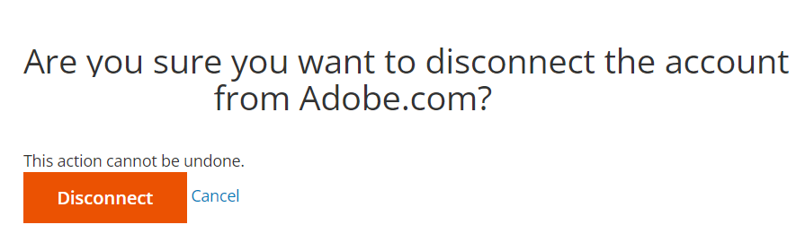

# Der Zugriff auf das richtige Cloud-Konto/-Projekt ist nicht möglich oder das Projekt fehlt in Ihrem Konto

In diesem Artikel werden die folgenden Probleme behoben, nachdem das Kontoeigentum oder die zugehörigen E-Mail-Adressen geändert wurde:

1. Sie können nicht auf die richtigen Cloud Adobe Commerce-Projekte zugreifen.
1. Unter [accounts.magento.cloud/user](https://accounts.magento.cloud/user) werden keine Cloud-Adobe Commerce-Projekte angezeigt.
1. Sie sehen die Details eines anderen Kontos (d. h. des vorherigen Kontoinhabers) unter [accounts.magento.cloud/user](https://accounts.magento.cloud/user).

## Problem

Sie können nicht auf das richtige Cloud Adobe Commerce-Projekt zugreifen, wenn Änderungen an den Eigentümerschaften oder an den E-Mail-Adressen vorgenommen werden.

## Betroffene Produkte und Versionen

* Adobe Commerce in der Cloud-Infrastruktur, [alle unterstützten Versionen](https://www.adobe.com/content/dam/cc/en/legal/terms/enterprise/pdfs/Adobe-Commerce-Software-Lifecycle-Policy.pdf)

## Ursache

Dieses Problem tritt normalerweise auf, wenn das Single Sign-On (SSO) des vorherigen Projekteigentümers weiterhin in Adobe.com integriert ist, nachdem:

1. Der Eigentümer des Cloud-Projekts wurde auf Sie (den Benutzer) übertragen und Sie sehen das Konto des ursprünglichen Projektinhabers. Klicken Sie hier für die [Lösung](#solution-for-cause-one-and-two).

   ODER

1. Sie (der Benutzer) haben sich in ein anderes Unternehmen umgezogen und haben eine Änderung der E-Mail-Adresse und der Projekte vorgenommen, auf die Sie Zugriff haben. Sie sehen die Projekte, auf die Sie Zugriff erhalten hatten, in Ihrer vorherigen Rolle/im vorherigen Unternehmen. Klicken Sie hier für die [Lösung](#solution-for-cause-one-and-two).

   ODER

1. Sie haben Ihre E-Mail-Adresse unter https://account.adobe.com in eine andere E-Mail-Adresse geändert, die derzeit nicht mit einem Cloud-Projekt verknüpft ist. Klicken Sie hier für die [Lösung](#solution-for-cause-three).

## Lösung für die Ursache eins und zwei {#solution-for-cause-one-and-two}

Die Lösung für den Fall, dass das Problem durch ein und zwei verursacht wird, besteht darin, die Single Sign-On-Integration mit Adobe.com zu trennen. Gehen Sie wie folgt vor, um die Verbindung zu trennen:

1. Erweitern Sie von https://accounts.magento.cloud/user aus den Abschnitt **[!UICONTROL Single Sign-On]** . Klicken Sie auf **[!UICONTROL Disconnect from Adobe.com]**, um die Verbindung zu trennen.

   

1. Klicken Sie auf **[!UICONTROL Disconnect]**.

   

1. Melden Sie sich ab.
1. Klicken Sie auf die Schaltfläche **[!UICONTROL Adobe.com]** .

   

1. Sie sollten jetzt das richtige Konto sehen und auf das richtige Cloud-Projekt zugreifen können.

## Lösung für Ursache drei {#solution-for-cause-three}

Wenn das Problem durch Grund 3 verursacht wurde, bitten Sie einen vorhandenen Superuser im Projekt, Ihre neue E-Mail-Adresse zum Projekt hinzuzufügen. Weitere Informationen finden Sie unter [Benutzerzugriff verwalten](https://experienceleague.adobe.com/docs/commerce-cloud-service/user-guide/project/user-access.html).
