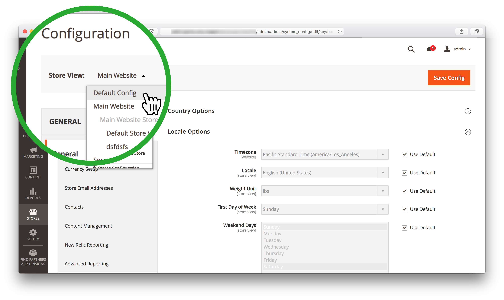

# Suchmaschine kann mit Commerce Admin nicht geändert werden (Menü &quot;Suchmaschine&quot;ist nicht verfügbar)

>[!WARNING]
>
> [Die MySQL-Katalogsuchmaschine wird in Adobe Commerce 2.4.0 entfernt](/help/announcements/adobe-commerce-announcements/mysql-catalog-search-engine-will-be-removed-in-magento-2-4-0.md). Sie müssen den Elasticsearch-Host vor der Installation von Version 2.4.0 eingerichtet und konfiguriert haben.
> 
> Siehe:
> [Installieren und Konfigurieren von Elasticsearch](https://experienceleague.adobe.com/en/docs/commerce-cloud-service/user-guide/configure/service/elasticsearch).
> [Installieren und Konfigurieren von OpenSearch](https://experienceleague.adobe.com/en/docs/commerce-cloud-service/user-guide/configure/service/opensearch)
> [Live Search installieren und konfigurieren](https://experienceleague.adobe.com/en/docs/commerce-merchant-services/live-search/install)

Dieser Artikel bietet eine Lösung zum Ändern der Adobe Commerce-Suchmaschine mithilfe des Commerce-Administrators, wenn die **Suchmaschine** nicht angezeigt wird oder die **Systemwert verwenden** ist ausgegraut und nicht zugänglich.

In diesem Artikel:

* [Betroffene Versionen](#affected-versions)
* [Suchmaschine mit Commerce Admin ändern (Schritte)](#change-search-engine-using-magento-admin-steps)
* [Probleme mit Adobe Commerce vor Ort](#magento-commerce-on-premise)
* [Adobe Commerce auf Cloud-Infrastruktur](#magento-commerce-cloud)

## Betroffene Versionen

* Adobe Commerce vor Ort: 2.4.X
* Adobe Commerce über Cloud-Infrastruktur:
   * Version: 2.4.X
   * Architektur des Einstiegs- und Pro-Plans
* MySQL, Elasticsearch, OpenSearch, Live Search: alle unterstützten Versionen

## Suchmaschine mit Admin ändern (Schritte)

1. Melden Sie sich bei Admin als Administrator an.
1. Klicken Sie in der linken Admin-Seitenleiste auf **Stores**. Dann, unter **Einstellungen** auswählen **Konfiguration**.
1. Im Bedienfeld auf der linken Seite unter **Katalog,** Auswählen **Katalog**.
1. Erweitern Sie die **Katalogsuche** Abschnitt.    
1. Navigieren Sie zu **Suchmaschine** und die Auswahl aus dem **Systemwert verwenden** aktivieren.
1. Klicken Sie auf **Suchmaschine** und wählen Sie eine der verfügbaren Optionen aus.    
1. Klicks **Konfiguration speichern** in der oberen rechten Ecke der Seite.

## Probleme mit Adobe Commerce vor Ort

### Problem 1: Das Suchmaschinenfeld wird nicht angezeigt

Wenn Sie auf **Katalogsuche** -Abschnitt **Suchmaschine** -Menü überhaupt nicht angezeigt.


### Ursache: Die Store-Ansicht ist keine Standardkonfiguration

Die Store-Ansicht für den Administrator wurde auf einen beliebigen anderen Wert als *Standardkonfiguration*.

Bei der Suchmaschine handelt es sich um eine globale Konfiguration, die auf Anwendungsebene und nicht auf Store-Umfang festgelegt wird. Stores in einer Adobe Commerce-Anwendung können keine unterschiedlichen Suchmaschinen verwenden.

### Lösung: Legen Sie die Store-Ansicht auf Standardkonfiguration fest.

1. Melden Sie sich bei Admin als Administrator an.
1. Klicken Sie in der linken Admin-Seitenleiste auf **Stores**. Dann, unter **Einstellungen** auswählen **Konfiguration**.
1. Klicken Sie oben links auf die **Store-Ansicht** auswählen *Standardkonfiguration*.
1. Klicks **OK** im Bestätigungsdialogfeld, um die Änderung der Store-Ansicht zu bestätigen.



**Verwandte Dokumentation:** [Ändern des Umfangs](https://experienceleague.adobe.com/docs/commerce-admin/config/scope-change.html#set-the-scope) in unserem Benutzerhandbuch.

### Problem 2: &quot;Use system value&quot; kann nicht deaktiviert werden

Wenn Sie auf **Katalogsuche** -Abschnitt des Administrators, der **Systemwert verwenden** ist ausgegraut, sodass Sie die Auswahl nicht aus dem Kontrollkästchen entfernen können, um die Suchmaschine später zu ändern.

### Ursache

Die standardmäßige Suchmaschine wurde auf der Anwendungskonfigurationsebene im `app/etc/env.php` oder `app/etc/config.php` -Dateien und daher nicht mit dem Admin geändert werden können.

Beispiel des Abschnitts mit standardmäßiger Suchmaschinenkonfiguration:

```php
'system'=>
array (
'default'=>
array (
'catalog'=>
array (
'search'=>
array (
'engine'=>'mysql',
),
),
),
),
```

### Lösung

Entfernen Sie den Abschnitt mit der standardmäßigen Suchmaschinenkonfiguration aus dem `app/etc/env.php` oder `app/etc/config.php` Konfigurationsdateien.

### Verwandte Artikel in unserer Entwicklerdokumentation

[Adobe Commerce-Konfigurationsdateien](https://experienceleague.adobe.com/docs/commerce-operations/configuration-guide/files/deployment-files.html) im Adobe Commerce-Konfigurationshandbuch

## Adobe Commerce auf Cloud-Infrastruktur

Der Wechsel von Suchmaschinen mithilfe von Admin ist in Adobe Commerce in der Cloud-Infrastruktur aufgrund der Organisation der Cloud-Infrastruktur nicht möglich.

Während des Bereitstellungsprozesses überprüfen die Adobe Commerce-Bereitstellungsskripte für Cloud-Infrastruktur, ob das Elasticsearch im `MAGENTO_CLOUD_RELATIONSHIPS` -Variable. Wenn deklariert, wird Elasticsearch als aktive Suchmaschine ausgewählt und automatisch konfiguriert. Die [MySQL-Suchmaschine](/help/announcements/adobe-commerce-announcements/mysql-catalog-search-engine-will-be-removed-in-magento-2-4-0.md) wird in der Admin-Konsole nicht zugänglich. Wenn die Elasticsearch-Beziehung nicht deklariert wurde, ist MySQL auf &quot;aktiv&quot;gesetzt und der Zugriff auf Elasticsearch wird nicht mehr möglich.

Die Bearbeitung der `app/etc/env.php` oder `app/etc/config.php` Konfigurationsdateien direkt in Ihrer Cloud-Umgebung. Daher ist es für Ihr Cloud-Projekt nicht relevant, diese Dateien zu ändern, um die Elasticsearch-Engine zu erstellen, die in Admin angezeigt werden soll (die im vorherigen Abschnitt empfohlene Lösung).

### Suchmaschine in Staging- und Produktionsumgebungen ändern

Bevor Sie in Ihren Staging- und Produktionsumgebungen die Suchmaschine von MySQL zu Elasticsearch wechseln, stellen Sie sicher, dass Sie zuvor [Support-Ticket gesendet](/help/help-center-guide/help-center/magento-help-center-user-guide.md#submit-ticket) -Anfrage zur Aktivierung des Elasticsearchs in der Umgebung gesendet und das Ticket wurde erfolgreich aufgelöst.

Um die in Ihren Staging- und Produktionsumgebungen verwendete Suchmaschine zu ändern, ändern Sie die `SEARCH_CONFIGURATION` Umgebungsvariable in `.magento.env.yaml` in Ihrer lokalen Umgebung speichern und dann Änderungen an die Integrations- und Staging-/Produktionsumgebungen pushen, damit die Änderungen wirksam werden.

Wenn Sie zu Elasticsearch 7 wechseln, wird die Variable SEARCH\_CONFIGURATION in der `.magento.env.yaml` -Datei könnte wie folgt aussehen:

```yaml
stage:
  deploy:
   SEARCH_CONFIGURATION:
     engine: elasticsearch7
     elasticsearch_server_hostname: hostname
     elasticsearch_server_port: '12345'
     elasticsearch_index_prefix: magento
     elasticsearch_server_timeout: '15'
```

Wenn Sie zu [OpenSearch (in 2.4.6 und höher)](https://experienceleague.adobe.com/en/docs/commerce-knowledge-base/kb/troubleshooting/elasticsearch/search-engine-shown-elasticsearch-despite-open-search) die Variable &quot;SEARCH\_CONFIGURATION&quot;in der resultierenden `.magento.env.yaml` -Datei könnte wie folgt aussehen:

```yaml
stage:
  deploy:
   SEARCH_CONFIGURATION:
     engine: opensearch
     elasticsearch_server_hostname: hostname
     elasticsearch_server_port: '12345'
     elasticsearch_index_prefix: magento
     elasticsearch_server_timeout: '15'
```

Wenn Sie [Wechseln zur Live-Suche](https://experienceleague.adobe.com/en/docs/commerce-knowledge-base/kb/troubleshooting/miscellaneous/error-opensearch-search-engine-doesnt-exist-falling-back-to-livesearch), die Variable SEARCH\_CONFIGURATION in der resultierenden `.magento.env.yaml` -Datei könnte wie folgt aussehen:

```yaml
stage:
  deploy:
   SEARCH_CONFIGURATION:
     engine: livesearch
```

### Verwandte Dokumentation

#### Support-Wissensdatenbank

* [Elasticsearch in Cloud aktivieren](/help/how-to/general/enable-elasticsearch-on-cloud.md)

#### Entwicklerdokumentation

* [Elasticsearch-Dienst einrichten](https://experienceleague.adobe.com/docs/commerce-cloud-service/user-guide/configure/service/elasticsearch.html)
* [Erstellen und Bereitstellen](https://experienceleague.adobe.com/docs/commerce-cloud-service/user-guide/configure/env/configure-env-yaml.html) (Dokumentation zu `.magento.env.yaml` Konfigurationsdatei)
* [Bereitstellen von Variablen](https://experienceleague.adobe.com/docs/commerce-cloud-service/user-guide/configure/env/stage/variables-deploy.html) ([Abschnitt &quot;SEARCH\_CONFIGURATION&quot;](https://experienceleague.adobe.com/docs/commerce-cloud-service/user-guide/configure/env/stage/variables-deploy.html#search_configuration))
* [Dienste](https://experienceleague.adobe.com/docs/commerce-cloud-service/user-guide/configure/service/services-yaml.html) (Dokumentation zu `.magento/services.yaml` Konfigurationsdatei)
* [Live Search](https://experienceleague.adobe.com/en/docs/commerce-merchant-services/live-search/overview)
