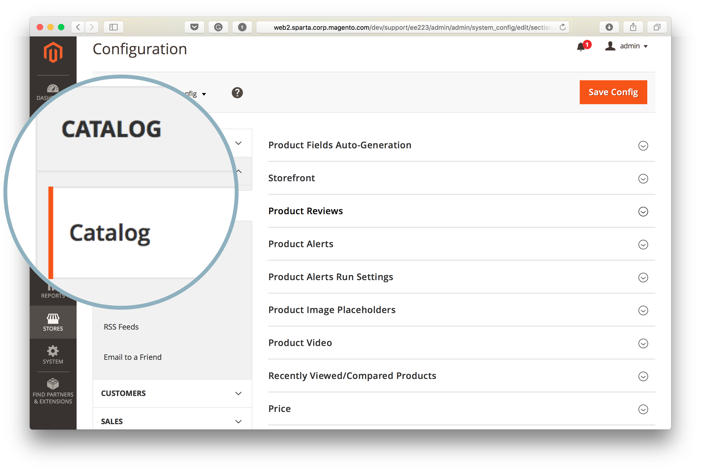

# Suchmaschine kann nicht mit Commerce Admin geändert werden (Suchmaschinenmenü ist nicht zugänglich)

>[!WARNING]
>
> [Die MySQL-Katalogsuchmaschine wird in Adobe Commerce 2.4.0 entfernt](/help/announcements/adobe-commerce-announcements/mysql-catalog-search-engine-will-be-removed-in-magento-2-4-0.md). Vor der Installation von Version 2.4.0 müssen Sie den Elasticsearch-Host eingerichtet und konfiguriert haben.
> 
> Siehe:
> [Installieren und Konfigurieren von Elasticsearch](https://experienceleague.adobe.com/de/docs/commerce-cloud-service/user-guide/configure/service/elasticsearch).
> [Installieren und konfigurieren Sie OpenSearch](https://experienceleague.adobe.com/de/docs/commerce-cloud-service/user-guide/configure/service/opensearch)
> [Live Search installieren und konfigurieren](https://experienceleague.adobe.com/de/docs/commerce-merchant-services/live-search/install)

Dieser Artikel bietet eine Lösung, mit der Sie die Adobe Commerce-Suchmaschine mithilfe der Commerce-Admin ändern können, wenn das Feld **Suchmaschine** nicht angezeigt wird oder das Kontrollkästchen **Systemwert verwenden** ausgegraut ist und nicht zugänglich ist.

In diesem Artikel:

* [Betroffene Versionen](#affected-versions)
* [Ändern der Suchmaschine mit Commerce Admin (Schritte)](#change-search-engine-using-magento-admin-steps)
* [Probleme mit Adobe Commerce On-Premise](#magento-commerce-on-premise)
* [Adobe Commerce auf Cloud-Infrastruktur](#magento-commerce-cloud)

## Betroffene Versionen

* Adobe Commerce On-Premise: 2.4.x
* Adobe Commerce auf Cloud-Infrastruktur:
   * Version: 2.4.x
   * Starter- und Pro-Plan-Architektur
* MySQL, Elasticsearch, OpenSearch, Live Search: alle unterstützten Versionen

## Ändern der Suchmaschine mit der Admin-Funktion (Schritte)

1. Melden Sie sich bei **[!UICONTROL Admin]** als Administrator an.
1. Klicken Sie auf der linken Seite der **[!UICONTROL Admin]** Seitenleiste auf **[!UICONTROL Stores]**.
1. Wählen Sie unter **[!UICONTROL Settings]** die Option **[!UICONTROL Configuration]** aus.
1. Navigieren Sie zum Bedienfeld auf der linken Seite unter **[!UICONTROL Catalog]** und wählen Sie **[!UICONTROL Catalog]** aus.
1. Erweitern Sie den Abschnitt **[!UICONTROL Catalog Search]** .    
1. Wechseln Sie zum **[!UICONTROL Search Engine]** Feld und entfernen Sie die Auswahl aus dem **[!UICONTROL Use system value]**.
1. Klicken Sie auf das Menü **[!UICONTROL Search Engine]** und wählen Sie eine der verfügbaren Optionen wie unten dargestellt aus.    
1. Klicken Sie oben rechts auf der Seite auf **[!UICONTROL Save Config]** .

## Probleme mit Adobe Commerce On-Premise

### Problem 1: Das Suchmaschinenfeld wird nicht angezeigt

Beim Zugriff auf den **Katalogsuche** wird das Menü **Suchmaschine** überhaupt nicht angezeigt.


### Ursache: Store-Ansicht ist keine Standardkonfiguration

Die Store-Ansicht für den Administrator wurde auf einen anderen Wert als &quot;*&quot;*.

Die Suchmaschine ist eine globale Konfiguration, die auf Anwendungsebene festgelegt wird, nicht auf dem Store-Bereich. Stores in einer Adobe Commerce-Anwendung können keine anderen Suchmaschinen verwenden.

### Lösung: Festlegen der Store-Ansicht auf die Standardkonfiguration

1. Melden Sie sich bei **[!UICONTROL Admin]** als Administrator an.
1. Klicken Sie auf der linken Seite der **[!UICONTROL Admin]** Seitenleiste auf **[!UICONTROL Stores]**.
1. Navigieren Sie zu **[!UICONTROL Settings]** und wählen Sie **[!UICONTROL Configuration]** aus.
1. Klicken Sie in der oberen linken Ecke auf die **[!UICONTROL Store View]** und wählen Sie **[!UICONTROL *Standardkonfiguration *]**.
1. Klicken Sie im Bestätigungsdialogfeld auf **[!UICONTROL OK]** , um die Änderungen der Store-Ansicht zu genehmigen.


**Verwandte Dokumentation:** [Ändern des ](https://experienceleague.adobe.com/docs/commerce-admin/config/scope-change.html?lang=de#set-the-scope)) in unserem Benutzerhandbuch.

### Problem 2: Die Option „Systemwert verwenden“ kann nicht deaktiviert werden

Wenn Sie auf den Abschnitt **Katalogsuche** des Admin-Bereichs zugreifen, ist das Kontrollkästchen **Systemwert verwenden** ausgegraut, sodass Sie die Auswahl nicht aus dem Kontrollkästchen entfernen können, um die Suchmaschine später zu ändern.

### Ursache

Die Standard-Suchmaschine wurde auf Anwendungskonfigurationsebene in den `app/etc/env.php`- oder `app/etc/config.php`-Dateien konfiguriert und kann daher nicht mit der Administratorin bzw. dem Administrator geändert werden.

Beispiel für den Abschnitt mit der standardmäßigen Suchmaschinenkonfiguration:

```php
'system'=>
array (
'default'=>
array (
'catalog'=>
array (
'search'=>
array (
'engine'=>'mysql',
),
),
),
),
```

### Lösung

Entfernen Sie den Abschnitt mit der standardmäßigen Suchmaschinenkonfiguration aus den `app/etc/env.php`- oder `app/etc/config.php`.

### Verwandte Artikel in unserer Entwicklerdokumentation

[Adobe Commerce-Konfigurationsdateien](https://experienceleague.adobe.com/docs/commerce-operations/configuration-guide/files/deployment-files.html?lang=de) im Adobe Commerce-Konfigurationshandbuch

## Adobe Commerce auf Cloud-Infrastruktur

Ein Wechsel zwischen Suchmaschinen mit dem Admin-Service ist in Adobe Commerce in der Cloud-Infrastruktur aufgrund der Art und Weise, wie die Cloud-Infrastruktur organisiert wurde, nicht verfügbar.

Während des Bereitstellungsprozesses überprüfen die Adobe Commerce-Bereitstellungsskripte für die Cloud-Infrastruktur, ob Elasticsearch in der `MAGENTO_CLOUD_RELATIONSHIPS` deklariert wurde. Wenn angegeben, wird Elasticsearch als aktive Suchmaschine ausgewählt und automatisch konfiguriert. Die [MySQL-Suchmaschine](/help/announcements/adobe-commerce-announcements/mysql-catalog-search-engine-will-be-removed-in-magento-2-4-0.md) kann in Admin nicht mehr aufgerufen werden. Wenn die Elasticsearch-Beziehung nicht deklariert wurde, wird MySQL auf active gesetzt und das Elasticsearch wird unzugänglich.

Es wird nicht empfohlen, die `app/etc/env.php`- oder `app/etc/config.php`-Konfigurationsdateien direkt in Ihrer Cloud-Umgebung zu bearbeiten. Daher ist es für Ihr Cloud-Projekt nicht sinnvoll, diese Dateien zu ändern, damit die Elasticsearch-Engine in der Admin angezeigt wird (die Lösung, die wir im vorherigen Abschnitt empfehlen).

### Ändern der Suchmaschine in Staging- und Produktionsumgebungen

Bevor Sie die Suchmaschine in Ihren Staging- und Produktionsumgebungen von MySQL zu Elasticsearch wechseln, stellen Sie sicher, dass Sie zuvor [ein Support-Ticket gesendet](/help/help-center-guide/help-center/magento-help-center-user-guide.md#submit-ticket) angefordert haben, Elasticsearch in der Umgebung zu aktivieren, und das Ticket erfolgreich aufgelöst wurde.

Um die in Ihren Staging- und Produktionsumgebungen verwendete Suchmaschine zu ändern, ändern Sie die Umgebungsvariable `SEARCH_CONFIGURATION` in Ihrer `.magento.env.yaml`-Datei in Ihrer lokalen Umgebung und übertragen Sie dann Änderungen an die Integrations- und Staging-/Produktionsumgebungen, damit die Änderungen wirksam werden.

Wenn Sie zu Elasticsearch 7 wechseln, könnte die Variable SEARCH\_CONFIGURATION in der resultierenden `.magento.env.yaml` wie folgt aussehen:

```yaml
stage:
  deploy:
   SEARCH_CONFIGURATION:
     engine: elasticsearch7
     elasticsearch_server_hostname: hostname
     elasticsearch_server_port: '12345'
     elasticsearch_index_prefix: magento
     elasticsearch_server_timeout: '15'
```

Wenn Sie zu [OpenSearch (ab 2.4.6) wechseln](https://experienceleague.adobe.com/de/docs/commerce-knowledge-base/kb/troubleshooting/elasticsearch/search-engine-shown-elasticsearch-despite-open-search) könnte die Variable SEARCH\_CONFIGURATION in der resultierenden `.magento.env.yaml` wie folgt aussehen:

```yaml
stage:
  deploy:
   SEARCH_CONFIGURATION:
     engine: opensearch
     elasticsearch_server_hostname: hostname
     elasticsearch_server_port: '12345'
     elasticsearch_index_prefix: magento
     elasticsearch_server_timeout: '15'
```

Wenn Sie [zur Live Search wechseln](https://experienceleague.adobe.com/de/docs/commerce-knowledge-base/kb/troubleshooting/miscellaneous/error-opensearch-search-engine-doesnt-exist-falling-back-to-livesearch) könnte die Variable SEARCH\_CONFIGURATION in der resultierenden `.magento.env.yaml` wie folgt aussehen:

```yaml
stage:
  deploy:
   SEARCH_CONFIGURATION:
     engine: livesearch
```

### Verwandte Dokumentation

#### Support-Wissensdatenbank

* [Elasticsearch in der Cloud aktivieren](/help/how-to/general/enable-elasticsearch-on-cloud.md)

#### Entwicklerdokumentation

* [Einrichten des Elasticsearch-Service](https://experienceleague.adobe.com/docs/commerce-cloud-service/user-guide/configure/service/elasticsearch.html?lang=de)
* [Erstellen und Bereitstellen](https://experienceleague.adobe.com/docs/commerce-cloud-service/user-guide/configure/env/configure-env-yaml.html?lang=de) (Dokumentation zur `.magento.env.yaml`-Konfigurationsdatei)
* [Variablen bereitstellen](https://experienceleague.adobe.com/docs/commerce-cloud-service/user-guide/configure/env/stage/variables-deploy.html?lang=de) ([Abschnitt SEARCH\_CONFIGURATION](https://experienceleague.adobe.com/docs/commerce-cloud-service/user-guide/configure/env/stage/variables-deploy.html?lang=de#search_configuration))
* [Dienste](https://experienceleague.adobe.com/docs/commerce-cloud-service/user-guide/configure/service/services-yaml.html?lang=de) (Dokumentation zur `.magento/services.yaml`-Konfigurationsdatei)
* [Live-Suche](https://experienceleague.adobe.com/de/docs/commerce-merchant-services/live-search/overview)
