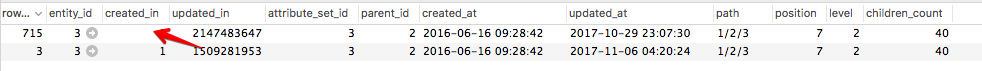

# Änderungen an Kategorien werden nicht gespeichert

Dieser Artikel enthält eine Fehlerbehebung für die Aktualisierung von Produktkategorien über den Commerce-Administrator. Die Änderungen werden nicht in der Admin- und Storefront angezeigt. Das Problem wird durch die beschädigten Daten in der Tabelle `catalog_category_entity` verursacht. Um das Problem zu beheben, beheben oder entfernen Sie die problematischen Kategorieaktualisierungsdatensätze in der Tabelle. Danach sollten Sie Produktkategorien mit dem Admin aktualisieren können.

## Problem

Nachdem Sie in Admin Änderungen an einer Produktkategorie vorgenommen und gespeichert haben, werden die neuen Aktualisierungen weder in Admin noch im Storefront gespeichert und angezeigt.

### Zu reproduzierende Schritte

1. Navigieren Sie zu **Katalog** > **Kategorien**.
1. Wählen Sie eine Kategorie aus.
1. Nehmen Sie Änderungen vor und klicken Sie dann auf **Speichern**.
1. Die Nachricht wird angezeigt: *Sie haben die Kategorie* gespeichert.
1. Beachten Sie, dass die von Ihnen vorgenommene Änderung nicht gespeichert wurde.

## Mögliche Ursache: Beschädigte Daten in der Tabelle `catalog_category_entity`

Das Problem wird durch dieselben Werte in der Spalte `created_in` der betroffenen Kategorieeinträge in der Datenbank (DB) verursacht.

Details:

* Die DB-Tabelle `catalog_category_entity` enthält zwei oder mehr Datensätze für die betroffene Kategorie (diese Datensätze haben denselben `entity_id` -Wert).
* Diese Kategorieeinträge haben **die gleichen Werte in der Spalte `created_in`**.

### Wie wird der zweite DB-Eintrag (und alle nächsten) in DB für eine und dieselbe Kategorie angezeigt?

Der zweite DB-Datensatz (und möglicherweise der nächste) für die betroffene Kategorie bedeutet, dass Kategorieaktualisierungen mit dem Magento\_Staging-Modul geplant wurden. Das Modul führt einen zusätzlichen Datensatz für eine Kategorie in der `catalog_category_entity` aus. Dies ist das erwartete Anwendungsverhalten. Das Problem besteht darin, dass die Datensätze dieselben Werte für die Spalte `created_in` aufweisen.

### Wie werden dieselben Werte angezeigt?

Wir können die Ursachen für Datenbeschädigungen nicht mit Sicherheit nennen. Mögliche Gründe sind:

* Anpassungen (Code, Designs usw.)
* falsche Datenmigration
* falsche Datenwiederherstellung aus der Sicherung

Nach unserem besten Wissen ist eine solche Datenbeschädigung nicht typisch für die &quot;saubere&quot;(vordefinierte) Adobe Commerce-Instanz und kann nicht bei einer Adobe Commerce-Installation ohne Anpassungen reproduziert werden.

### Überprüfen, ob dies Ihr Problem ist

Die Tabelle `catalog_category_entity` sollte mehrere Datensätze für die betroffene Kategorie enthalten (Datensätze sollten denselben `entity_id` -Wert aufweisen) und mindestens zwei dieser Datensätze sollten über dieselben `created_in` -Werte verfügen. Danach werden die geplanten Staging-Aktualisierungen nicht im Commerce-Administrator angezeigt. Sie sehen nur den leeren Baustein Geplante Änderungen .

#### Zu überprüfende Schritte

1. Rufen Sie die Tabelle catalog\_category\_entity in Ihrer Datenbank auf.
1. Entitäten nach entity\_id filtern, wobei entity\_id die betroffene Kategorie angibt.
1. Wenn die Werte in der Spalte created\_in für verschiedene Einträge mit derselben entity\_id identisch sind, ist dies unser Fall. Normalerweise unterscheiden sich die `created_in` -Werte für jeden Datensatz.

## Lösung

Sie können eine der folgenden Lösungen wählen:

1. **Löschen** der Datensätze zur Aktualisierung problematischer Kategorien
1. **Reparieren** der problematischen Kategorieaktualisierungsdatensätze

### Löschen Sie die problematischen Aktualisierungsdatensätze der Kategorie

In dieser Lösung müssen Sie den richtigen `updated_in` -Wert für den anfänglichen Kategoriedatensatz festlegen und alle anderen Datensätze für diese Kategorie löschen. Dadurch werden alle geplanten Kategorieaktualisierungen entfernt.

Führen Sie die folgenden Schritte aus:

1. Suchen Sie die DB-Datensätze mit dem Wert `entity_id` der betroffenen Kategorie.
1. Wählen Sie den Datensatz mit der größten Ganzzahl in der Spalte `updated_in` aus.
1. Kopieren Sie den Wert `updated_in` aus dem ausgewählten Datensatz.
1. Wählen Sie den Datensatz mit `row_id` = `entity_id` (erster Kategorieeintrag) aus und fügen Sie den kopierten Wert in die Spalte `updated_in` dieses Datensatzes ein.
1. Löschen Sie Zeilen mit `row_id` nicht gleich `entity_id` .

### Beheben Sie die problematischen Aktualisierungsdatensätze der Kategorie

1. Suchen Sie die Kategorieeinträge mit demselben `entity_id` und demselben `created_in` -Wert.
1. Wählen Sie den Datensatz mit `row_id` = `entity_id` aus und kopieren Sie den Wert `updated_in` .
1. Wählen Sie den Datensatz aus, bei dem `row_id` nicht gleich `entity_id` ist, und fügen Sie den kopierten `updated_in` -Wert als `created_in` -Wert ein. Siehe Screenshot unten als Abbildung.    
1. Vergewissern Sie sich, dass der Kategorieaktualisierungsdatensatz, dessen `created_in` -Wert Sie aktualisiert haben (in Schritt 3), in der Tabelle `staging_update` vorhanden ist. *Beispiel:* WENN der kopierte `created_in` -Wert 1509281953 ist, muss die Entität mit `row_id` = 1509281953 in der Tabelle `staging_update` vorhanden sein.

## Verwandtes Lesen

[Best Practices für die Änderung von Datenbanktabellen](https://experienceleague.adobe.com/en/docs/commerce-operations/implementation-playbook/best-practices/development/modifying-core-and-third-party-tables#why-adobe-recommends-avoiding-modifications) im Playbook für die Commerce-Implementierung
