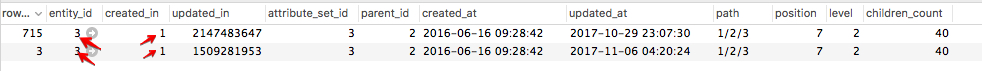

# Änderungen an Kategorien werden nicht gespeichert

Dieser Artikel enthält eine Fehlerbehebung für die Aktualisierung von Produktkategorien über den Commerce-Administrator. Die Änderungen werden nicht in der Admin- und Storefront angezeigt. Das Problem wird durch die beschädigten Daten im `catalog_category_entity` Tabelle. Um das Problem zu beheben, beheben oder entfernen Sie die problematischen Kategorieaktualisierungsdatensätze in der Tabelle. Danach sollten Sie Produktkategorien mit dem Admin aktualisieren können.

## Problem

Nachdem Sie in Admin Änderungen an einer Produktkategorie vorgenommen und gespeichert haben, werden die neuen Aktualisierungen weder in Admin noch im Storefront gespeichert und angezeigt.

### Zu reproduzierende Schritte

1. Navigieren Sie zu **Katalog** > **Kategorien**.
1. Wählen Sie eine Kategorie aus.
1. Nehmen Sie Änderungen vor und klicken Sie auf **Speichern**.
1. Die Nachricht wird angezeigt: *Sie haben die Kategorie gespeichert*.
1. Beachten Sie, dass die von Ihnen vorgenommene Änderung nicht gespeichert wurde.

## Mögliche Ursache: beschädigte Daten im `catalog_category_entity` table

Das Problem wird durch dieselben Werte in der `created_in` der betroffenen Kategorieeinträge in der Datenbank (DB).

Details:

* Die `catalog_category_entity` Die DB-Tabelle enthält zwei oder mehr Datensätze für die betroffene Kategorie (diese Datensätze haben die gleichen `entity_id` -Wert).
* Diese Kategorieeinträge enthalten **die gleichen Werte in `created_in` column**.

### Wie wird der zweite DB-Eintrag (und alle nächsten) in DB für eine und dieselbe Kategorie angezeigt?

Der zweite DB-Datensatz (und möglicherweise der nächste) für die betroffene Kategorie bedeutet, dass Kategorieaktualisierungen mit dem Magento\_Staging-Modul geplant wurden. Das Modul führt einen zusätzlichen Datensatz für eine Kategorie in der `catalog_category_entity` und dies ist das erwartete Anwendungsverhalten. Das Problem besteht darin, dass die Datensätze dieselben Werte für die `created_in` Spalte.

### Wie werden dieselben Werte angezeigt?

Wir können die Ursachen für Datenbeschädigungen nicht mit Sicherheit nennen. Mögliche Gründe sind:

* Anpassungen (Code, Designs usw.)
* falsche Datenmigration
* falsche Datenwiederherstellung aus der Sicherung

Nach unserem besten Wissen ist eine solche Datenbeschädigung nicht typisch für die &quot;saubere&quot;(vordefinierte) Adobe Commerce-Instanz und kann nicht bei einer Adobe Commerce-Installation ohne Anpassungen reproduziert werden.

### Überprüfen, ob dies Ihr Problem ist

Die `catalog_category_entity` sollte mehrere Datensätze für die betroffene Kategorie enthalten (Datensätze sollten denselben `entity_id` -Wert) und mindestens zwei dieser Datensätze sollten denselben `created_in` -Werte. Danach werden die geplanten Staging-Aktualisierungen nicht im Commerce-Administrator angezeigt. Sie sehen nur den leeren Baustein Geplante Änderungen .

#### Zu überprüfende Schritte

1. Rufen Sie die Tabelle catalog\_category\_entity in Ihrer Datenbank auf.
1. Entitäten nach entity\_id filtern, wobei entity\_id die betroffene Kategorie angibt.
1. Wenn die Werte in der Spalte created\_in für verschiedene Einträge mit derselben entity\_id identisch sind, ist dies unser Fall. Normalerweise wird die `created_in` -Werte sind für jeden Datensatz unterschiedlich.

## Lösung

Sie können eine der folgenden Lösungen wählen:

1. **Löschen** die problematischen Aktualisierungsdatensätze der Kategorie
1. **Reparatur** die problematischen Aktualisierungsdatensätze der Kategorie

### Löschen Sie die problematischen Aktualisierungsdatensätze der Kategorie

In dieser Lösung müssen Sie die `updated_in` -Wert für den ersten Kategoriedatensatz und löschen Sie alle anderen Einträge für diese Kategorie. Dadurch werden alle geplanten Kategorieaktualisierungen entfernt.

Führen Sie die folgenden Schritte aus:

1. Suchen Sie die DB-Datensätze mit dem `entity_id` der betroffenen Kategorie.
1. Wählen Sie den Datensatz mit der größten Ganzzahl im `updated_in` Spalte.
1. Kopieren Sie die `updated_in` aus dem ausgewählten Datensatz.
1. Wählen Sie den Datensatz mit `row_id` = `entity_id` (anfänglicher Kategoriedatensatz) und fügen Sie den kopierten Wert in den `updated_in` Spalte dieses Datensatzes.
1. Löschen von Zeilen mit `row_id` nicht gleich `entity_id` .

### Beheben Sie die problematischen Aktualisierungsdatensätze der Kategorie

1. Kategorieeinträge mit dem gleichen `entity_id` und `created_in` -Wert.
1. Wählen Sie den Datensatz aus, in dem `row_id` = `entity_id` und kopieren Sie die `updated_in` -Wert.
1. Wählen Sie den Datensatz aus, in dem `row_id` ist nicht gleich `entity_id` und fügen Sie den kopierten `updated_in` Wert als `created_in` -Wert. Siehe Screenshot unten als Abbildung.    
1. Stellen Sie sicher, dass der Kategorieaktualisierungsdatensatz, der `created_in` -Wert, den Sie aktualisiert haben (in Schritt 3), in der `staging_update` Tabelle. *Beispiel:* WENN kopiert `created_in` Wert 1509281953, DANN die Entität mit `row_id` = 1509281953 muss im `staging_update` table
