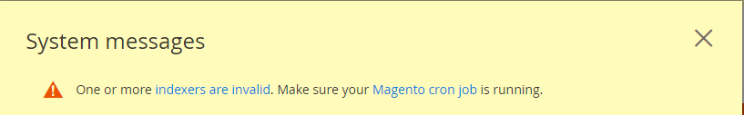

# Probleme bei der Cron-Bereitschaft-Überprüfung

Dieser Artikel bietet Lösungen für Probleme mit der Cron-Bereitschaft. Im Folgenden finden Sie Symptome von Cron-Problemen:

* Eine Fehlermeldung zur PHP-Einstellung `$HTTP_RAW_POST_DATA` angezeigt, obwohl sie richtig eingestellt ist.
* Die PHP Ready Check zeigt die PHP-Version nicht wie in der folgenden Abbildung dargestellt an:
  
* Der folgende Fehler wird in Commerce Admin angezeigt:
  
Um den Fehler anzuzeigen, müssen Sie möglicherweise auf **Systemmeldungen** oben im Fenster wie folgt:
  

## Überprüfen Sie die vorhandene Registerkarte {#check-your-existing-crontab}

In diesem Abschnitt wird beschrieben, wie Sie sehen, ob Cron derzeit ausgeführt wird, und überprüfen, ob es ordnungsgemäß eingerichtet ist.

So überprüfen Sie, ob Ihr Crontab eingerichtet ist:

1. Melden Sie sich bei Ihrem Commerce-Server an oder wechseln Sie zu dem [Magento-Dateisysteminhaber](https://devdocs.magento.com/guides/v2.3/install-gde/prereq/file-sys-perms-over.html).
1. Überprüfen Sie, ob die folgende Datei vorhanden ist: `$ ls -al <magento_root>/var/.setup_cronjob_status`. Wenn die Datei vorhanden ist, hat cron in der Vergangenheit erfolgreich ausgeführt. Wenn die Datei *nicht* vorhanden sind, entweder haben Sie Adobe Commerce noch nicht installiert oder Cron wird nicht ausgeführt. Fahren Sie in beiden Fällen mit dem nächsten Schritt fort.
1. Erfahren Sie mehr über Cron. Als Benutzer mit `root` -Berechtigungen verwenden, geben Sie den folgenden Befehl ein: `$ crontab -u <Magento file system owner name> -l`. Beispiel: unter CentOS `$ crontab -u magento_user -l`. Wenn für den Benutzer kein Crontab eingerichtet wurde, wird die folgende Meldung angezeigt:    `no crontab for magento_user`. Ihr Crontab sagt Ihnen Folgendes:
   * Welche PHP-Binärdatei Sie verwenden (in einigen Fällen haben Sie mehr als eine)
   * Welche Adobe Commerce-Cron-Skripte Sie ausführen (insbesondere die Pfade zu diesen Skripten)
   * Wo sich Ihre Cron-Protokolle befinden

   In einem der folgenden Abschnitte finden Sie eine Lösung für Ihr Problem.

## Lösung: crontab nicht eingerichtet {#solution-crontab-not-set-up}

Informationen zum Überprüfen der ordnungsgemäßen Einrichtung Ihrer Cron-Aufträge finden Sie unter [Einrichten von Cron-Aufträgen](https://devdocs.magento.com/guides/v2.3/install-gde/install/post-install-config.html#post-install-cron) in unserer Entwicklerdokumentation.

## Lösung: cron läuft aus falscher PHP-Binärdatei {#solution-cron-running-from-incorrect-php-binary}

Wenn Ihr Cron-Job eine PHP-Binärdatei verwendet, die sich vom Webserver-Plug-in unterscheidet, werden möglicherweise Fehler bezüglich PHP-Einstellungen angezeigt. Um das Problem zu beheben, legen Sie identische PHP-Einstellungen für die PHP-Befehlszeile und das PHP-Webserver-Plug-in fest.

Weitere Informationen zu PHP-Einstellungen finden Sie unter [Erforderliche PHP-Einstellungen](https://devdocs.magento.com/guides/v2.3/install-gde/prereq/php-settings.html) in unserer Entwicklerdokumentation.

## Lösung: cron läuft mit Fehlern {#solution-cron-running-with-errors}

Versuchen Sie, jeden Befehl manuell auszuführen, da der Befehl möglicherweise hilfreiche Fehlermeldungen anzeigt. Siehe [Einrichten von Cron-Aufträgen](https://devdocs.magento.com/guides/v2.3/install-gde/install/post-install-config.html#post-install-cron) in unserer Entwicklerdokumentation.

>[!NOTE]
>
>Sie müssen cron mindestens ausführen *zweimal* für den Auftrag, der ausgeführt werden soll; das erste Mal, dass Aufträge in die Warteschlange gestellt werden, das zweite Mal, dass die Aufträge ausgeführt werden.
