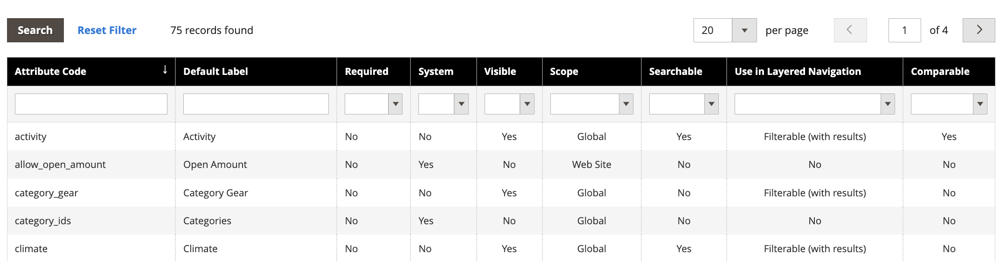

# [!DNL Live Search] Facetten sind nicht alphabetisch sortiert

## Betroffene Produkte und Versionen

Adobe Commerce-Versionen 2.4.x und höher

## Problem

Alle Facetten der Adobe Commerce-Storefront werden alphabetisch mit Einzelauswahloptionen sortiert, unabhängig vom Eingabetyp, der dem entsprechenden Attribut zugewiesen ist.

## Abhilfe

In bestimmten Randfällen werden Facetten jedoch möglicherweise nicht alphabetisch sortiert, wie dies im Arbeitsbereich [[!DNL Live Search] Facettierung“ ](https://experienceleague.adobe.com/en/docs/commerce-merchant-services/live-search/live-search-admin/facets/faceting-workspace) wurde.

Als Problemumgehung können Sie Produktattribute im Abschnitt [!UICONTROL Admin] sortieren.

1. Navigieren Sie in der **[!UICONTROL Admin]** Seitenleiste zu **Stores** > *Attribute* > **Product**.
1. Wählen Sie ein Attribut aus der Tabelle aus.

   

1. Öffnen Sie das Attribut mit den Werten, die Sie sortieren möchten, und wählen Sie **Attributinformationen** > **Eigenschaften**.
1. Unter **Optionen verwalten** können Sie die Attributwerte sortieren.

   
