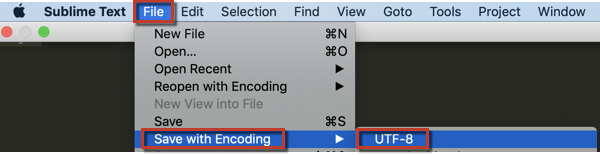

# Beheben von UTF-8-Fehlern beim Hochladen von CSV-Dateien

Dieser Artikel bietet eine Fehlerbehebung für den Fall, dass Sie die Fehlermeldung „CSV-Dateien müssen UTF-8-Codierung verwenden“ erhalten. Diese Fehlermeldung bedeutet, dass die Datei, die Sie hochladen möchten, unzulässige Zeichen enthält bzw. nicht zulässige Zeichen enthält. Während die UTF-8-Kodierung [die Mehrzahl der Zeichen) ](https://www.fileformat.info/info/charset/UTF-8/list.htm), sind einige nicht mit Magento BI kompatibel.

Um das Problem zu beheben, müssen Sie die Codierung der Datei ändern. Das erneute Speichern der Datei mit der richtigen Codierung behebt in der Regel das Problem, aber beachten Sie, dass Sie dabei einige Informationen verlieren (z. B. die unzulässigen Zeichen).

Es wird empfohlen[ „Sublime Text](https://www.sublimetext.com/2) zu verwenden, um die Datei zu speichern und zu kodieren.

1. Öffnen Sie die Datei in Microsoft Excel, Google Docs, Apple Numbers oder einem beliebigen Programm.
1. Klicken Sie auf &#x200B;&#x200B; **Datei** > **Speichern unter** &#x200B;&#x200B; und wählen Sie das Format &#x200B;&#x200B; **Kommagetrennte Werte (.csv)**, um die Datei zu speichern.
1. Öffnen Sie die CSV-Datei im Volltext.
1. Navigieren Sie in „Vollständiger Text“ zu &#x200B;&#x200B; **Datei** > **Mit Kodierung speichern** > **UTF-8\*&#x200B;** . Dadurch wird die CSV-Datei mit UTF-8-Codierung gespeichert.    
1. [Laden Sie die Daten ](https://experienceleague.adobe.com/en/docs/commerce-business-intelligence/mbi/analyze/connecting/using-file-uploader) (in unserem Benutzerhandbuch) in eine neue Tabelle in Magento BI hoch.
