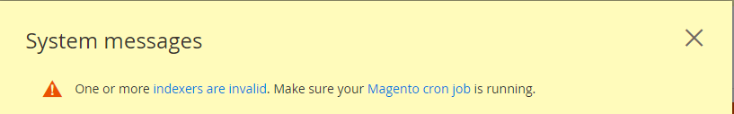

# Fehlerbehebung bei Cron

Dieser Artikel bietet Lösungen zur Fehlerbehebung bei Problemen mit Cron in On-Premise-Produkten von Adobe Commerce.

## Betroffene Produkte und Versionen

* Adobe Commerce On-Premises 2.2.x, 2.3.x
* Magento Open Source 2.2.x, 2.3.x

## Probleme

## Im Folgenden finden Sie Symptome von Cron-Problemen:

* Ihr Update oder Upgrade wird nie ausgeführt. Es verbleibt in einem `pending` Status.
* Eine Fehlermeldung über die PHP-Einstellung `$HTTP_RAW_POST_DATA` wird angezeigt, obwohl sie richtig eingestellt ist.
* Die Cron-Bereitschaftsprüfung schlägt fehl. Zu den möglichen Fehlern gehören nicht beschreibbare Pfade und Cron nicht eingerichtet. Es folgt ein Beispiel:

  

* Die PHP Readiness Check zeigt die PHP-Version nicht wie in der folgenden Abbildung dargestellt an.

  

* Der folgende Fehler wird in Commerce Admin angezeigt:

  

Um den Fehler anzuzeigen, müssen Sie möglicherweise wie folgt **Systemmeldungen** oben im Fenster klicken:

## Die Ursache untersuchen {#check-your-existing-crontab}

In diesem Abschnitt wird beschrieben, wie Sie sehen, ob Cron derzeit ausgeführt wird, und überprüfen, ob es ordnungsgemäß eingerichtet ist.

Gehen Sie wie folgt vor, um zu überprüfen, ob Ihr crontab eingerichtet ist:

1. Melden Sie sich bei Ihrem Magento-Server als Besitzer des [Magento-Dateisystems an oder wechseln Sie zu diesem](https://experienceleague.adobe.com/en/docs/commerce-operations/installation-guide/prerequisites/file-system/overview).
1. Überprüfen Sie, ob die folgende Datei vorhanden ist:    `bash    ls -al <magento_root>/var/.setup_cronjob_status`. Wenn die Datei vorhanden ist, wurde Cron in der Vergangenheit erfolgreich ausgeführt. Wenn die Datei *nicht* existiert, haben Sie entweder noch nicht Magento installiert oder Cron wird nicht ausgeführt. Fahren Sie in beiden Fällen mit dem nächsten Schritt fort.
1. Erhalten Sie weitere Details zu Cron. Geben Sie als Benutzer mit `root` Berechtigungen den folgenden Befehl ein:    `bash    crontab -u <Magento file system owner name> -l`. Zum Beispiel auf CentOS-`bash    crontab -u magento_user -l`.  Wenn für den Benutzer keine crontab eingerichtet wurde, wird die folgende Meldung angezeigt:    `terminal    no crontab for magento_user`. Ihr crontab sagt Ihnen Folgendes:

   * Welche PHP-Binärdatei Sie verwenden (in einigen Fällen haben Sie mehr als eine)
   * Welche Magento-Cron-Skripte Sie ausführen (insbesondere die Pfade zu diesen Skripten)
   * Wo sich Ihre Cron-Protokolle befinden

Eine Lösung für Ihr Problem finden Sie in einem der folgenden Abschnitte.

## Lösungen

### Lösung für crontab wird nicht eingerichtet {#solution-crontab-not-set-up}

Informationen zum Überprüfen, ob Ihre Cron-Aufträge ordnungsgemäß eingerichtet sind, finden Sie unter [Einrichten von Cron-Aufträgen](https://experienceleague.adobe.com/en/docs/commerce-operations/installation-guide/next-steps/configuration).

### Lösung für Cron, das von einer falschen PHP-Binärdatei läuft {#solution-cron-running-from-incorrect-php-binary}

Wenn Ihr Cron-Job eine andere PHP-Binärdatei als das Webserver-Plug-in verwendet, können PHP-Einstellungsfehler angezeigt werden. Um das Problem zu beheben, stellen Sie identische PHP-Einstellungen sowohl für die PHP-Befehlszeile als auch für das PHP-Webserver-Plug-in ein.

Weitere Informationen zu PHP-Einstellungen finden Sie unter [Erforderliche PHP-Einstellungen](https://experienceleague.adobe.com/en/docs/commerce-operations/installation-guide/prerequisites/php-settings) in unserer Entwicklerdokumentation.

### Lösung für Cron mit Fehlern {#solution-cron-running-with-errors}

Führen Sie die einzelnen Befehle manuell aus, da der Befehl möglicherweise hilfreiche Fehlermeldungen anzeigt. Siehe [Einrichten von Cron-Aufträgen](https://experienceleague.adobe.com/en/docs/commerce-operations/installation-guide/next-steps/configuration).

>[!NOTE]
>
>Sie müssen cron mindestens *zweimal* ausführen, damit der Auftrag ausgeführt wird. Beim ersten Mal werden Aufträge in die Warteschlange gestellt, beim zweiten Mal werden die Aufträge ausgeführt.
