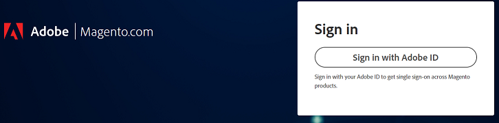

# Anmeldung beim Adobe Commerce Support- oder Cloud-Konto nicht möglich

Dieser Artikel bietet eine Lösung für den Fall, dass Sie Schwierigkeiten bei der Anmeldung bei der Adobe Commerce-Unterstützung für Ihr Cloud-Projekt haben.

## Betroffene Produkte und Versionen

Adobe Commerce (alle Bereitstellungsmethoden) - alle [unterstützten Versionen](https://www.adobe.com/content/dam/cc/en/legal/terms/enterprise/pdfs/Adobe-Commerce-Software-Lifecycle-Policy.pdf)

## Problem

Wenn Sie zu [https://account.magento.com/customer/account/login/](https://account.magento.com/customer/account/login/) oder [https://accounts.magento.cloud/user wechseln](https://accounts.magento.cloud/user) werden Sie möglicherweise feststellen, dass jetzt ein einheitliches Anmeldeformular vorhanden ist und Sie Ihre Anmeldedaten nicht mehr wie zuvor eingeben können.

<u>Schritte zur Reproduktion</u>:

Versuchen Sie, sich bei Ihrem Commerce-Konto anzumelden.

<u>Erwartetes Ergebnis</u>:

Erfolgreich angemeldet.

<u>Tatsächliches </u>:

Sie werden zu einer Seite weitergeleitet, auf der Sie sich mit einem Adobe-Konto anmelden, und die Anmeldeinformationen funktionieren nicht.

## Ursache

Im Rahmen unserer Integration von Adobe Commerce mit anderen Adobe-Lösungen müssen alle Anwender eine Adobe-Anmeldung erstellen - falls noch keine vorhanden ist - und dabei dieselbe E-Mail-Adresse verwenden, die mit ihrer MageID verbunden ist.

## Lösung

Sie können sich wie folgt beim Konto anmelden:

- Ein bestehendes Firmen-/Privatkonto für Adobe.
- Wenn Sie kein Adobe-Konto haben, erstellen Sie eines mit derselben E-Mail-Adresse.

Anweisungen hierzu finden Sie unter [Commerce Identity Manager](https://experienceleague.adobe.com/docs/commerce-admin/start/commerce-account/commerce-identity-manager.html) in Adobe Experience League.

## Verwandtes Lesen

- [Verknüpfen von Magento.com und accounts.magento.cloud-Konto-Anmeldungen](/help/faq/general/linking-magento-com-and-accounts-magento-cloud-account-logins.md)
