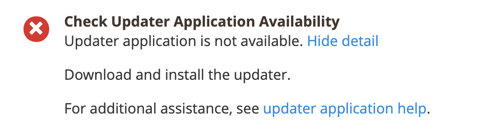

# Fehler &quot;Aktualisierungsanwendung ist nicht verfügbar&quot;

In diesem Artikel wird die Lösung für das Problem &quot;Update-Anwendung ist nicht verfügbar&quot;beschrieben, mit der Sie möglicherweise konfrontiert sind, wenn Sie versuchen, Adobe Commerce lokal mit dem Web-Setup-Assistenten zu aktualisieren/zu installieren.

## Problem

Die folgende Meldung wird in der Bereitschaftsprüfung angezeigt:

## Betroffene Produkte/Versionen

* Adobe Commerce lokal 2.2.x, 2.3.x
* Magento Open Source 2.2.x, 2.3.x

## Lösung

Um dieses Problem zu beheben, überprüfen Sie, ob ein &quot;`<magento_root>/update`&quot;-Ordner vorhanden ist, der Dateien und Unterverzeichnisse enthält. Weitere Informationen finden Sie unter [Einrichten des Aktualisierungsdienstes](https://experienceleague.adobe.com/en/docs/commerce-knowledge-base/kb/troubleshooting/miscellaneous/updater-application-is-not-available-error) in unserer Entwicklerdokumentation.
