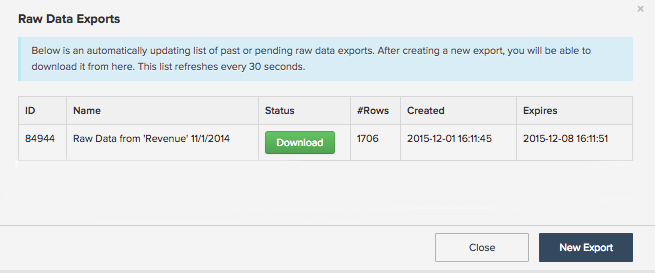
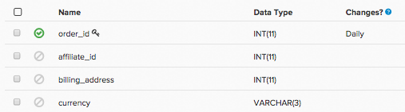

# Verwendung von Datenexporten zur Ermittlung von Diskrepanzen

Dieser Artikel bietet Lösungen zur Fehlerbehebung bei Diskrepanzen in Ihren Magento BI-Daten. Datenexporte sind ein nützliches Tool zum Vergleichen Ihrer Magento BI-Daten mit Ihren Quelldaten, um Datendiskrepanzen in Ihren Berichten zu erkennen, insbesondere wenn die Variable [Checkliste für die Datendiskrepanz-Diagnose](/help/troubleshooting/miscellaneous/diagnosing-a-data-discrepancy.md) Ich habe dir nicht dabei geholfen, das Problem zu bestimmen. Dieser Artikel führt Sie durch ein echtes Beispiel dafür, wie Datendiskrepanzen mithilfe von Datenexporten ermittelt werden können.

Nehmen wir diese Analyse beispielsweise:

Im November 2014 gibt es einen verdächtigen Tiefpunkt. 500.780,94 $ Umsatz? Das klingt nicht richtig. Sie haben bestätigt, dass in Ihrer Quelldatenbank mehr Umsatz angezeigt wird für den Monat November 2014, und Sie haben überprüft, dass die Variable **Umsatz** -Metrik, die in diesem Bericht verwendet wird, korrekt definiert ist. Die Daten im Data Warehouse von Magento BI sind anscheinend unvollständig und können mithilfe eines Datenexports bestätigt werden.

## Daten exportieren {#export}

Klicken Sie zunächst auf das Zahnrad oben rechts im Diagramm und dann im Dropdown-Menü auf die Option Rohexport . Dadurch erhalten Sie einen Rohexport der Daten hinter der Grafik.

Im Menü &quot;Rohdatenexport&quot;können Sie die zu exportierende Tabelle zusammen mit den Spalten auswählen, die in den Export einbezogen werden sollen. Filter können auch auf die Ergebnismenge angewendet werden.

In unserem Beispiel wird die **Umsatz** -Metrik verwendet, verwendet in diesem Bericht die **order\_total** im Feld definiert **Bestellungen** -Tabelle mithilfe der **date** als Zeitstempel. In unserem Export möchten wir alle **order\_id** -Werte für November 2014 und ihre **order\_total** . Die **Umsatz** -Metrik verwendet keine Filter, aber wir fügen dem Export einen Filter hinzu, um den Ergebnissatz auf November 2014 zu begrenzen.

So sieht das Menü &quot;Rohdatenexport&quot;für dieses Beispiel aus:

Klicken Sie auf Daten exportieren , um den Export zu starten. Daraufhin wird ein Fenster mit Details zum Export einschließlich des Status angezeigt. Das Vorbereiten des Exports dauert einige Minuten. Dies ist nun eine gute Zeit, um einen analogen Extrakt unserer Quelldaten für November 2014 durchzuführen, einschließlich **date, order\_id** und die **order\_total** . Wir werden diese Datei in Excel öffnen und sie hochlassen, da wir gleich darauf zurückkommen werden.

Wenn die Schaltfläche Herunterladen im Fenster Rohdatenexporte angezeigt wird, klicken Sie darauf, um die ZIP-Datei mit der CSV-Datei herunterzuladen.

An dieser Stelle müssen wir alle Daten in ein Blatt bekommen, um das Problem zu finden. Wir importieren die CSV-Datei (den Export von Magento BI) in eine andere Tabelle der Excel-Datei, die unsere Quelldaten enthält.

## Problemstellung bestimmen {#pinpoint}

Da sich alle Daten an einem Ort befinden, können wir nach der Quelle der Diskrepanz suchen. Wenn wir die Anzahl der Zeilen in den einzelnen Blättern vergleichen, können wir das Problem erkennen. Sehen wir uns jede Situation genauer an.

### Beide Arbeitsblätter enthalten die gleiche Anzahl von Zeilen.

Wenn beide Systeme dieselbe Zeilenanzahl aufweisen und die **Umsatz** die Metrik nicht mit den Quelldaten übereinstimmt, wird die **order\_total** muss irgendwo weg sein. Es ist möglich, dass die **order\_total** -Feld wurde in Ihrer Quelldatenbank aktualisiert und Magento BI übernimmt diese Änderungen nicht.

Um dies zu bestätigen, prüfen Sie, ob die Variable **order\_total** -Spalte wird erneut überprüft. Gehen Sie zum Data Warehouse-Manager und klicken Sie auf die Bestelltabelle. Du wirst die [Wiederholungsfrequenz](https://experienceleague.adobe.com/docs/commerce-business-intelligence/mbi/analyze/warehouse-manager/cfg-data-rechecks.html) in der Liste &quot;Änderungen?&quot; Spalte. Die **order\_total** -Feld so oft wie erwartet erneut überprüft werden. Ist dies nicht der Fall, starten Sie den Vorgang und stellen Sie ihn auf die gewünschte Häufigkeit ein.

### 

Wenn die Überprüfungsfrequenz bereits korrekt eingestellt ist, ist etwas Anderes falsch. Siehe Abschnitt [Supportbereich kontaktieren](#support) am Ende dieses Artikels für die nächsten Schritte.

## Die Quelldatenbank enthält mehr Zeilen als Magento BI. {#morerows}

Wenn die Quelldatenbank mehr Zeilen als Magento BI enthält und die Lücke größer ist als die Anzahl der Bestellungen, die Sie während eines Aktualisierungszyklus erwarten können, kann es zu einem Verbindungsproblem kommen. Das bedeutet, dass Magento BI keine neuen Daten aus der Quelldatenbank abrufen kann, was aus mehreren Gründen passieren kann.

Navigieren Sie zur Seite Verbindungen und sehen Sie sich den Status der Datenquelle an, die die Bestelltabelle enthält:

1. **Wenn der Status Re-auth lautet** , verwendet die Verbindung nicht die richtigen Anmeldeinformationen. Klicken Sie auf die Verbindung, geben Sie die richtigen Anmeldeinformationen ein und versuchen Sie es erneut.
1. **Wenn der Status Fehlgeschlagen ist** , wird die Verbindung möglicherweise nicht ordnungsgemäß auf der Serverseite eingerichtet. Fehlgeschlagene Verbindungen entstehen normalerweise durch einen falschen Hostnamen oder den Zielserver, der keine Verbindungen am angegebenen Port akzeptiert. Klicken Sie auf die Verbindung und überprüfen Sie die Rechtschreibung des Hostnamens und vergewissern Sie sich, dass der richtige Port eingegeben wurde. Stellen Sie auf der Serverseite sicher, dass der Port Verbindungen akzeptieren kann und dass Ihre Firewall die Magento BI IP-Adresse (54.88.76.97/32) wie erlaubt hat. **Wenn die Verbindung weiterhin fehlschlägt** , siehe [Supportbereich kontaktieren](#support) am Ende dieses Artikels für die nächsten Schritte.
1. **Wenn der Status erfolgreich ist** , dann ist die Verbindung nicht das Problem und der RJ-Support muss beteiligt werden. Siehe Abschnitt [Supportbereich kontaktieren](#support) am Ende dieses Artikels für die nächsten Schritte.

## Die Quelldatenbank verfügt über FEWER-Zeilen als Magento BI {#lessrows}

Wenn die Quelldatenbank weniger Zeilen enthält als Magento BI, können Zeilen aus der Quelldatenbank gelöscht werden und Magento BI übernimmt diese Löschungen nicht. ** [Daten löschen](https://experienceleague.adobe.com/docs/commerce-business-intelligence/mbi/best-practices/data/opt-db-analysis.html) kann zu Diskrepanzen, längeren Aktualisierungszeiten und einer Reihe logistischer Kopfschmerzen führen. Daher empfehlen wir dringend, Daten nur dann zu löschen, wenn sie wirklich erforderlich sind.

Wenn jedoch Zeilen aus der Tabelle gelöscht werden, sollten Sie sich die Häufigkeit des erneuten Zugriffs auf den Primärschlüssel ansehen. Eine erneute Überprüfung des Primärschlüssels bedeutet, dass die Tabelle auf gelöschte Zeilen überprüft wird.

Im Data Warehouse-Manager werden die Primärschlüsselspalten mit einem Schlüsselsymbol markiert. In unserem Beispiel ist der Primärschlüssel die **order\_id** column:

Wenn der Primärschlüssel bereits auf eine erneute Überprüfung eingestellt ist oder Zeilen nie aus dieser Tabelle gelöscht werden, benötigen Sie RJ-Unterstützung, um das Problem zu identifizieren. Die nächsten Schritte finden Sie im folgenden Abschnitt .

## Support kontaktieren {#support}

Wenn Sie nicht in der Lage sind, die Ursache des Problems zu bestimmen, müssen Sie den RJ-Support einbinden. Bevor Sie ein Ticket einreichen, gehen Sie wie folgt vor:

* **Wenn Ihre Quelldatenbank und Magento BI über dieselbe Anzahl von Zeilen verfügen** und die Überprüfungsfrequenzen korrekt eingestellt sind, führen Sie eine VLOOKUP in Ihrer Tabelle durch. **um zu ermitteln, welche order\_id-Werte einen anderen order\_total -Wert zwischen Magento BI und Ihrer Quelldatenbank haben.** Fügen Sie diese Werte bei, wenn Sie Ihr Ticket übermitteln.
* **Wenn Ihre Quelldatenbank mehr Zeilen als Magento BI enthält** und die Verbindung als erfolgreich angezeigt wird oder weiterhin fehlschlägt, müssen wir den Namen der Verbindung und die Fehlermeldung kennen, die Sie sehen, sofern vorhanden.
* **Wenn Ihre Quelldatenbank über FEWER-Zeilen als Magento BI verfügt,** Zeilen werden nicht aus der Tabelle gelöscht, und die Überprüfungsfrequenzen werden korrekt eingestellt, führen Sie eine VLOOKUP in Ihrer Tabelle durch. **um zu finden, welche order\_id-Werte in Magento BI vorhanden sind** aber nicht in Ihrer Quelldatenbank. Fügen Sie diese Werte bei, wenn Sie Ihr Ticket übermitteln.

## Verwandte

* [Checkliste für die Diagnose von Datendiskrepanzen](/help/troubleshooting/miscellaneous/diagnosing-a-data-discrepancy.md)
* [Senden eines Tickets zur Datendiskrepanz](https://support.magento.com/hc/en-us/articles/360016506472-Submitting-a-data-discrepancy-ticket)
