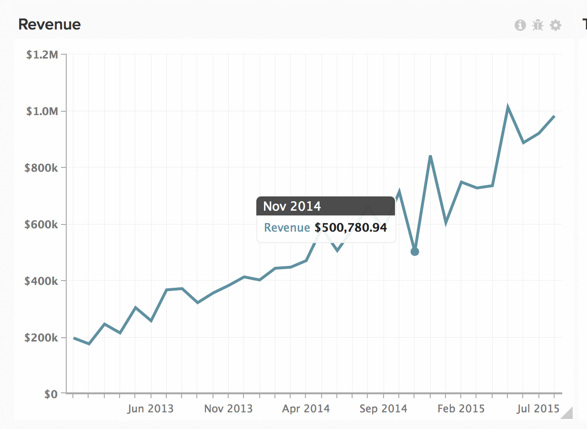

# Verwenden von Datenexporten zur Ermittlung von Diskrepanzen

Dieser Artikel enthält Lösungen zur Fehlerbehebung bei Diskrepanzen in Ihren Magento BI-Daten. Datenexporte sind ein nützliches Tool für den Vergleich Ihrer Magento BI-Daten mit Ihren Quelldaten, um Datendiskrepanzen in Ihren Berichten zu identifizieren, insbesondere wenn die [Checkliste für die Datendiskrepanzdiagnose](https://experienceleague.adobe.com/en/docs/commerce-knowledge-base/kb/troubleshooting/miscellaneous/diagnosing-a-data-discrepancy) Ihnen nicht geholfen hat, das Problem zu identifizieren. Dieser Artikel zeigt Ihnen ein Beispiel aus der Praxis, wie Datendiskrepanzen mithilfe von Datenexporten erkannt werden können.

Nehmen wir beispielsweise diese Analyse:

Es gibt einen verdächtigen Einbruch im November 2014. 500.780,94 US-Dollar Umsatz? Das klingt nicht richtig. Sie haben bestätigt, dass in Ihrer Quelldatenbank mehr Umsatz für den Monat November 2014 angezeigt wird, und Sie haben überprüft, ob die in diesem Bericht verwendete Metrik **Umsatz** korrekt definiert ist. Es scheint, dass die Daten im Magento BI-Data Warehouse unvollständig sind, was mithilfe eines Datenexports bestätigt werden kann.

## Daten exportieren {#export}

Klicken Sie zunächst auf das Zahnrad oben rechts im Diagramm und dann im Dropdown-Menü auf die Option „Rohexport“. Dadurch erhalten Sie einen Rohexport der Daten hinter dem Diagramm.

Im Menü **Rohdatenexport** können Sie die zu exportierende Tabelle zusammen mit den im Export einzuschließenden Spalten auswählen. Filter können auch auf die Ergebnismenge angewendet werden.

In unserem Beispiel verwendet die **Umsatz** Metrik, die für diesen Bericht verwendet wird, das Feld **order\_total**, das in der **`orders`** definiert ist, wobei **date** als Zeitstempel verwendet wird. In unseren Export möchten wir alle Werte von **order\_id** für November 2014 und deren **order\_total** aufnehmen. Die **Umsatz**-Metrik verwendet keine Filter, aber wir fügen dem Export einen Filter hinzu, um den Ergebnissatz auf November 2014 zu beschränken.

So sieht das Menü für den Export von Rohdaten für dieses Beispiel aus:

Klicken Sie auf Daten exportieren , um den Export zu starten. Daraufhin wird ein Fenster mit den Details des Exports angezeigt, einschließlich des Status. Die Exportvorbereitung dauert einige Minuten. Daher ist jetzt ein guter Zeitpunkt, um eine analoge Extraktion unserer Quelldaten für November 2014 durchzuführen, einschließlich **date, order\_id** und **order\_total** . Wir öffnen diese Datei in Excel und lassen sie dort, da wir gleich darauf zurückkommen werden.

Wenn die Schaltfläche Herunterladen im Fenster Rohdatenexporte angezeigt wird, klicken Sie darauf, um die ZIP-Datei mit der CSV-Datei herunterzuladen.

An dieser Stelle müssen wir alle Daten in ein Blatt packen, um das Problem zu finden. Wir importieren die CSV-Datei (den Export von Magento BI) in ein anderes Blatt der Excel-Datei, die unsere Quelldaten enthält.

## Problemanalyse {#pinpoint}

Nun, da alle Daten an einem Ort sind, können wir nach der Quelle der Diskrepanz suchen. Ein Vergleich der Anzahl der Zeilen in jedem Blatt hilft uns, das Problem zu identifizieren. Sehen wir uns die einzelnen Situationen genauer an.

### Beide Blätter enthalten die gleiche Anzahl von Zeilen

Wenn beide Systeme dieselbe Zeilenanzahl aufweisen und die Metrik **Umsatz** nicht mit den Quelldaten übereinstimmt, muss **order\_total** irgendwo abgeschaltet sein. Es ist möglich, dass das Feld **order\_total** in Ihrer Quelldatenbank aktualisiert wurde und Magento BI diese Änderungen nicht übernimmt.

Um dies zu bestätigen, überprüfen Sie, ob die Spalte **order\_total** erneut überprüft wird. Gehen Sie zum Data Warehouse-Manager und klicken Sie auf die **`orders`**. Die „Häufigkeit der [&quot; wird ](https://experienceleague.adobe.com/docs/commerce-business-intelligence/mbi/analyze/warehouse-manager/cfg-data-rechecks.html) „Änderungen?“ angezeigt. Spalte. Das Feld **order\_total** sollte so oft neu überprüft werden, wie dies erwartet wird. Ist dies nicht der Fall, sollte mit der gewünschten Häufigkeit fortgefahren werden.

### 

Wenn die Häufigkeit der erneuten Prüfung bereits korrekt eingestellt ist, ist ein anderer Fehler aufgetreten. Die nächsten Schritte [ Sie im Abschnitt ](#support)Support kontaktieren“ am Ende dieses Artikels.

## Die Quelldatenbank enthält MEHR Zeilen als Magento BI {#morerows}

Wenn die Quelldatenbank mehr Zeilen als Magento BI enthält und die Lücke größer ist als die Anzahl der Bestellungen, die während eines Aktualisierungszyklus eingehen werden, kann es zu einem Verbindungsproblem kommen. Das bedeutet, dass Magento BI keine neuen Daten aus der Quelldatenbank abrufen kann, was aus verschiedenen Gründen passieren kann.

Navigieren Sie zur Seite Verbindungen und sehen Sie sich den Status der Datenquelle an, die die `order`-Tabelle enthält:

1. **Wenn der Status Erneut**, verwendet die Verbindung nicht die richtigen Anmeldeinformationen. Klicken Sie auf die Verbindung, geben Sie die richtigen Anmeldeinformationen ein und versuchen Sie es erneut.
1. **Wenn der Status Fehlgeschlagen**, ist die Verbindung auf der Server-Seite möglicherweise nicht ordnungsgemäß eingerichtet. Fehlgeschlagene Verbindungen ergeben sich in der Regel aus einem falschen Hostnamen oder dem Ziel-Server, der keine Verbindungen am angegebenen Port akzeptiert. Klicken Sie in die Verbindung und überprüfen Sie die Schreibweise des Hostnamens und dass der richtige Port eingegeben wurde. Stellen Sie auf der Serverseite sicher, dass der Port Verbindungen akzeptieren kann und dass Ihre Firewall die zulässige Magento BI-IP-Adresse (54.88.76.97/32) hat. **Wenn die Verbindung weiterhin fehlschlägt** finden Sie im Abschnitt [Kontaktaufnahme mit dem Support](#support) am Ende dieses Artikels die nächsten Schritte.
1. **Wenn der Status Erfolgreich ist** , ist die Verbindung nicht das Problem und der RJ-Support muss einbezogen werden. Die nächsten Schritte [ Sie im Abschnitt ](#support)Support kontaktieren“ am Ende dieses Artikels.

## Die Quelldatenbank enthält WENIGER Zeilen als Magento BI {#lessrows}

Wenn die Quelldatenbank weniger Zeilen als Magento BI enthält, werden möglicherweise Zeilen aus der Quelldatenbank gelöscht und Magento BI nimmt diese Löschungen nicht auf. ** [Löschen von Daten](https://experienceleague.adobe.com/docs/commerce-business-intelligence/mbi/best-practices/data/opt-db-analysis.html) kann zu Diskrepanzen, längeren Aktualisierungszeiten und einer Reihe von logistischen ** führen. Daher empfehlen wir dringend, Daten niemals zu löschen, es sei denn, dies ist wirklich erforderlich.

Wenn jedoch Zeilen aus der Tabelle gelöscht werden, sollten Sie sich die Häufigkeit der erneuten Überprüfung auf dem Primärschlüssel ansehen. Das erneute Überprüfen des Primärschlüssels bedeutet, dass die Tabelle auf gelöschte Zeilen überprüft wird.

Im Data Warehouse-Manager werden Primärschlüsselspalten mit einem Schlüsselsymbol gekennzeichnet. In unserem Beispiel ist der Primärschlüssel die Spalte **order\_id**:

Wenn der Primärschlüssel bereits auf eine erneute Überprüfung eingestellt ist oder Zeilen nie aus dieser Tabelle gelöscht werden, benötigen Sie RJ-Unterstützung, um das Problem zu identifizieren. Die nächsten Schritte finden Sie im folgenden Abschnitt .

## Support kontaktieren {#support}

Wenn Sie die Ursache des Problems nicht identifizieren können, müssen Sie den RJ-Support einbinden. Bevor Sie ein Ticket senden, gehen Sie wie folgt vor:

* **Wenn Ihre Quelldatenbank und Magento BI dieselbe Anzahl von Zeilen aufweisen** die Häufigkeit der erneuten Prüfung korrekt ist, führen Sie eine Suche in Ihrer Tabelle durch, **festzustellen, welche order\_id-Werte einen anderen order\_total-Wert zwischen Magento BI und Ihrer Quelldatenbank aufweisen.** Schließen Sie diese Werte beim Senden Ihres Tickets ein.
* **Wenn Ihre Quelldatenbank mehr Zeilen als Magento BI** enthält und die Verbindung als Erfolgreich angezeigt wird oder weiterhin fehlschlägt, müssen wir den Namen der Verbindung und die angezeigte Fehlermeldung kennen, falls vorhanden.
* **Wenn Ihre Quelldatenbank weniger Zeilen als Magento BI enthält,** Zeilen nicht aus der Tabelle gelöscht werden und die Häufigkeit der erneuten Prüfung korrekt ist, führen Sie eine Suche in Ihrer Tabelle durch, **um zu ermitteln, welche Sortierungs-\_id-Werte sich in Magento BI,** nicht in Ihrer Quelldatenbank befinden. Schließen Sie diese Werte beim Senden Ihres Tickets ein.

## Verwandtes Lesen

* [Checkliste für die Datendiskrepanzdiagnose](https://experienceleague.adobe.com/en/docs/commerce-knowledge-base/kb/troubleshooting/miscellaneous/diagnosing-a-data-discrepancy)
* [Adobe Commerce Intelligence-Service-Richtlinien](https://experienceleague.adobe.com/en/docs/commerce-knowledge-base/kb/troubleshooting/miscellaneous/mbi-service-policies)
* [Best Practices zum Ändern von Datenbanktabellen](https://experienceleague.adobe.com/en/docs/commerce-operations/implementation-playbook/best-practices/development/modifying-core-and-third-party-tables#why-adobe-recommends-avoiding-modifications) im Commerce-Implementierungs-Playbook

