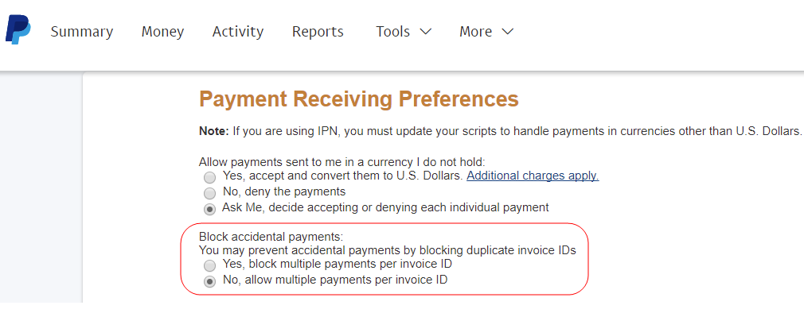

# PayPal Gateway Anfrage abgelehnt - Problem mit doppelten Rechnungen

Dieser Artikel enthält eine Fehlerbehebung für das PayPal Gateway abgelehnt Anfrage - Problem mit doppelten Rechnungen.

Beim Einreichen der Zahlung wird dem Kunden möglicherweise ein Fehler für eine doppelte Rechnung angezeigt:

>PayPal Gateway hat Anfrage abgelehnt. Für diese InvoiceID (\#10412: Doppelte Rechnung) wurde bereits eine Zahlung getätigt.

Das Problem tritt auf, wenn Rechnungen mit denselben IDs mehrmals an PayPal gesendet werden.

Um das Problem zu beheben, lassen Sie mehrere Zahlungen pro Rechnungskennung in den Zahlungsempfängereinstellungen von PayPal zu. Bei Änderung akzeptiert PayPal Zahlungen ohne Fehlermeldungen, auch für Rechnungen mit doppelten Kennungen.

## Betroffene Versionen

* Adobe Commerce vor Ort, alle Versionen
* Adobe Commerce in der Cloud-Infrastruktur, alle Versionen

## Problem

Beim Senden der Zahlung wird den Kunden die Fehlermeldung angezeigt:

```
... main.CRITICAL: Exception message: PayPal gateway has rejected request. Payment has already been made for this InvoiceID (#10412: Duplicate invoice).
```

PayPal kann die Zahlung nicht verarbeiten und die Bestellung nicht abschließen.

## Ursache

Die Fehlermeldung wird angezeigt, wenn Rechnungen mit derselben ID mehrmals an PayPal gesendet werden.

Dies kann vorkommen, wenn Sie dieselben Anmeldeinformationen auf mehreren Adobe Commerce-Sites verwenden (auch in den lokalen und Staging-Umgebungen). Bestimmte Szenarien können die folgenden sein:

* Mehrere Stores übermitteln Rechnungen an PayPal und verwenden dieselben Rechnungskennungen.
* Ein neuer Store sendet eine Rechnung mit einer ID, die zuvor von einem alten Store übermittelt wurde.

Standardmäßig gestattet PayPal die zweifache Verarbeitung derselben Rechnung nicht.

## Lösung

Ändern Sie Ihr PayPal-Profil, um mehrere Zahlungen pro Rechnungskennung zuzulassen. Sie müssen diese Änderungen über PayPal vornehmen.

1. Melden Sie sich bei Ihrem Konto an unter [https://www.paypal.com](https://www.paypal.com/).
1. Klicks **Profil** > **Profil und Einstellungen** (obere rechte Ecke).
1. Navigieren Sie zu **Meine Verkaufstools**.
1. Navigieren Sie zu **Bezahlung und Risikomanagement** > **Blockzahlungen** und klicken **Aktualisieren**.
1. **Verkaufsvoreinstellungen** klicken **Zahlungseinstellungen**.
1. under **Unbeabsichtigte Zahlungen blockieren** auswählen **Nein, mehrere Zahlungen pro Rechnungskennung zulassen**.    
1. Scrollen Sie nach unten und klicken Sie auf **Speichern**.

## Weitere Informationen

* [Unbeabsichtigte Zahlungen blockieren](https://developer.paypal.com/docs/admin/setup-account/#block-accidental-payments) zu PayPal Developer Docs.
* PayPal-Zahlungen in unserem Benutzerhandbuch:
   * [PayPal Express Checkout](/docs/commerce-admin/stores-sales/payments/paypal/paypal-express-checkout.html)
   * [Andere PayPal-Lösungen](/docs/commerce-admin/stores-sales/payments/paypal/paypal.html)
* In unserer Entwicklerdokumentation:
   * [PayPal-Zahlungsmethoden für Adobe Commerce in der Cloud-Infrastruktur einrichten](/docs/commerce-cloud-service/user-guide/configure-store/paypal.html)
   * [Zahlungsintegrationen](https://developer.adobe.com/commerce/php/development/payments-integrations/)
