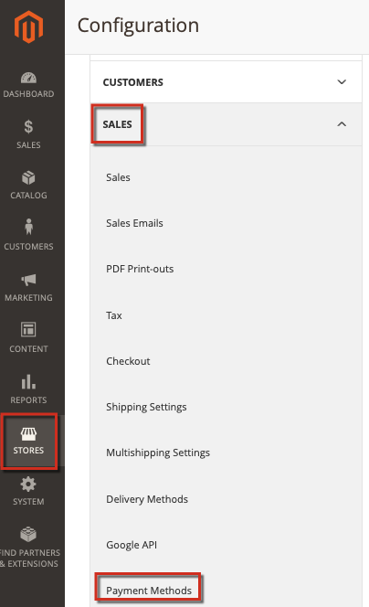

# Fehlerbehebung bei PayPal auf Adobe Commerce

Dieser Artikel bietet Lösungen für Probleme bei der Verarbeitung von Zahlungen über PayPal, insbesondere die PayFlow Pro-Lösung. Einige Empfehlungen in diesem Artikel mögen offensichtlich erscheinen. Wir bitten Sie, die in dieser Wissensdatenbank aufgelisteten Fehlerbehebungsoptionen auszuprobieren und alle Informationen in den von Ihnen eingegebenen Tickets anzugeben. Support-Techniker von Adobe Commerce oder PayPal werden Sie bitten, diese Schritte bei der Diagnose Ihrer Probleme auszuführen.

## Häufige Probleme

Die meisten Probleme mit PayPal-Zahlungen haben ähnliche Symptome: Nachdem die Zahlungskartendetails angegeben wurden und zur Kasse gegangen ist, wird die Zahlung nicht verarbeitet. Stattdessen kann eine Fehlermeldung, eine nicht verarbeitete Zahlung oder sogar eine leere Seite angezeigt werden.

## Überprüfen Sie Ihre Anmeldeinformationen, Schlüssel und Lizenzen

Mögliche Probleme: Druckfehler in Kontodetails (Benutzernamen, Passwörter), ungültige Konten, abgelaufene oder nicht angegebene Lizenzen, ungültige öffentliche und persönliche Schlüssel und viele andere Aspekte. Um diese Probleme zu finden, müssen Sie möglicherweise auch Ihre Zahlungskonfigurationseinstellungen überprüfen.

## Anwenden konsistenter Einstellungen in Adobe Commerce und PayPal

Stellen Sie sicher, dass Sie dieselben Einstellungen angewendet und dieselben Funktionen in den Commerce Admin- und PayPal-Kontoeinstellungen aktiviert haben.

### Problem mit den Beispieleinstellungen

Bei der Anwendung der PayPal Express Checkout-Lösung müssen Transaktionen, die auf AVS/CSC-Antworten basieren, in **PayPal Manager** (Diensteinstellungen > Einrichten > Sicherheitsoptionen) und in **Commerce Admin** abgelehnt werden ( **Stores** > Konfiguration > **Verkauf** > **Zahlungsmethoden**…).

Weitere Informationen finden Sie in der Dokumentation: [PayPal](https://www.paypalobjects.com/en_US/vhelp/paypalmanager_help/setup.htm) und [Adobe Commerce](/docs/commerce-admin/stores-sales/payments/paypal/paypal-express-checkout.html) in unserem Benutzerhandbuch.

## Referenztransaktionen zulassen

Wenn Ihre PayPal-Zahlungsmethode eine API mit Abrechnungsvereinbarungen und Referenztransaktionen umfasst, stellen Sie sicher, dass diese in Ihren Einstellungen aktiviert und korrekt konfiguriert sind.

### Zusätzliche Fehlerbehebung

Siehe die folgenden Artikel:

* [PayPal-Gateway hat Anfrage abgelehnt - Problem mit doppelter Rechnung](https://experienceleague.adobe.com/en/docs/experience-cloud-kcs/kbarticles/ka-26838) in unserer Support-Wissensdatenbank.
* [Ändern der Inkrement-ID für eine neue Store](/help/how-to/general/change-increment-id-for-a-db-entity-order-invoice-credit-memo-etc-on-particular-store.md)Entität in unserer Support-Wissensdatenbank.

## Support kontaktieren, um erweiterte Zahlungsprotokolle zu erfassen

Um komplizierte Zahlungsprobleme zu beheben, kann das Adobe Commerce-Supportteam Sie bitten, einen speziellen Patch anzuwenden, um die erweiterte Zahlungsprotokollierung zu aktivieren. In diesem Fall sollten Sie die folgenden Schritte ausführen:

[Senden eines Support-Tickets](/help/help-center-guide/help-center/magento-help-center-user-guide.md#submit-ticket) mit den folgenden Details:

* Geben Sie Ihr Problem mit so vielen Details wie möglich an.
* Führen Sie die Schritte auf, die Sie in diesem Artikel, in der Wissensdatenbank und in anderen Ressourcen versucht haben. Alle Ergebnisse einschließen.
* Fordern Sie einen Advanced Payment Logging Patch (Referenznummer MDVA-4352) und eine Anleitung zur Anwendung des Patches an.

Wenn Sie den Patch für die erweiterte Zahlungsprotokollierung erhalten:

* Pflaster aufkleben.
* Sammeln Sie Protokolle und fügen Sie sie Ihrem [Support-Ticket“ ](/help/help-center-guide/help-center/magento-help-center-user-guide.md#submit-ticket).
* Warten Sie auf weitere Empfehlungen vom Adobe Commerce-Supportteam.
