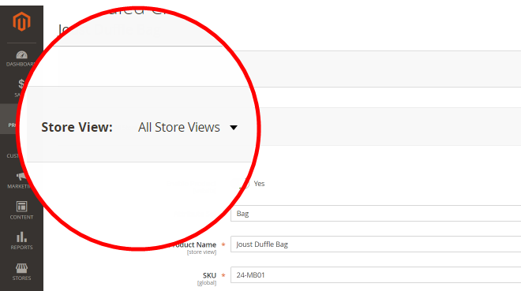

# Produktbilder werden trotz der Bildrollen &quot;Produkt bearbeiten&quot;nicht angezeigt

Dieser Artikel enthält eine Fehlerbehebung für den Fall, dass Produktbilder trotz der Bildrollen, die auf der Seite &quot;Produktbearbeitung&quot;festgelegt sind, nicht in der Storefront angezeigt werden.

**Ursache:** Bei Adobe Commerce-Instanzen mit mehr als einem Store verfügen einige Produktbilder möglicherweise über die `no_selection` -Werte für Bildrollenattribute `image`, `small_image`, `thumbnail`, `swatch`. Solche `no_selection` -Werte treten auf, wenn die Bildrolle des Produkts auf den globalen Bereich gesetzt wird, werden alle Stores anstelle des Umfangs eines bestimmten Stores verwendet (d. h. auf die **Alle Store-Ansichten** anstelle eines bestimmten **Store-Ansicht**). Um zu verstehen, ob dies der Fall ist, führen Sie das SQL-Skript aus dem **Ursache** unten.

**Lösung:** Löschen Sie Zeilen mit der `no_selection` -Werte für diese Bilder mithilfe des SQL-Skripts aus dem Abschnitt Lösung unten.

## Betroffene Versionen

* Adobe Commerce On-Premise 2.X.X
* Adobe Commerce auf Cloud-Infrastruktur 2.X.X

## Problem

Produktbilder werden möglicherweise nicht in Ihrer Storefront angezeigt, obwohl die Bildrollen (Basis, Klein, Miniatur, Muster) auf der Produktseite Ihres Admin-Bedienfelds korrekt festgelegt wurden.

Wenn Sie die Produktseite mit **Store-Ansicht** auf **Alle Store-Ansichten**, hat das Bild die Rollen, die für die **Bilddetails** angezeigt.




Auf der Storefront wird das Bild jedoch nicht angezeigt. Wenn Sie die Produktseite auf der jeweiligen Store-Ebene überprüfen (Wechseln der **Store-Ansicht**), ist das Bild vorhanden, aber die Rollen sind nicht festgelegt.


## Ursache

Bei Adobe Commerce-Instanzen mit mehreren Stores (mit mehreren Stores) können einige Produktbilder die Variable `no_selection` Werte für Attribute `image`, `small_image`, `thumbnail`, `swatch` (diese Attribute entsprechen Bildrollen). Solche `no_selection` -Werte treten auf, wenn die Bildrolle des Produkts auf den globalen Bereich gesetzt wird, werden alle Stores anstelle des Umfangs eines bestimmten Stores verwendet (d. h. auf die **Alle Store-Ansichten** anstelle eines bestimmten **Store-Ansicht**).

Technisch gesehen: on `store_id=0` (die die globalen Einstellungen für alle Stores in Ihrer Adobe Commerce-Instanz enthält), können die Produktbildrollen festgelegt werden: Dies bedeutet, dass die Attribute `image`, `small_image`, `thumbnail`, `swatch` über gültige Werte verfügen (Pfad zu Bildern). Gleichzeitig können Sie `store_id=1` (die eine bestimmte Store-Darstellung ist), sind die Werte für diese Attribute `no_selection`.

### Überprüfen des Problems

Führen Sie diese SQL-Abfrage aus:

```sql
SELECT `cpev_s`.*, `cpev_0`.`value` AS `store_value` FROM `catalog_product_entity_varchar` `cpev_s` JOIN `eav_attribute` `ea` ON `cpev_s`.`attribute_id` = `ea`.`attribute_id` LEFT JOIN `catalog_product_entity_varchar` `cpev_0` ON `cpev_0`.`row_id` = `cpev_s`.`row_id` AND `cpev_0`.`attribute_id` = `cpev_s`.`attribute_id` AND `cpev_0`.`store_id` = 0 WHERE `cpev_s`.`value` = 'no_selection' AND `ea`.`attribute_code` IN ('image', 'small_image', 'thumbnail') AND `cpev_s`.`store_id` > 0 AND `cpev_s`.`value` != `cpev_0`.`value` AND `cpev_s`.`value` = 'no_selection';
```

Wenn die Abfrage ein Ergebnis wie unten zurückgibt, haben Sie es mit dem in diesem Artikel dokumentierten Problem zu tun:

```sql
+----------+--------------+----------+--------+--------------+----------------------------+
| value_id | attribute_id | store_id | row_id | value        | store_value                |
+----------+--------------+----------+--------+--------------+----------------------------+
|    67722 |           87 |        1 |    481 | no_selection | /3/5/355sss1_main.jpg      |
|    67723 |           88 |        1 |    481 | no_selection | /3/5/355sss1_main.jpg      |
|    67724 |           89 |        1 |    481 | no_selection | /3/5/355sss1_main.jpg      |
|    67814 |           87 |        1 |    503 | no_selection | /s/k/skb2031_main.jpg      |
|     6769 |           87 |        2 |    503 | no_selection | /s/k/skb2031_main.jpg      |
|    67815 |           88 |        1 |    503 | no_selection | /s/k/skb2031_main.jpg      |
|     6770 |           88 |        2 |    503 | no_selection | /s/k/skb2031_main.jpg      |
|    67816 |           89 |        1 |    503 | no_selection | /s/k/skb2031_main.jpg      |
|     6771 |           89 |        2 |    503 | no_selection | /s/k/skb2031_main.jpg      |
+----------+--------------+----------+--------+--------------+----------------------------+
9 rows in set (0.06 sec)
```

### Warum passiert das?

Wenn die Adobe Commerce-Anwendung über mehr als einen Store verfügt, werden die Daten zwischen einem bestimmten Store und den globalen Store-Einstellungen möglicherweise nicht synchronisiert.

Werte für `store_id=1` haben eine höhere Priorität als der standardmäßige (globale) Store (`store_id=0`). Daher kann die Anwendung die globalen Bildeinstellungen ignorieren und die Speicherbereichskonfiguration (`no_selection` für Bildrollenattribute) bei der Anzeige eines Bildes.

## Lösung {#solution}

Löschen von Attributen mit `no_selection` Werte, die dieses SQL-Skript verwenden:

```
DELETE `cpev_s`.* FROM `catalog_product_entity_varchar` `cpev_s` JOIN `eav_attribute` `ea` ON `cpev_s`.`attribute_id` = `ea`.`attribute_id` LEFT JOIN `catalog_product_entity_varchar` `cpev_0` ON `cpev_0`.`row_id` = `cpev_s`.`row_id` AND `cpev_0`.`attribute_id` = `cpev_s`.`attribute_id` AND `cpev_0`.`store_id` = 0 WHERE `cpev_s`.`value` = 'no_selection' AND `ea`.`attribute_code` IN ('image', 'small_image', 'thumbnail') AND `cpev_s`.`store_id` > 0 AND `cpev_s`.`value` != `cpev_0`.`value` AND `cpev_s`.`value` = 'no_selection';
```

Nachdem diese Attribute entfernt wurden, werden die Rollen für bestimmte Stores festgelegt und Bilder auf der Storefront angezeigt.

## Zusätzliche Details

Wenn der vollständige Seiten-Cache in Ihrer Adobe Commerce-Instanz aktiviert ist, können Sie die Fixergebnisse nicht sofort sehen.

Damit die Änderungen angezeigt werden, aktualisieren Sie den Seiten-Cache mit dem **Cacheverwaltung** Menü Ihres Admin-Bedienfelds.

## Weitere Informationen

### Stores und Bereiche

[Speicher und Speicherbereiche](/docs/commerce-admin/stores-sales/site-store/stores.html) in unserem Benutzerhandbuch

### Bilder

[Hochladen von Produktbildern](/docs/commerce-admin/catalog/products/digital-assets/product-image.html#upload-an-image) in unserem Benutzerhandbuch

### Cache

* [Cacheverwaltung](/docs/commerce-admin/systems/tools/cache-management.html) in unserem Benutzerhandbuch für das Admin-System.
* [Verwalten des Cache](/docs/commerce-operations/configuration-guide/cli/manage-cache.html) in unserer Entwicklerdokumentation