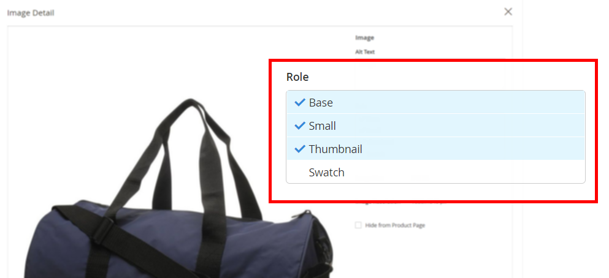

# Produktbilder werden trotz der Rollen „Produktbild bearbeiten“ nicht angezeigt

Dieser Artikel bietet eine Fehlerbehebung für Fälle, in denen Produktbilder trotz auf der Seite „Produktbearbeitung“ festgelegter Bildrollen nicht in Ihrer Storefront angezeigt werden.

**Ursache:** Auf Adobe Commerce-Instanzen mit mehr als einem Store verfügen einige Produktbilder möglicherweise über die `no_selection` Werte für die Bildrollenattribute `image`, `small_image`, `thumbnail`, `swatch`. Solche `no_selection` werden angezeigt, wenn die Rolle des Produktbilds für den globalen Bereich mit allen Stores anstelle des Bereichs eines bestimmten Stores (d. h. für die Ansicht **Alle Stores** anstelle einer bestimmten **Store-Ansicht**) festgelegt wird. Um zu verstehen, ob dies Ihr Fall ist, führen Sie das SQL-Skript aus dem Abschnitt **Ursache** unten aus.

**Lösung:** Löschen Sie mithilfe des SQL-Skripts aus dem Abschnitt „Lösung“ unten Zeilen mit den `no_selection` Werten für diese Bilder.

## Betroffene Versionen

* Adobe Commerce On-Premises 2.X.X
* Adobe Commerce auf Cloud-Infrastruktur 2.x.x

## Problem

Produktbilder werden möglicherweise nicht in Ihrer Storefront angezeigt, obwohl die Bildrollen (Basis, Klein, Miniaturansicht, Farbfeld) auf der Produktseite Ihres Admin-Bedienfelds korrekt festgelegt wurden.

Wenn Sie die Produktseite überprüfen und **Store-Ansicht** auf **Alle Store-Ansichten** setzen, werden für das Bild die Rollen auf dem Bildschirm **Bilddetails** festgelegt.




In der Storefront wird das Bild jedoch nicht angezeigt. Wenn Sie die Produktseite auf der jeweiligen Storeebene überprüfen (**Store-Ansicht** wechseln), ist das Bild vorhanden, aber die Rollen sind nicht festgelegt.


## Ursache

Auf den Adobe Commerce-Instanzen mit mehreren Stores (mit mehr als einem Store) können einige Produktbilder die `no_selection` Werte für die Attribute `image`, `small_image`, `thumbnail` und `swatch` aufweisen (diese Attribute entsprechen Bildrollen). Solche `no_selection` werden angezeigt, wenn die Rolle des Produktbilds für den globalen Bereich mit allen Stores anstelle des Bereichs eines bestimmten Stores (d. h. für die Ansicht **Alle Stores** anstelle einer bestimmten **Store-Ansicht**) festgelegt wird.

Technisch gesehen: Auf `store_id=0` (das die globalen Einstellungen für alle Stores in Ihrer Adobe Commerce-Instanz enthält) können die Rollen für Produktbilder festgelegt werden. Dies bedeutet, dass die Attribute `image`, `small_image`, `thumbnail` `swatch` gültige Werte aufweisen (Pfad zu Bildern). Gleichzeitig werden auf `store_id=1` (bei dem es sich um eine bestimmte Store-Darstellung handelt) die Werte für diese Attribute `no_selection`.

### So stellen Sie sicher, dass Ihr Problem ist

Diese SQL-Abfrage ausführen:

```sql
SELECT `cpev_s`.*, `cpev_0`.`value` AS `store_value` FROM `catalog_product_entity_varchar` `cpev_s` JOIN `eav_attribute` `ea` ON `cpev_s`.`attribute_id` = `ea`.`attribute_id` LEFT JOIN `catalog_product_entity_varchar` `cpev_0` ON `cpev_0`.`row_id` = `cpev_s`.`row_id` AND `cpev_0`.`attribute_id` = `cpev_s`.`attribute_id` AND `cpev_0`.`store_id` = 0 WHERE `cpev_s`.`value` = 'no_selection' AND `ea`.`attribute_code` IN ('image', 'small_image', 'thumbnail') AND `cpev_s`.`store_id` > 0 AND `cpev_s`.`value` != `cpev_0`.`value` AND `cpev_s`.`value` = 'no_selection';
```

Wenn die Abfrage ein Ergebnis wie unten zurückgibt, haben Sie mit dem in diesem Artikel dokumentierten Problem zu tun:

```sql
+----------+--------------+----------+--------+--------------+----------------------------+
| value_id | attribute_id | store_id | row_id | value        | store_value                |
+----------+--------------+----------+--------+--------------+----------------------------+
|    67722 |           87 |        1 |    481 | no_selection | /3/5/355sss1_main.jpg      |
|    67723 |           88 |        1 |    481 | no_selection | /3/5/355sss1_main.jpg      |
|    67724 |           89 |        1 |    481 | no_selection | /3/5/355sss1_main.jpg      |
|    67814 |           87 |        1 |    503 | no_selection | /s/k/skb2031_main.jpg      |
|     6769 |           87 |        2 |    503 | no_selection | /s/k/skb2031_main.jpg      |
|    67815 |           88 |        1 |    503 | no_selection | /s/k/skb2031_main.jpg      |
|     6770 |           88 |        2 |    503 | no_selection | /s/k/skb2031_main.jpg      |
|    67816 |           89 |        1 |    503 | no_selection | /s/k/skb2031_main.jpg      |
|     6771 |           89 |        2 |    503 | no_selection | /s/k/skb2031_main.jpg      |
+----------+--------------+----------+--------+--------------+----------------------------+
9 rows in set (0.06 sec)
```

### Warum passiert das?

Wenn die Adobe Commerce-Anwendung über mehr als einen Store verfügt, werden möglicherweise keine Daten zwischen einem bestimmten Store und den globalen Store-Einstellungen synchronisiert.

Werte in `store_id=1` haben eine höhere Priorität als der standardmäßige (globale) Speicher (`store_id=0`). Daher kann die Anwendung die globalen Bildeinstellungen ignorieren und die Konfiguration des Speicherbereichs (`no_selection` für Bildrollenattribute) verwenden, wenn ein Bild angezeigt wird.

## Lösung {#solution}

Löschen Sie Attribute mit den `no_selection` Werten mithilfe dieses SQL-Scripts:

```
DELETE `cpev_s`.* FROM `catalog_product_entity_varchar` `cpev_s` JOIN `eav_attribute` `ea` ON `cpev_s`.`attribute_id` = `ea`.`attribute_id` LEFT JOIN `catalog_product_entity_varchar` `cpev_0` ON `cpev_0`.`row_id` = `cpev_s`.`row_id` AND `cpev_0`.`attribute_id` = `cpev_s`.`attribute_id` AND `cpev_0`.`store_id` = 0 WHERE `cpev_s`.`value` = 'no_selection' AND `ea`.`attribute_code` IN ('image', 'small_image', 'thumbnail') AND `cpev_s`.`store_id` > 0 AND `cpev_s`.`value` != `cpev_0`.`value` AND `cpev_s`.`value` = 'no_selection';
```

Nachdem diese Attribute entfernt wurden, werden die Rollen für bestimmte Stores festgelegt und Bilder werden in der Storefront angezeigt.

## Zusätzliche Details

Die Fehlerbehebungsergebnisse werden nicht sofort angezeigt, wenn der vollständige Seitencache in Ihrer Adobe Commerce-Instanz aktiviert ist.

Damit die Änderungen angezeigt werden, aktualisieren Sie den Seitencache mithilfe des Menüs **Cache-Verwaltung** Ihres Admin-Bedienfelds.

## Weitere Informationen

### Stores und Bereiche

[Stores und Store-Bereiche](/docs/commerce-admin/stores-sales/site-store/stores.html) in unserem Benutzerhandbuch

### Bilder

[Hochladen von ](/docs/commerce-admin/catalog/products/digital-assets/product-image.html#upload-an-image) in unserem Benutzerhandbuch

### Cache

* [Cache-Verwaltung](/docs/commerce-admin/systems/tools/cache-management.html) in unserem User Admin-Systemhandbuch.
* [Verwalten des Cache](/docs/commerce-operations/configuration-guide/cli/manage-cache.html) in unserer Entwicklerdokumentation